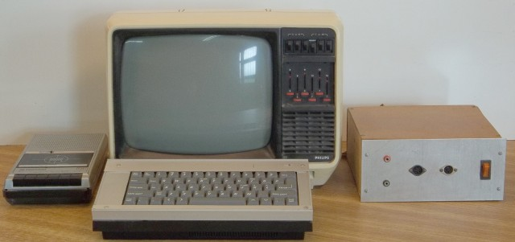
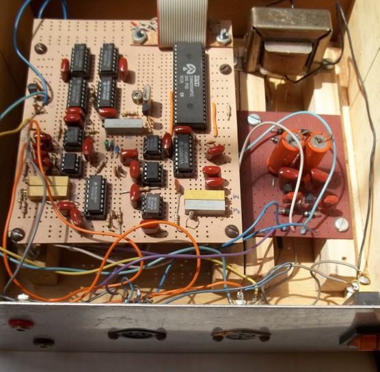

# 6. History of the use of data acquisition interfaces in Secondary Public Education Physics Laboratories (N.T. in Uruguay)

Many of the Physics Laboratories of the CES began working with data acquisition interfaces decades ago.

The first of them (that we know about) was designed and built in our country; at the end of the decade of 1980, the teachers Juan Correa and Pablo García of Instituto N°6 "Francisco Bauzá" designed the "Dédalo" data acquisition interface for microcomputers based on the Z80 microprocessor.

Source: Correa & García (1991)

Some commercial brands of these microcomputers were the Sinclair Spectrum and the Microdigital TK95.
The following laboratory guides are evidence of the use of the "Dédalo" system at the mentioned school:

1. "Carga de un condensador" ("Charging a condensator"), GARCÍA, P., Agosto de 1991. 
2. "Momento de Inercia" ("Moment of inertia"), CORREA, J., GARCÍA, P., Julio de 1992.
3. "Ley de Faraday" ("Faraday's Law"), CORREA, J., GARCÍA, P., Julio de 1992.
4. "Sistema masa resorte" ("Spring mass system"), GARCÍA, P., TERRA, L., Marzo de 1995.
5. "Impulso y cantidad de movimiento" ("Impulse and quantity of movement"), GARCÍA, P., TERRA, L., Agosto de 1995.

Between the years 1992 and 1994 at the Physics Laboratory of Liceo Solymar N°1, whose coordinator was teacher Juan Francisco Pannone, and thanks to the help and precise instructions of teacher Pablo García, we built a "Dédalo" that our students used during their practical Physics course.

The picture below shows the complete system: The tape deck (from which the program was loaded), TV (used as display), "Spectrum" microcomputer (in front of the TV) and "Dédalo" interface (to the right). The next photo shows the circuit board and power source of the unit.

In the year 1994 Physics equipment including a PC and the data acquisition interface "CASSY-E" from the german company "Leybold" were distributed to all secondary schools. This generalization in access to technology was followed by a great number of Physics teachers, who flocked to use it in their secondary school courses and in research. Evidence of this is the great number and variety of articles published in the "Educación en Física" journal of the APFU (Spanish initials for Association of Physics Teachers of Uruguay). See APFU:

1. GARCÍA, P., “Construcción de cajas de sensor para Interfases Cassy”, Vol. 2, No 3, Agosto de 1996. - (Constructing sensor boxes for Cassy Interfaces)
2. GÓMEZ, E., MAYERO, M., “Registrando distintas cantidades de magnitud con el ordenador”, Vol. 4, No 1, Julio de 1998. - (Recording different physical magnitudes with the computer)
3. COLLADO, O, DELGADO, A., FALCÓN, S., PRIETO, O., RAMÍREZ, S., “1.Movimiento Circular” - (Circular Movement)
4. BACCINO, D., COSTA, A., ECHENIQUE, J., MIRIANCO, V., VARAKSA, C., “2.Proyectil con salida horizontal”, Vol. 5, No 2, Diciembre de 1999. - (Horizontal exit projectile)
5. ECHARTE, A., GARCIMARTÍN, M., “Laboratorio II”, Vol. 6, No 2, Setiembre de 2000
6. CASTRO, G., SÁNCHEZ, E., SUÁREZ, R., VILLAMIL, A., “Sensor de posición angular”, Vol. 6, No 4, Agosto de 2001 - (Angular position sensor)
7. CÁCERES, J., “Sensor óptico para medir frecuencia de luz Estroboscópica”, Vol. 6, No 5, Diciembre de 2001. - (Optical sensor for measuring frequency in estroboscopic light)
8. BARNECH, A., DE SOUZA, A., TRINIDAD, G., “Resonancia en sistemas mecánicos”, Vol. 6, No 6, Setiembre de 2002. - (Resonance in mechanical systems)

Since then, other interfaces have been added, which goes to show that they have been naturally assimilated to the work at the Physics Laboratory as another measuring instrument, among many.

The Association of Physics Teachers of Uruguay (APFU), founded in 1989 has, since it's beginnings, organized and conducted activities for perfecting and promoting topics related to the use of computers, data acquisition interfaces and robotics in Physics teaching.

For illustration purposes, only between 1989 and 1999 the following activities were developed:

## National Summit of Physics Teachers (E.N.P.F from spanish initials)
## International Summit of Physics Education (E.I.E.F)

### II E.N.P.F
"Days for updating Teachers"
10 to 15 of December of 1990. "Artigas" Teachers Institute. Montevideo.

Workshop: "Interface between a microcomputer and the experience in a Physics Laboratory"
Pablo García, Juan Correa.

### III E.N.P.F and I E.I.E.F
21 to 25 of September of 1992, Montevideo.

Workshop: "The computer as calculation tool for Physics Teaching"
Carlos Zamalvide, Pablo García.

### IV E.N.P.F and II E.I.E.F
12 to 16 of December of 1994, Montevideo

Workshop:"Robotics and Teaching"
G. Ghilardi, F. Varsi (ESEEC "F.Arias", UTU)

### "Applications of CASSY from the didactic and experimental point of view assisted by the INFED 2000 computer"
M. Baudín, M. Vacca, M. Jubín, E. Gómez.

### VI E.N.P.F and III E.I.E.F
16 to 20 of September of 1996, La Paloma, Rocha.

Workshop "The CASSY interface at the Physics laboratories in Secondary Schools"
Juan Pablo Forcheri - Alejandro Villamil.

Workshop "Treatment of experimental data with the computer in Physics Teaching"
Pablo García - Lucía Terra.

### VIII E.N.P.F and IV E.I.E.F
Colonia del Sacramento, Colonia, 21 to 25 of September, 1998.

Keynote:"Educational Robotics: Its importance in the learning of Science"
Jose Miguel García.

Workshop:"Sound, computers and Fourier"
Carlos Zamalvide, Pablo García, Alejandro Villamil.

Brito & Trinidad (2006)
