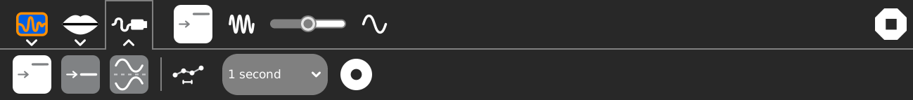
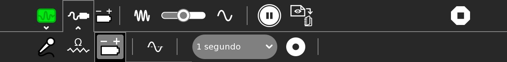

# 7. Measure Activity (versions 31, 36 and 42)

The SUGAR graphical user interface includes a very potent tool for working in Experimental Physics and Musical Acoustics: The Measure Activity (Sugar Labs Measure); with it the XO is transformed into a single (XO1) or double (XO1.5 and XO1.75) stroke **oscilloscope** that enables us to analyze the sounds that the XO registers from its built-in microphone, or the voltage or resistance values that can be read through the external microphone input. Sound registered by the microphone may be analyzed as graphics that display the signal as a function of time (known as *oscilograms*), or as amplitude vs. frequency graphs (**A=f (f)**).

The Measure Activity can also read values of Voltage and Resistance through an audio cable connected to its external microphone socket. These values are displayed as detailed below in the description of the toolbar for version 31 (displays the voltage and resistance as an integer number to be calibrated), version 36 (displays measures of voltage and resistance already calibrated as Volt or Ohm values, and includes the ability to connect a second sensor) and version 42 (includes on-screen reference lines for fundamental frequencies and their harmonics for tuning diverse musical instruments).

## 7.1. Measure Activity version 31: Toolbar

In the area of the screen (divided in a grid by 22 horizontally and 14 vertically), an oscillogram is displayed Voltage=f(time) (Mode SOUND, baseline frequency), or an FFT Amplitude graph = f (frequency) (Mode SOUND, baseline frequency), or rather the value read by the Resistance or Voltage sensor (according to the selection). In the bottom bar, the integer resulting from the AD conversion is displayed, as shown in the example:

    Sensors, DC (connect sensor to pink 'Mic In' on left side of XO)
    Bias/Offset Disabled - Volts (-32768)

### Toolbar of the Measure Activity v.31

#### 1. Project Toolbar

1. Project title
2. "Share" button (gray, not available)
3. Save a copy

#### 2. Configuration Toolbar, Sound, Time Base

1. "Time Base" (selected, see fourth icon in the top bar)
2. "Frequency Base" (grey)
3. "Freeze the display" button (pauses the image)
4. "Sampling interval" pull-down menu: each 30 sec, 2 min, 10 min, 30 min
5. "Capture sample now" button
6. "Create a trigger" pull down: rising edge, falling edge (enables a cursor to the center left of the screen)

**Sensitivity control**:

Sensitivity is adjustable by using the vertical slider located to the right of the screen (top = maximum sensibility).

**Horizontal sweep control**:

Slider bar (5th icon in the top bar) 
This control allows to select between 0.05 ms/DIV and 1.0 ms/DIV (by default: 0.5 ms/DIV). Settings are displayed in the bottom bar, as follows:

    Sound   Time Base
    X Axis Scale : 1 division = 0.5 ms

#### 3. Configuration Toolbar, Sound, Frequency Base

1. "Time Base" (gray)
2. "Frequency Base" (selected, see fourth icon in the top bar)
3. "Freeze the display" button (pauses the image)
4. "Sampling interval" pull-down menu: each 30 sec, 2 min, 10 min, 30 min
5. "Capture sample now" button
6. "Create a trigger" pull down: rising edge, falling edge

**Sensitivity control**:

Sensitivity is adjustable by using the vertical slider located to the right of the screen (top = maximum sensibility).

**Horizontal sweep control**:

Slider bar (5th icon in the top bar) 
This control allows to select between 10 Hz/DIV and 1000 Hz/DIV (by default: 500 Hz/DIV). Settings are displayed in the bottom bar, as follows:

    Sound   Time Base
    X Axis Scale : 1 division = 500 Hz

#### 4. Resistance sensor

1. Resistance sensor (selected, note the fourth icon in the top bar)
2. Voltage sensor (gray)
3. "Invert" button
4. Pull down: 1/10 s, 1 s, 30 s, 5 min., 30 min.
5. "Start recording" button

**Sensitivity control**:

Sensitivity is adjustable by using the vertical slider located to the right of the screen (top = maximum sensibility).

#### 5. Voltage sensor

1. Resistance sensor (gray)
2. Voltage sensor (selected, note the fourth icon in the top bar)
3. "Invert" button
4. Pull down: 1/10 s, 1 s, 30 s, 5 min., 30 min.
5. "Start recording" button

**Sensitivity control**:

Sensitivity is adjustable by using the vertical slider located to the right of the screen (top = maximum sensibility).

## 7.2 Measure Activity v36: Toolbar

When working with an XO1.5 or an XO1.75, this version of Measure will display the value of sensors connected to each channel, because the external microphone input for these models is stereo, allowing the measurement of two magnitudes simultaneously. When working with an XO1, only the left channel will be displayed.

The screen area (20 DIV abscissas x 14 DIV ordinates) may display:

1. A (double) oscillogram Voltage = f(time) (Sound mode, Time Base)
2. A (double) oscillogram FFT Amplitude = f(frequency) (Sound mode, Frequency Base)
3. A (double) oscillogram Measure = f(time) where ordinates are proportional to the value read for each Resistance or Voltage sensor (depending on selection)

In sensor mode, the bottom bar shows the value of Resistance or Voltage as read by each of the sensors connected to the left channel (CHL) and right channel (CHR) of the XO1.5 or 1.75, as the example shows:

    Resistive sensor (connect sensor to pink 'Mic In' on left side of XO)
    Resistance (Ohms)   (420000000) (12673050)

### Toolbar of the Measure Activity v.36

#### 1. Project Toolbar

1. Project title
2. "Share" button (gray, not available)
3. Save a copy

Top toolbar, 5th icon (after sensitivity slider): "Freeze the display" button
Top toolbar, 6th icon: "Capture sample now" button
Top toolbar, 7h icon: Exit the activity

#### 2. Configuration Toolbar, Sound, Time Base

1. "Sound" (selected, see third icon in the top toolbar)
2. Resistance sensor (not selected)
3. Voltage sensor (not selected)
4. "Time base" (selected)
5. "Sampling interval" pull-down menu: 1/10 s, 1 s, 30 s, 5 min., 30 min.
6. "Start recording" button

**Sensitivity control**:

Sensitivity is adjustable by using the two vertical sliders located to the right of the screen (top = maximum sensibility). Next to these controls, "Invert" buttons have been added (one per channel).

**Horizontal sweep control**:

Slider bar (3th icon in the top bar) 
This control allows to select between 0.05 ms/DIV and 1.0 ms/DIV (by default: 0.5 ms/DIV). Settings are displayed in the bottom bar, as follows:

    Sound   Time Base
    X Axis Scale : 1 division = 0.5 ms

#### 3. Configuration Toolbar, Sound, Frequency Base

1. "Sound" (selected, see third icon in the top toolbar)
2. Resistance sensor (not selected)
3. Voltage sensor (not selected)
4. "Frequency base" (selected)
5. "Sampling interval" pull-down menu: 1/10 s, 1 s, 30 s, 5 min., 30 min.
6. "Start recording" button

**Sensitivity control**:

Sensitivity is adjustable by using the two vertical sliders located to the right of the screen (top = maximum sensibility).

**Horizontal sweep control**:

Slider bar (3th icon in the top bar) 
This control allows to select between 10 Hz/DIV and 1000 Hz/DIV (by default: 500 Hz/DIV). Settings are displayed in the bottom bar, as follows:

    Sound   Time Base
    X Axis Scale : 1 division = 500 Hz

#### 4. Resistance sensor

1. Sound (not selected)
2. Resistance sensor (selected, note the third button in the top bar)
3. Voltage sensor (not selected)
4. "Time base" (selected)
5. "Sampling interval" pull-down menu: 1/10 s, 1 s, 30 s, 5 min., 30 min.
6. "Start recording" button

**Sensitivity control**:

Sensitivity is adjustable by using the vertical slider located to the right of the screen (top = maximum sensibility). Next to these controls, "Invert" buttons have been added (one per channel).

#### 5. Voltage sensor

1. Sound (not selected)
2. Resistance sensor (not selected)
3. Voltage sensor (selected, note the third button in the top bar)
4. "Time base" (selected)
5. "Sampling interval" pull-down menu: 1/10 s, 1 s, 30 s, 5 min., 30 min.
6. "Start recording" button

**Sensitivity control**:

Sensitivity is adjustable by using the vertical slider located to the right of the screen (top = maximum sensibility). Next to these controls, "Invert" buttons have been added (one per channel).

## 7.3 Measure Activity v41: Toolbar

This version (June 18th, 2012) includes noteworthy tools for using it as a musical instrument tuner. An idea to use this activity for this purpose was published on 01/09/2011 at the "*Física con XO*" web page.

It was programmed to tune the following instruments: Recorder, Mandolin, Cello, Cavaquinho, Violin, Viola, Guitar, Charango, Ukelele, Sitar and Bass. New instruments may also be configured.

In the lower toolbar (from left to right):

1. List for selecting the instrument
2. Note to tune (can show every note)
3. Frequency corresponding to the selected note (in Hertz)
4. ("Tuning fork" icon) Show/hide tuning line
5. ("Lines" icon) Show/hide harmonics
6. ("Play" icon) Plays the note (synthesizes the note for tuning)
7. ("Note" - G in the example) Name of the note being played

### How to tune a musical instrument:

In order to tune an instrument, for example, a guitar, choose *Sound mode / Frequency Base* and click on the "tuning fork" icon (d). You will see then a set of six vertical lines appear located in the x coordinate, corresponding to the base frequency of each note for a tuned instrument. When tapping a string, the corresponding "peak" should be centered at the reference line. If this doesn't happen, tighten or loose the string until achieving it. An icon "play note" is included that will play the reference frequency.
