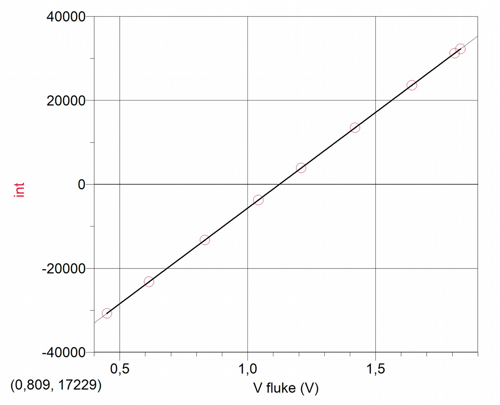
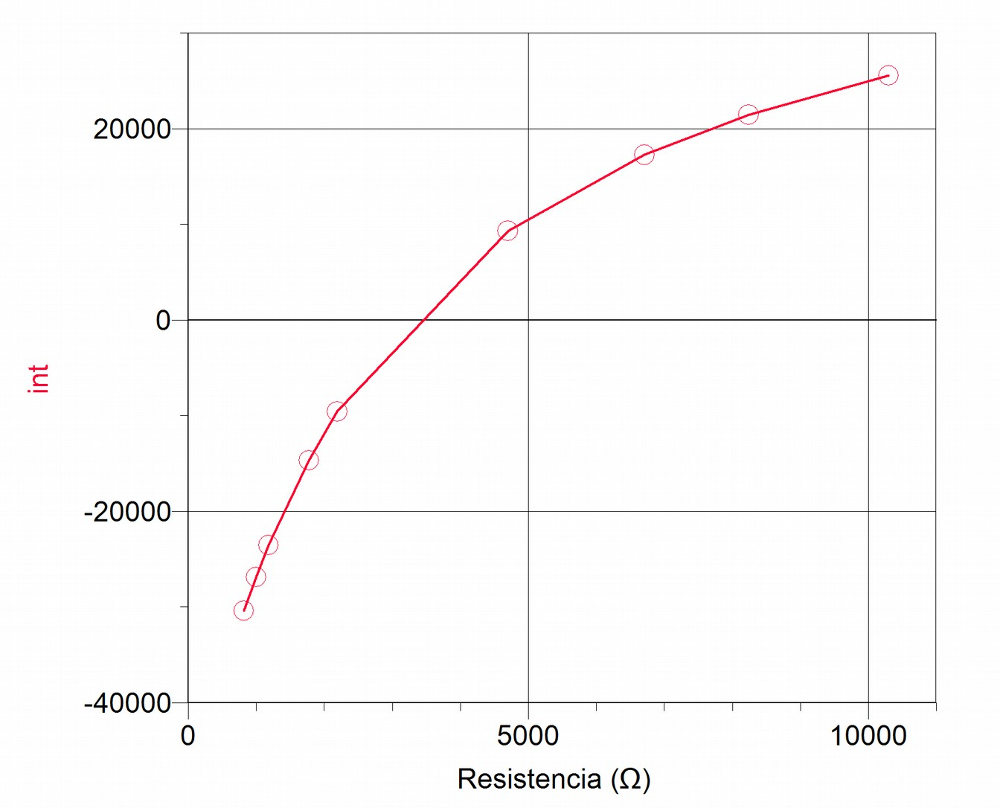
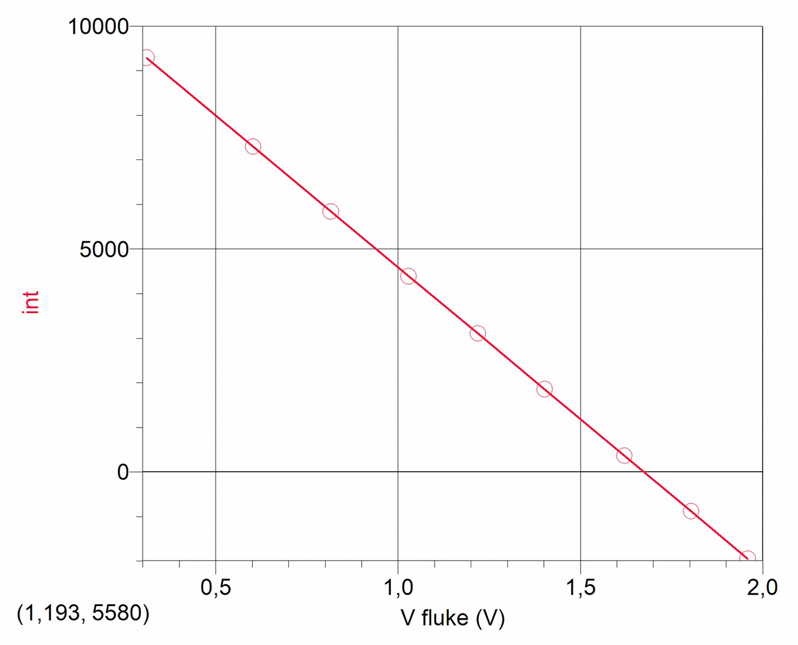
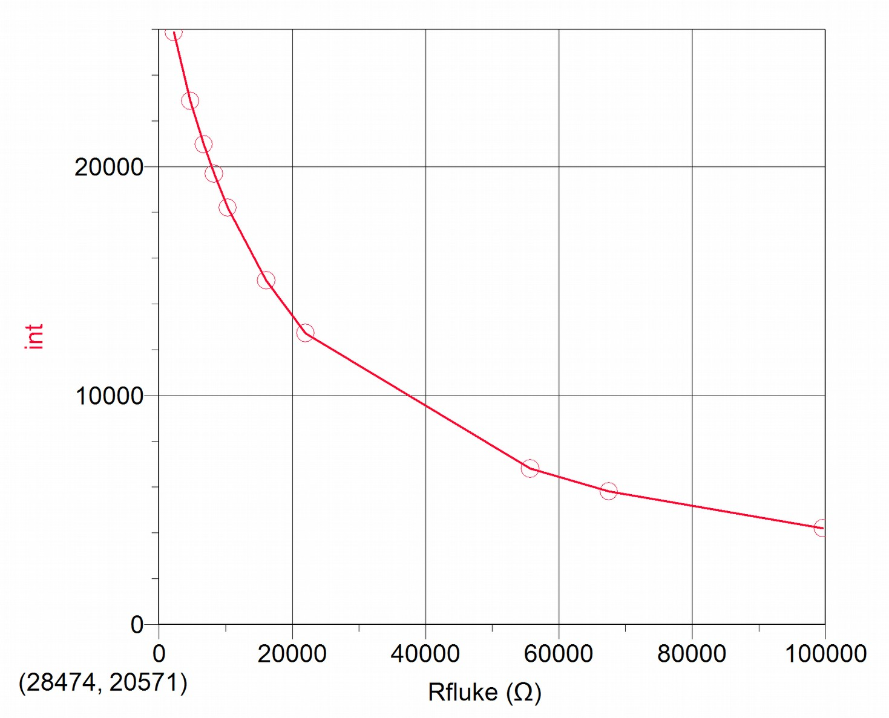

# 8. Analog to Digital conversion: Voltage and Resistance as integers in XO1 and XO1.5

The Measure Activity displays an oscillogram of the detected signal from the built-in microphone of the XO or an external one connected to the microphone input socket. Beyond this, its initial versions also displayed qualitative information onscreen relative to the readings from sensors connected to the netbook by means of a horizontal bar that was vertically displaced with changes in the signal. Starting with version 31, it was possible to read from the bottom part of the screen the integer value product of the AD conversion:

    Sensors, DC (connect sensor to pink 'Mic In' on left side of XO)
    Bias/Offset Disabled - Volts (-32768)

Current versions of this Activity return the integer value converted to Voltage or Resistance values that is being measured (the picture is an XO1.5 measuring on dual channel with version 36):

    Voltage sensor (connect sensor to pink 'Mic In' on left side of XO)
    Voltage - Volts (1.698) (1.693)

    Resistive sensor (connect sensor to pink 'Mic In' on left side of XO)
    Resistance - Ohms (420000000) (126730050)

By using the versions of Measure that we have referenced, we were able to obtain the A-D conversion to Voltage/integer and Resistance/integer that are shown below (going forward we will abbreviate *integer* into *int* when referring to an integer value).

## Procedure

In order to achieve the goal set you must make a decision with regard to the **tester** that we'll use as reference pattern with respect to which we'll contrast measurements taken by using the XO. This measuring instrument must meet the condition to be of the highest quality possible be in optimum operating conditions and have been calibrated within the maximum time period set by the manufacturer. Before beginning to measure, the operator will have to verify that he is working within the parameters established by the manufacturer in order to consider the values obtained reliable.

In our case, we had two measuring instruments that were judged to be the most adequate:

1. A digital multimeter (tester) of the FLUKE® brand, TRUE RMS MULTIMETER, model 87 (FLUKE 87)
2. LabQuest Mini data acquisition interface and the corresponding sensors, of the Vernier brand (VERNIER LQM)

Both instruments belonging to the Physics Laboratory of Liceo Solymar N°1 (Ciudad de la Costa, Canelones). The latter was connected to a **Magalhães** Laptop model **MG10T** (distributed by Plan Ceibal to Secondary School students of Canelones). The software that was used to control the interface is called "Logger Pro for Linux Public Beta" which can be downloaded at no cost from the interface provider (VERNIER LPL).

The mentioned instruments were used within the conditions indicated by the manufacturer to take measurements. For example, for the multimeter they read: Operating Temperature: -20°C to 55°C and Relative Humidity between 0% and 90% (0 at 35°C). No correction of temperature coefficient was applied, because it was considered that other sources would be more significant in determining the precision and accuracy of measurements obtained with the XO.

NOTE: in the following graphs, the points are united by straight lines only in order to make a clear visualization of the tendency that the distribution follows. In any case this representation is wrong from a Physics point of view.

## XO1: A-D conversion Voltage/integer

|V(V)|int|
|----|---|
|0,45|-30757|
|0,615|-23220|
|0,833|-13252|
|1,042|-3761|
|1,209|3874|
|1,42|13484|
|1,642|23561|
|1,809|31208|
|1,832|32249|

## XO1: A-D conversion Resistance/integer

|R(Ω)|int
|---|---
|818|-30385
|997|-26856
|1180|-23534
|1771|-14660
|2190|-9577
|4700|9286
|6710|17256
|8240|21457
|10300|25547

## XO1.5: A-D conversion Voltage/integer

|V(V)|int
|---|---
|0,31|9291
|0,603|7295
|0,816|5840
|1,029|4388
|1,219|3105
|1,402|1854
|1,621|363
|1,804|-883
|1,959|-1947

## XO1.5: A-D conversion Resistance/integer

|R(Ω)|int
|---|---
|2190|25874
|4700|22870
|6710|20963
|8240|19679
|10300|18202
|16090|15020
|22000|12727
|55700|6808
|67500|5822
|99600|4210

## Analysis of the A-D conversion curves obtained

Starting from the obtained results it can be observed that the Voltage/integer conversion follows a linear function (y=ax+b), therefore the procedure for calibrating  will involve only determining values for **a** and **b** for the linear function and their validity ranges. On the contrary, the conversion Resistance/integer displays a non-linear link, implying a greater complexity since in order to obtain the resistance value that we're looking for, we must in the first place choose the best function that links the variables in order to determine the parameters that define it and find their range of validity. Based on this, we expect a lower precision in determining the resistance values measured by the XO, because of the larger amount of processing involved from the original integer to the final value obtained; we'll analyze this further ahead. 
