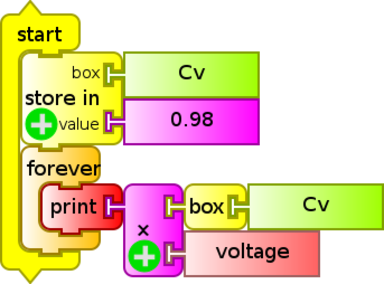
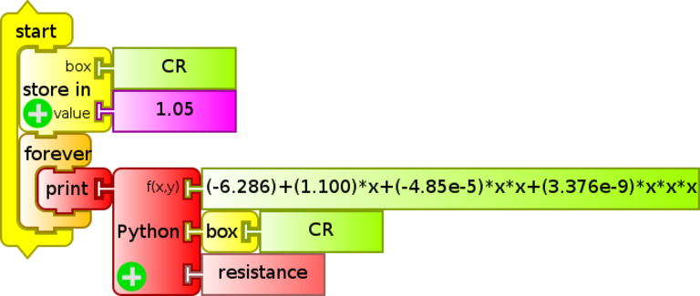

# 9. Accuracy and Precision of the Analog to Digital conversion (XO1, XO1.5, XO1.75)

## Accuracy:

Accuracy is the level of calibration of the measuring instrument to be analyzed. This value appears by comparing the results of measurements obtained with the same in respect to those obtained by using a second measuring instrument that is chosen as reference or standard.

In general it is recommended to check this periodically; for this an instrument is required that will serve as standard such as a high quality digital tester that has been calibrated as directed by the manufacturer. (For example, in our case, among others, we used a Fluke tester model 87 which must be calibrated "...once a year to make sure that it is working in accordance to its specifications." as explained by its "Instructions Manual Fluke 87 TRUE RMS MULTIMETER", PN 834200, December 1988, Rev. 1. 3/93,  © 1993 John Fluke Mfg Co., Inc, Litho in U.S.A.)

## Precision:

In an ADC the precision of conversion depends on its resolution or number of bits ($$ n $$) and the *linearity* of the effected conversion. Other factors such as signal displacement $$b$$ (offset) also affect precision. The original analog signal that we'll call $$A$$ is converted into a given digital signal $$D$$ by the following expression: $$\displaystyle D = int[(\frac{2^{n}}{FS}) \cdot A+b] $$ being $$FS$$ (Full Scale) the maximum input voltage, and $$int[...]$$ the integer part of the expression between square brackets.

For example, the AD conversor integrated to the sound board of the XO1 (Analog Devices 1888) has a 16bit resolution, and a maximum input voltage of 1.85 V (approx) therefore we are able to resolve the value in a series of $$ 2^{16} = 65536 $$ steps of digitization.

In an ideal AD conversion, the function $$ D= f(A) $$ represents the direct proportionality. That is, the graph shows a straight line with the ordinal origin zero. In the real case, the measure of separation with respect to this ideal behavior is measured by the *linearity* of the conversion. Measured deviations will limit the *precision* in the conversion done. Even with high resolution ($$n$$), if the AD conversion is strongly non-linear, precision will be low.

Source: Gil & Rodriguez (2001)

## 9.1 Accuracy and precision of measurements with XO1.

### Note

The results shown below refer to measures taken with an XO1, SKU5, model known as XO1 (CL1A) distributed by Plan Ceibal among students of public primary school when it first began. Beginning the month of June of 2012, an upgrade program was completed and students in 5th and 6th grade of Primary School got an XO1.75 in exchange for the old model.

### Accuracy and precision in measuring Voltage with XO1

Although the subject will be developed in detail in the following chapters, it may be intuitive to recognize that the following code written with the programming blocks of the TurtleBlocks (TB) Activity allows us to read the voltage from the external microphone input:

In order for the display of the value to become clear, text may be combined at the "print" block by using the "addition" block, since it admits alphanumerical variables (text and numeric values); the program then could be as follows (`monitor de voltaje.ta`):

Now that we know how to show measured values on-screen, the question that we'll attempt to answer is: What is the precision and accuracy of the XO measuring as a voltmeter? The answer involves a series of aspects to take into account:

#### Appreciation:

We may determine the appreciation of the XO as a voltmeter by using the programming shown above: the voltages are displayed on-screen to a hundredth of a Volt, therefore the **appreciation** is **0.01 V**.

#### Accuracy:

While it is true (as will be discussed further ahead) that there is no data dispersion in the order of a hundredth of a Volt, the values measured by the XO and the reference instruments independently or simultaneously usually don't coincide, therefore we must determine the accuracy of the obtained results, by calculating the calibration level of the XO1 as voltmeter; this can be done by analyzing the graph $$ V _ {\text{ref}} = f(V _ {\text{xo1}}) $$. The reference voltage $$V _ {\text{ref}}$$ in this case was measured with the LQ mini interface.

Having plotted the values, two adjustments are included to the data set: for one part the linear adjustment $$(y=mx+b)$$ and for the other the proportional $$(y=ax)$$; the first of them shows a **correlation coefficient ("Correlation")=1**, this implies that the data adjusts itself to the linear function optimally. In favor of simplicity, and observing an ordinal at the origin of relative negligible value, we prefer to apply the proportional adjustment (instead of the referred linear) to link the volt measurements to one another.

While linear adjustment is satisfactory and practically coincident with proportional adjustment, the proportionality coefficient $$A$$ is not one, therefore measurements are not accurate. To recover accuracy we need to use this factor that we may call (in this case) *accuracy coefficient in voltage measurements*, and that we may abbreviate as $$C _ v$$. In the case shown, the value is **0.9788**,  for this reason every volt measurement must be corrected with the following expression:

$$
V _ \text{corrected} = C _ v \cdot \text{Voltage}
$$

In this case, it is:

$$
V _ \text{corrected} = (0.9788) \cdot \text {Voltage}
$$

"Voltage" being the value measured directly by the XO1.

Following are two ways to recover accuracy in volt measurements:

1. one of them (`cv product.ta`) by using the `product` block:
   
2. (`cv Python.ta`) with the `Python` block that allows to include mathematical formulas and commands in the Python language (the variable "box" was included in order to modify the variable value within the program "`save in` `box` `Cv` `value` `0.9788`"):
   

This coefficient depends on each particular XO we are working with, so we must determine it for each of them. To know the dispersion level for *accuracy coefficients in voltage measurements*, 9 different XO1 laptops were used to measure the same voltage, which was later compared with the reference instrument ($$V _ \text{ref} = 1.529 V$$).

We graph $$C _ v$$ for each XO1 as a function of $$N$$, an ordinal arbitrary number that identifies each of the netbooks used:

It can be deduced that according to our measurements, the values obtained for $$C _ v$$ do not differ more than 4% (XO1 ordinal $$N=6$$) with respect to the reference so it is worth to introduce this correction only in applications that require it (where accuracy in voltage reading is fundamental).

#### Precision:

##### Precision associated with statistical dispersion of measurements:

Now we must determine what level of statistical dispersion exists when measuring the same voltage repeatedly. We calculate the average of the series $$V _ \text{average}$$, the standard deviation for the measure $$ \sigma _ s $$ and from it the standard deviation for the average, $$ \sigma _ \text{est} $$ (the parameter that allows to determine the dispersion of measurements with respect to their average value), and $$ N _ \text{op} $$, the optimal number of measurements to make.

Summary[^6]:

[^6]: This summary is based in the following references: Roederer (1980), Maiztegui & Gleisner (1980), Gil & Rodríguez (2001), Díaz & Pecard (1970), Maiztegui et al (1987(, Chemuschi & Greco (1970).

(we summarize the expressions that were used when doing calculations)

Given a series of $$ N $$ values $$ x _ i $$ (resulting from performing measurements of the same physical magnitude under identical conditions), we calculate the arithmetical average $$ \overline{x} $$ with:
 
$$
\overline{x} = \displaystyle \frac { \displaystyle \sum _ {i=1} ^ {N} x _ i } {N}
$$ 

We define the deviation εi of each measurement xi with respect to an average as

$$
\displaystyle \varepsilon _ i = x _ i - \overline{x}
$$

Supposing that the series of measurements shows a normal distribution, it makes sense to calculate the standard deviation for each measurement:

$$
\sigma _ s = \sqrt{ \displaystyle \frac { \displaystyle \sum _ {i=1}^{N} \displaystyle \varepsilon _ i ^ 2 } { (N - 1) } }
$$

For $$ N \to \infty $$ and the above conditions, 68% of values will be found within the interval: $$ X \pm \sigma _ s $$

Nevertheless the uncertainty associated with dispersion is determined starting from a previous value, calculating standard deviation from the average with the expression:

$$
\sigma _ \text{est} = \frac{ \sigma _ s }{ \sqrt {N} }
$$

Once nominal uncertainty σnom is determined in association with a measurement (which can be considered, in a simplified form and under certain conditions, to be equal to the appreciation of the utilized measuring instrument), we will be able to calculate the optimal number $$ N _ {op} $$ of measurements to make. The criteria used here is to make enough measurement until the condition σest~=σnom allows to obtain the following expression:

$$
N _ \text{op} = \left[ \displaystyle \frac { \sigma _ s } { \sigma _ \text{nom} } \right] ^ {2} +1
$$

The combined uncertainty can be obtained with:

$$
\delta x = \sqrt {\sigma _ \text {nom} ^2 + \sigma _ \text {est} ^2}
$$

To reach our goal, we will compare the measurements from measuring a given voltage with the reference tester Fluke 87, the AD LQ mini (Vernier), and the XO. For this the TurtleBlocks Activity will be used to program the reading of 50 consecutive voltage readings, averaging them and showing the result on screen.

The program is as follows: 

   

This program (`Vpromedio.ta`) is executed 30 times for the same voltage, then calculates the standard deviation σs for the set of measurement if there are differences from each other.

The values resulting from the procedure show that there is no dispersion in the order of a hundredth of a volt, so that value will be taken as the uncertainty associated to the precision for statistical dispersion and appreciation combined.

##### Precision associated with linearity

##### Calculation of the dispersion level in measurements of Voltage with respect to proportional adjustment (once the XO1 has been calibrated)

Once the calibration level has been recovered by means of the introduction of the $$C _ v$$ coefficient, we must calculate how far apart the (corrected) voltages measured by the XO1 are from the proportional adjustment. For this we have calculated the relative percent deviations of voltages with respect to the proportional adjustment. The results are summarized in the following graph, where the relative percentual $$ \varepsilon _ r \% $$ is observed as a function of the reference voltage Vref (in this case it was measured with the LQ mini interface):

It can be concluded that the set of values maintains a low percentual dispersion with respect to the applied adjustment, that don't exceed 1.5%.

### Conclusions

1. When used as a Voltmeter directly, measurements can be made that may differ in accuracy up to 4% with respect to a reference instrument.

    In order to obtain more accurate results, before you begin measurements, and for each XO in particular, the accuracy coefficient $$C _ v$$ will need to be calculated. This factor must multiply the `voltage` sensor block each time that it is used.

2. The uncertainty of the XO1 as voltmeter is:

$$
\pm (0.01V +1.5\% \text{of the value displayed on-screen})
$$

#### Input impedance of the XO1 as voltmeter

An ideal measuring device would be capable of obtaining a measurement for the system being studied without taking energy from it, that is, without interacting. Such a measuring device does not exist. Real measuring devices are constructed in such a way as to obtain a measurement from the minimum interaction with the system being measured.

In the particular case of voltmeters, this condition would be met if their input impedance was infinite. The reference tester that we used has (according to the manufacturer) an input impedance of 10MΩ. The data relative to the XO1 indicate that its input impedance is in the order of 150 kΩ.

## Accuracy and precision of resistance measurements with XO1

The reading of ohmic resistance connected to the external microphone input is done in a similar way as the reading of voltages (`monitor de resistencia.ta`), substituting the `voltage` sensor block for the `resistance` sensor block:

Now that we know how to show the mean resistance on-screen, the question becomes: What is the precision of the XO as an ohmmeter? The answer involves a number of aspects to consider:

### Appreciation

We can determine the appreciation of the XO1 as ohmmeter by using the program described above: The resistance is shown on screen up to a hundredth of ohm, therefore the **appreciation is 0.01 Ω**. Nevertheless, (as can be observed by running the program), the digit that corresponds to this decimal order (and many times the preceding two) are constantly varying, for this reason determining the absolute uncertainty in these measurements depends on factors that must be quantified in detail.

### Accuracy

The measured resistance values for the XO and the reference instrument (FLUKE 87 tester) generally don't coincide, indicating a need for correcting the calibration (accuracy) of the XO1 as ohmmeter, which can be achieved by analyzing the graph $$R _ \text{ref} = f( R _ \text{xo1} )$$.

A non-linear relationship between the graphed variables is clearly observable, which becomes explicit when performing proportional adjustment; from it one may obtain the *accuracy coeficient for resistance measurements*, a correction factor that we will call $$C _ r$$ (in the example case the value is **1.050**). Every measurement of resistance must be corrected by means of the following expression:

$$
R _ \text{xo1} \text {corrected} = C _ r \cdot R _ \text{xo1}
$$

In this case:

$$
R _ \text{xo1} \text {corrected} = (1.050) \cdot R _ \text{xo1}
$$

with $$R _ \text {xo1}$$ being the measurement directly performed by the XO1.

The following graph presents the variables $$ R _ \text{fluke}$$ and $$R _ \text{xo1}$$ (corrected by the $$C _ r$$ coeficient), joined by an adjustment of a third degree polynomial:

Depending on the level of accuracy of resistance measurements one wishes to operate under, either one of the procedures might be chosen in order to retrieve the accuracy resistance measurements:

#### First level:

Measurements of resistance may be corrected by means of the $$C _ r$$ coefficient by multiplying it as a factor of the `resistance` block each time it is used; the following example (`cr Python.ta`) demonstrates it:

#### Second level:

When looking for greater accuracy and precision, a cubic adjustment may be applied (instead of the previous one), as shown by the following code (`CR Python cúbico.ta`):

This $$C _ r$$ coefficient depends on each particular XO we are using, so it should be determined for each of them. The following graph displays the result of measuring resistance with 9 different XO1; we have graphed $$ R _ \text{xo1} = f ( R _ \text{ref} )$$ (inverting the axes order to be able to observe the general tendency in the same graph), switching the axis magnitudes, with respect to the previous graph:

Measured resistances for different XO1 are not precisely corrected so that the differences in levels of calibration between them are observable, as well as the non-linear tendency which all of them share. Nevertheless, once the correction has been made, the user will be able to verify that the curve $$R _ \text{ref} = f ( R _ \text{xo1} )$$ intersects the straight line of proportional adjustment at the 11000 ohm value, for this reason a practical method for calculating the $$C _ r$$ factor might be extracted: a resistance of this value might be connected (for example by combining resistors with 1% tolerance for example) to the XO1 and then calculating the coefficient with:

$$
C _ r = 11000 \Omega / R _ \text{xo1 11k} 
$$

with denominator being the value as displayed by the `resistance` sensor of the particular XO1 when running the program previously seen.

To determine the level of dispersion of **Cr** coefficients, following is a graph of the $$C _ r$$ value for each XO1 as a function of $$N$$, an arbitrary ordinal number that identifies each of the used netbooks:

It may be deduced according to our measurements that the values of **Cr** obtained involve calibration differences that don't surpass 3% (N=6) of the reference value, so it will only be worth to introduce this correction for applications that merit it.

### Precision

### Precision associated with linearity:

#### a. Calculating the level of dispersion in measurements of Resistance with respect to proportional adjustment (once the XO1 is calibrated)

Once the level of calibration is retrieved by means of the introduction of the $$C _ r$$ coefficient, we must calculate how far apart from proportional adjustment are the (corrected) resistance values as measured by the XO1. For this we have calculated the relative percentage of deviation of the resistance values with respect to proportional adjustment. The results are summarized in the following graph:

For the measured values, a standard deviation in the order of 5% is calculated, which can be considered as a measure of the non-linearity of the $$ R _ \text {ref} = f( R _ \text{xo1}) $$ function.

#### b. Calculating the level of dispersion in measurements of Resistance with respect to cubic adjustment (once the XO1 is calibrated)

Once the calibration level has been retrieved by means of the introduction of the $$ C _ r$$ coefficient, and having performed the adjustment by a 3-degree polynomial, we must calculate how far the (corrected) resistance values measured with the XO1 are from the mentioned adjustment. The results are summarized in the following graph:

In this case, a standard deviation of less than 2% is calculated for measured values, which is clearly an improvement from the proportional adjustment previously mentioned.

### Precision associated with statistical dispersion of measurements

We shall determine what level of statistical dispersion exists when measuring the same resistance multiple times. For doing this, we solder to an audio cable (to be connected to the external microphone socket), a resistor of known resistance, that is within the measurement range of the XO1, and wait sufficient time for the set to reach ambient temperature. This must be done because resistance will depend on temperature and otherwise the risk is taken of assuming that a single resistance value is being measured when in reality it would be a value that is varying.

Next, we will compare the measurements that result from measuring the resistance with a FLUKE 87 tester and the XO. We will use the TurtleBlocks Activity, where we will program (`R promedio.ta`) the reading of 50 consecutive resistance measurements, for which we will calculate an average to be displayed on-screen:

The procedure is repeated for five resistors of resistances within the measurement range of the XO1 (700 to 14000 ohm approximately), chosen to sweep the range uniformly in order to detect local non-linearities.

We will calculate the average for each series, the standard deviation of each measurement $$ \sigma _ s$$ and from it, the standard deviation of the average $$\sigma _ \text{est}$$, and the optimal number $$N _ \text{op}$$.

The program is similar to the one previously shown to perform repeated voltage measurements, but substitutes the `voltage` sensor block with the `resistance` block, and the text blocks `average voltage=` and `V`(unit) for the corresponding `average resistance=` and `ohm` (unit).

The program is run 30 times for each resistance value. This series is input into *Logger Pro* for processing, the standard deviation for each $$ \sigma _ s $$ measurement is calculated; the results are shown in the following graph:

We are interested in analysing the level of statistical dispersion of the resistance values measured by the XO1, which can be summarized as in the following table:

|$$R _ \text{fluke} (\Omega)$$|$$\text{average} R _ \text{xo1} (\Omega)$$|$$\sigma _ s$$|$$\sigma _ \text{est}$$|$$N _ \text{op}$$
|---------|----------------|---|----|---
|818      |780.8           |0.02406|0,004393|7
|2188     |2024            |0.06454|0,01178 |43
|4.72x10^3|4820            |0.3641 |0,06647 |1327
|6.71x10^3|6929            |0.2965 |0,05413 |880
|10300    |1.014x10^4      |0.7629 |0,1393  |5821

It can be observed that the level of dispersion is such that it is not practical to measure with appreciation equal to a hundredth of Ohm (it's not practical to measure 5821 times). This happens because we are at conditions where $$\sigma _ \text{est} > \sigma _ \text{nom}$$ is true, where the statistical dispersion is more important than nominal uncertainties.

In reality, we have to define the value of appreciation considering a practical criterion in such a way that a reasonable measurement can be obtained by measuring only once. For this we will calculate the value to be used in the appreciation (considered equal to $$ \sigma `_ \text{nom} $$ such that the $$N _ \text{op}$$ is lower than 1.5. Accordingly and by using the expression $$ N _ \text{op} = [\sigma _ s / \sigma _ \text{nom}]^2 + 1$$, it may be deduced that measuring resistances with an appreciation of **1Ω**, allows us to reach our target.

## Conclusions:

1. If using the XO1 directly as ohmmeter, we will get measurements that differ in precision up to a distance of 3% with respect to the reference instrument.

    The function $$R _ \text{ref} = f( R _ \text{xo1} )$$ that links both variables presents a non linearity that allows the definition of two precedures for recovering calibration and determining the level of precision of resistance measurements:

    1. Calculating the precision coefficient in resistance measurements $$C _ r$$ and use it as an adjustment factor, or
    2. Construct a polynomial regression of third degree for attaining superior accuracy and precision.

1. Once the calibration has been corrected with "procedure 1", the combined uncertainty of XO1 as ohmmeter can be calculated as:

$$
\pm (1 \Omega + 5\% \text{ of the value read on screen})
$$

**Note:**

A practical option for working with these concepts quickly when calibrating sensors such as temperature or illumination (lighting), is the following:
    If a Temperature/Resistance or Illumination/Resistance calibration curve is constructed, the inaccuracy and imprecision remain hidden within the curve adjustment parameters applied when calibrating the sensor. This has the advantage of simpifying treatment of these concepts and the disadvantage that these parameters are good only for the particular XO1 being used.

## 9.2 Accuracy and precision of measurements with XO1.5.

### Note 1:

The following results are from measurements taken with XO1.5, SKU 121. This corresponds to the model CL1C known as XO1.5HS, distributed by Plan Ceibal among students of basic cycle of Secondary Public School (*liceo*) when the first replacement plan was implemented and students could exchange their XO1 for this model. Students in the Canelones region got the JP S.A. Couto Magalhães MG10T model instead (known as Magallanes MG2).

### Note 2:

Starting with XO1.5, these netbooks include a stereo external microphone socket, so it is possible to measure two voltages (`voltage` and `voltage2`) or two resistances (`resistance` and `resistance2`) at the same time; these are known (for its relation with measurements from a double channel oscilloscope or audio work) as measurements from the left channel CHL (for the English abbreviation), and right channel CHR.

## Accuracy and precision in measuring Voltage with XO1.5

### Appreciation

The voltages are shown on-screen up to a hundredth of a Volt, therefore the **appreciation** is **0.01 V**.

### Accuracy

Although in this case there isn't data dispersion in the order of a hundredth of a Volt, the values measured by the XO and the reference instruments independently or simultaneously usually don't coincide, therefore we must determine the accuracy of the obtained results, by calculating the calibration level of the XO1.5 as voltmeter; this can be done by analyzing the graph $$V _ \text{ref} = f ( V _ \text{xo1.5} )$$. The reference voltage $$ V _ \text{ref} $$ in this case was measured with the FLUKE 87 tester.  The value name $$ V _ \text{xo1.5} $$ is the voltage measured by the XO on the left channel:

Having plotted the values, two adjustments are included to the data set: for one part the linear adjustment $$(y=mx+b)$$ and for the other the proportional $$(y=ax)$$; the first of them shows a **correlation coefficient ("Correlation")=1**, this implies that the data adjusts itself to the linear function optimally. In favor of simplicity, and observing an ordinal at the origin of relatively negligible value, we prefer to apply the proportional adjustment (instead of the referred linear) to link the volt measurements to one another.

While linear adjustment is satisfactory and practically coincident with proportional adjustment $$(y=Ax)$$, the proportionality coefficient $$A$$ is not one, therefore measurements are not accurate. To recover accuracy we need to use this factor that we may call (in this case) *accuracy coefficient in voltage measurements*, and that we may abbreviate as $$C _ v$$. Therefore, every volt measurement must be corrected with the following expression:

$$
V _ \text{corrected} = C _ v \cdot \text{Voltage}
$$

In our case, since $$A = 0.999$$, it's not justified to perform any correction.

#### Relative accuracy: Volt measurements with double channel

We have to compare the relative calibration level between measurements obtained in both channels: supposedly both handle the same accuracy level, but our measurements don't confirm this, as the following graphs show:

The first graph shows a proportional adjustment with coefficient $$ A=0.9955 $$, which might suggest accordance between measurements; however the second graph shows that values can differ up to 2% $$(V _ \text{chl} = 0.51V)$$.

### Precision

#### Precision associated with linearity

#### Calculating the level of dispersion in Volt measurements with respect to proportional adjustment (once the XO1.5 has been calibrated)

Results are summarized in the following graph where we represent relative deviation percentage εr% as a function of $$ V _ \text{fluke} $$, the reference voltage:

It can be observed that the set of values hold a low dispersion percentage with respect to the adjustment for voltages beyond 0.50 V (less than 1%), however these deviations can be much higher for lower values (3.74% for 0.19V). The standard deviation for the 10 values displayed is in the order of 1.3%.

### Conclusions

1. If the XO1.5 is used directly as voltmeter, measurements ca be made that may differ in accuracy with respect to the reference instrument. In order to obtain more accurate results, an accuracy coefficient for voltage measurements $$ C _ v $$ needs to be calculated before commencing measurements, for each XO in particular. A coefficient needs to be calculated for each channel (CHL and CHR), since they may not coincide.

   This factor needs to be multiplied to the `voltage` (CHL) and `voltage2` (CHR) sensor block each time it is used.

2. The uncertainty of the XO1.5 as a voltmeter is:

$$
\pm (0.01V + 2\% \text{ of the value displayed on-screen})
$$

#### Input impedance of the XO1.5 as voltmeter

The data relative to the XO1.5 indicate its input impedance is in the order of 15 kΩ. This value, 10 times lower than the XO1, should be taken into account when evaluating the use of this netbook as voltmeter.

## Accuracy and precision of Resistance measurements with XO1.5

### Appreciation

The resistance is shown on screen up to a hundredth of ohm, therefore the **appreciation is 0.01 Ω**. Nevertheless, (as can be observed by running the program), the digit that corresponds to this decimal order (and many times the preceding two) are constantly varying, for this reason determining the absolute uncertainty in these measurements depends on factors that must be quantified in detail.

### Accuracy

The measured resistance values for the XO and the reference instrument (FLUKE 87 tester) generally don't coincide, indicating a need for correcting the calibration (accuracy) of the XO1.5 as ohmmeter, which can be achieved by analyzing the graph $$R _ \text{ref} = f ( R _ \text{xo1.5} )$$.

Having plotted the values, two adjustments are included to the data set: for one part the linear adjustment $$(y=mx+b)$$ and for the other the proportional $$(y=ax)$$; the first of them shows a **correlation coefficient ("Correlation")=1**, this implies that the data adjusts itself to the linear function optimally. In favor of simplicity, and observing an ordinal at the origin of relative negligible value, we prefer to apply the proportional adjustment (instead of the referred linear) to link the resistance measurements to one another.

While linear adjustment is satisfactory and practically coincident with proportional adjustment $$(y=Ax)$$, the proportionality coefficient $$A$$ is not one, therefore measurements are not accurate. To recover accuracy we need to calculate the *accuracy coefficient in resistance measurements*, that we will call $$C _ r$$ (in this example, the value is **1.153**). Every resistance measurement must be corrected using the following expression:

$$
R _ \text{xo1.5} \text{ corrected} = C _ r * R _ \text{xo1.5}
$$

In our example:

$$
R _ \text{xo1.5} \text{ corrected} = (1.153) * R _ \text{xo1.5}
$$

where $$ R _ \text{xo1.5} $$ is the value directly obtained by the XO1.5's CHL.

### Relative accuracy: Resistance measurements in double channel

We have to compare the relative calibration level between measurements obtained in both channels: supposedly both handle the same accuracy level, but our measurements don't confirm this, as the following graphs show:

### Precision

#### Precision associated with linearity

#### Calculating the level of dispersion in resistance measurements with respect to proportional adjustment (once the XO1.5 has been calibrated)

Once the calibration level has been recovered by means of the introduction of the $$ C _ r $$ coefficient, we must calculate how far apart the (corrected) resistance values measured by the XO1.5 are from the proportional adjustment. For this we have calculated the relative percent deviations of resistance values with respect to the proportional adjustment. The results are summarized in the following graph:

Even though it is observed that for all 9 values measured the standard deviation is in the order of 6%, for resistances beyond $$ R _ \text{chl} = 15000 \Omega $$, deviations are in the vicinity of 13%.

### Precision associated with statistical dispersion of measurements:

We will determine what level of statistical dispersion exists when measuring the same resistance repeatedly. To achieve this, we solder to an audio cable (to be connected to the external microphone socket), and a resistor of known resistance, that is within the measurement range of the XO1.5, and wait sufficient time for the set to reach ambient temperature. This must be done because resistance will depend on temperature and otherwise the risk is taken of assuming that a single resistance value is being measured when in reality it would be a value that is varying.

Next, we will compare the measurements that result from measuring the resistance with a FLUKE 87 tester and the XO. We will use the TurtleBlocks Activity, where we will program the reading of 50 consecutive resistance measurements, for which we will calculate an average to be displayed on-screen.

The procedure is repeated for 6 resistors of resistances within the measurement range of the XO1.5 (2600 Ω to 420 MΩ approximately), chosen to sweep the range uniformly in order to detect local non-linearities.

We will calculate the average for each series, the standard deviation of each measurement **σs** and from it, the standard deviation of the average $$\sigma _ \text{est}$$, and the optimal number $$N _ \text{op}$$.

The program is similar to the one previously shown to perform repeated voltage measurements, but substitutes the `voltage` sensor block with the `resistance` block, and the text blocks `average voltage=` and `V`(unit) for the corresponding `average resistance=` and `ohm` (unit).

The program is run 30 times for each resistance value. This series is input into *Logger Pro* for processing, the standard deviation for each $$ \sigma _ s $$ measurement is calculated:

We are interested in analysing the level of statistical dispersion of the resistance values measured by the XO1.5, which can be summarized as in the following table:

|$$ R _ \text{xo1.5} \text{ average} (\Omega)$$|$$\sigma _ s$$|$$ \sigma _ \text{ est } $$|$$ N _ \text{op} $$
|--------------------|-------|-------|---
|4866                |0,3684 |0,06726|1358
|6544                |0,5418 |0.09892|2936
|9572                |0,7236 |0,1321 |5237
|14430               |1,919  |0,3503 |36827
|19530               |3,8    |0,6938 |144401
|48040               |9,649  |1,762  |931033

It can be observed that the level of dispersion is such that it is not practical to measure with appreciation equal to a hundredth of Ohm (it's not practical to measure 931033 times). This happens because we are at conditions where $$ \sigma _ \text{est} > \sigma _ \text{nom} $$ is true, where the statistical dispersion is more important than nominal uncertainties.

In reality, we have to define the value of appreciation considering a practical criterion in such a way that a reasonable measurement can be obtained by measuring only once. For this we will calculate the value to be used in the appreciation (considered equal to $$ \sigma _ \text{nom} $$) such that the $$ N _ \text{op} $$ is lower than 1.5. Accordingly and by using the expression $$ N _ \text{op} = ( \sigma _ s / \sigma _ \text{nom})^2 + 1 $$, it may be deduced that measuring resistances with an appreciation of **10Ω**, allows us to reach our target.

## Conclusions:

1. If using the XO1.5 directly as ohmmeter, we will get measurements that may differ in precision with respect to the reference instrument. In order to obtain more accurate results, before you begin measurements, and for each XO in particular, the accuracy coefficient $$ C _ r $$ will need to be calculated. A coefficient must be calculated for each channel (CHL and CHR), since they may not coincide.

This factors must multiply the `resistance` (CHL) and `resistance2` (CHR) sensor blocks each time that they are used.

2. Once corrected for calibration, the combined uncertainty of the XO1.5 as ohmmeter can be calculated as:

$$
\pm (10 \Omega + \text{ a percentage in the order of } 6 \% \text { of the value presented onscreen } )
$$

   This describes mean deviations. For measurements above $$R _ \text{chl} = 15000 \Omega$$ the deviations will be in the surroundings of 13%.

## 9.3 Accuracy and precision of measurements with XO1.75.

### Note 1:

The results shown below correspond to measurements taken with the XO1.75 in its SKU 199 variant. This refers to the model CL2A, manufactured by OLPC for developer testing. This model is similar but not identical to the one that will be distributed by Plan Ceibal among children of primary public schools (or other beneficiaries to be defined in the future). For this reason the results of this section need to be compared with new results when the new model reaches the country. No conclusions will be extracted in this section since they won't coincide with the model to be distributed in Uruguay. Since we don't have access to them for measurements, we prefer to inform only the data obtained with the model we do have.

### Note 2:

When about to be finished with this work, we were able to access an XO1.75 of the SKU206 that was distributed by Plan Ceibal among some students of the higher levels of primary school. We made test measurements with it and presented the results obtained here although not with the in-depth treatment of data of prior models.

### Note 3:

Starting with XO1.5, these netbooks include a stereo external microphone socket, so it is possible to measure two voltages (`voltage` and `voltage2`) or resistances (`resistance` and `resistance2`) at the same time; these are known (for its relation with measurements from an double channel oscilloscope or audio work) as measurements from the left channel CHL (for the English abbreviation), and right channel CHR.

## Measurement of Voltage and Resistance with XO1.75 SKU 199

### Accuracy and precision of Voltage measurements with XO1.75 SKU 199

### Input impedance of the XO1.75 SKU 199 as voltmeter

The data relative to the XO1.75 indicate that its input impedance is between 1kΩ (SKU199) and 4kΩ (SKU204) (very small value, 150 to 40 times inferior to XO1) making it a voltmeter of relative usefulness.

### Appreciation

The voltages are shown on-screen up to a hundredth of a Volt, therefore the **appreciation** is **0.01 V**.

### Accuracy

Although in this case there isn't data dispersion in the order of a hundredth of a Volt, the values measured by the XO and the reference instruments independently or simultaneously usually don't coincide, therefore we must determine the accuracy of the obtained results, by calculating the calibration level of the XO1.75 as voltmeter; this can be done by analyzing the graph $$V _ \text{ref} = f ( V _ \text{xo1} \cdot 75)$$. The reference voltage $$V _ \text{ref}$$ in this case was measured with the FLUKE 87 tester.  The value name $$V _ \text{xo1.75}$$ is the voltage measured by the XO on the left channel:

Having plotted the values, two adjustments are included to the data set: for one part the linear adjustment $$(y=mx+b)$$ and for the other the proportional $$(y=ax)$$; the first of them shows a **correlation coefficient ("Correlation")=1**, this implies that the data adjusts itself to the linear function optimally. In favor of simplicity, and observing an ordinal at the origin of relatively negligible value, we prefer to apply the proportional adjustment (instead of the referred linear) to link the volt measurements to one another.

While linear adjustment is satisfactory and practically coincident with proportional adjustment $$(y=Ax)$$, the proportionality coefficient $$A$$ is not one, therefore measurements are not accurate. To recover accuracy we need to use this factor that we may call (in this case) *accuracy coefficient in voltage measurements*, and that we may abbreviate as $$C _ v$$. In our case, it is **0.9696**, so every volt measurement must be corrected with the following expression:

$$
V _ \text{corrected} = C _ v \cdot \text{Voltage}
$$

For our case, it's:

$$
V _ \text{corrected} = (0.9696) \cdot \text{Voltage}
$$

Where **"Voltage"** is the result of measuring the CHL of the XO1.75.

#### Relative accuracy: Volt measurements with double channel

We have to compare the relative calibration level between measurements obtained in both channels: supposedly both handle the same accuracy level, however this needs to be verified by performing measurements (as was shown for XO1.5).

### Precision

#### Precision associated with linearity

#### Calculating the level of dispersion in Volt measurements with respect to proportional adjustment (once the XO1.75 SKU 199 has been calibrated)

Results are summarized in the following graph where we represent relative deviation percentage $$\varepsilon r \% $$ as a function of $$ V _ \text{fluke} $$, the reference voltage:

It can be observed that the set of values hold a dispersion percentage with respect to the applied adjustment (for the 18 presented values) that is in the order of 16%.

### Accuracy and precision of Resistance measurements with XO1.75 SKU 199

### Appreciation

The resistance is shown on screen up to a hundredth of ohm, therefore the **appreciation is 0.01 Ω**. Nevertheless, (as can be observed by running the program), the digit that corresponds to this decimal order (and many times the preceding two) are constantly varying, for this reason determining the absolute uncertainty in these measurements depends on factors that must be quantified in detail. This dispersion measurement was not done for this model of XO.

### Accuracy

The measured resistance values for the XO and the reference instrument (FLUKE 87 tester) generally don't coincide, indicating a need for correcting the calibration (accuracy) of the XO1.75 as ohmmeter, which can be achieved by analyzing the graph $$ R _ \text{ref} = f ( R _ \text{xo1.75} )$$.

Having plotted the values, two adjustments are included to the data set: for one part the linear adjustment $$(y=mx+b)$$ and for the other the proportional $$(y=ax)$$; the first of them shows a **correlation coefficient ("Correlation")=0.9998**, this implies that the data adjusts itself to the linear function (almost) optimally. In favor of simplicity, and observing an ordinal at the origin of relative negligible value, we prefer to apply the proportional adjustment (instead of the referred linear) to link the resistance measurements to one another.

While linear adjustment is satisfactory and practically coincident with proportional adjustment $$(y=Ax)$$, the proportionality coefficient $$A$$ (generally) is not one, therefore measurements are not accurate. To recover accuracy we need to calculate the *accuracy coefficient in resistance measurements*, that we will call $$C _ r$$ (in this example, the value is **1.063**). Every resistance measurement must be corrected using the following expression:

$$
R _ \text{xo1.5} \text{ corrected } = C _ r \cdot R _ \text{xo1.75}
$$

In our example:

$$
R _ \text{xo1.5} \text{ corrected } = (1.063) \cdot R _ \text{xo1.75}
$$

Where $$R _ \text{xo1.75}$$ is the value directly obtained by the XO1.75's CHL.

### Relative accuracy: Resistance measurements in double channel

We have to compare the relative calibration level between measurements obtained in both channels: supposedly both handle the same accuracy level, but this needs to be verified performing measurements (as was shown for XO1.5).

### Precision

#### Precision associated with linearity

#### Calculating the level of dispersion in resistance measurements with respect to proportional adjustment (once the XO1.75 has been calibrated)

Once the calibration level has been recovered by means of the introduction of the $$C _ r$$ coefficient, we must calculate how far apart the (corrected) resistance values measured by the XO1.75 are from the proportional adjustment. For this we have calculated the relative percent deviations of resistance values with respect to the proportional adjustment. The results are summarized in the following graph:

For the 8 values measured, the standard deviation is in the order of 3%.

## Measurement of Voltage and Resistance with XO1.75 SKU 206

### Note

We worked with an XO1.75 with build 161-A (Dextrose 3 uy), Sugar 0.94.1, only measuring with the left channel (CHL). For performing measurements, TurtleBlocks v158 had to be installed (version 160 did not work well). Measurements obtained with Measure Activity v42 do not coincide with those obtained with TB v158 (which were correct).

**It is important to highlight that at the moment of finishing this investigation we detected an important problem with this model: When the TB Activity attempts to measure voltage or resistance in one channel, it randomly obtains the readings belonging to one channel or the other; this problem makes it impossible, for the moment, to use the applications that involve these measurements. In queries made about this issue, we were informed that it is a low level error ("bug") that is being worked on.**

Primary measurements to determine impedance as voltmeter show results in the order of one kΩ.

### Voltage measurements

Voltages between -0.3 and 3.03 V where measured, obtaining the following graph (only showing values between 0 and 3.03V):

While linear adjustment is satisfactory and practically coincident with proportional adjustment $$(y=Ax)$$, the proportionality coefficient $$A$$ is not one, therefore measurements are not accurate. To recover accuracy we need to use this factor that we may call (in this case) *accuracy coefficient in voltage measurements*, and that we may abbreviate as $$C _ v$$. In our case, it is **1.011**, so every volt measurement must be corrected with the following expression:

$$
V _ \text{corrected} = C _ v \cdot \text{Voltage}
$$

For our case, it's:

$$
V _ \text{corrected} = (1.011) \cdot \text{Voltage}
$$

Where **"Voltage"** is the result of measuring the CHL of the XO1.75.

Having recovered precision, data dispersion with respect to proportional adjustment was studied; large deviations can be observed for smaller voltage values, with a standard deviation of dispersion in the order of 6%:

### Resistance measurements

Resistors of different resistances (between 820Ω and 100kΩ were connected to the audio cable by means of alligator clips (in this case no soldering was done, in contrast with previous cases). Measurements obtained with TB were compared with resistance values given by the manufacturer.

To recover accuracy we need to calculate the *accuracy coefficient in resistance measurements*, that we will call $$C _ r$$. Every resistance measurement must be corrected using the following expression:

$$
R _ \text{xo1.5} \text{corrected} = C _ r \cdot R _ \text{xo1.75}
$$

In our example:

$$
R _ \text{xo1.5} \text{corrected} = (0.9170) \cdot R _ \text{xo1.75}
$$

Where $$R _ \text{xo1.75}$$ is the value directly obtained by the XO1.75's CHL.

Having recovered precision, data dispersion with respect to proportional adjustment was studied; large deviations can be observed for smaller resistance values, with a standard deviation of dispersion in the order of 5%:

