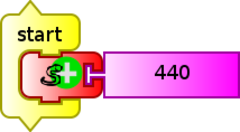

# 10. Digital to Analog conversion

## 10.1 Synthesis of sound on XO1

## Pippy Sugar Activity

The XO1 can sythethize sounds by means of the digital to analog (DAC) converter integrated to its sound card. The programming of this synthesis can be done by programming Python code in the programming activity Pippy that comes included with SUGAR. The following code (Oscilador.py) may be used to program the synthesys of pure sounds of the desired frequency (in Hz), amplitude (arbitrary units), and duration (in seconds):

## Turtle Blocks Sugar Activity (TB)

It is also possible to achieve the synthesis with the TurtleBlocks Activity (v.109), with the python example "sinewave.py". The same may be loaded from the main menu:

Main Toolbar/ Save/ Load Python Block/ "sinewave.py"/ Open

When executing this example program, the speakers will emit a sound of 440 Hz of frequency (adjustable), fixed amplitude, and about 3 seconds of duration (non adjustable) corresponding to the note LA (A4).

### Frequency range for synthesized sounds

The sound card of the XO1 synthesizes sounds between 30 Hz and 5000 Hz. The synthesized sounds correspond to practically pure sinusoidal (sine) signals, although the presence of other frequencies can be detected. En general, these components have much smaller amplitudes than the main signal, but they are measurable. The following graph shows some of them and the frequencies that accompany them; measurement was done on an XO1 emitting and an XO1.5 HS detecting the sound with the Measure Activity / Sound / Baseline Frequency:

|Frequency (Hz)|Component Frequency(Hz)
|---|---
|400|-|-|-|-
|800|1200|1600|1950|-
|1000|2000|3000|4000|5000
|2000|6000|-|-|-
|3000|6000|7000|-|-
|4000|8000|-|-|-
|5000|9000|10000|-|-     

### Generated signal strength

According to technical specifications, the sound produced is emitted by the embedded speakers, which respond optimally to the range between 480 and 40kHz, fed by 1.4W each, for this reason, sounds generated between 30Hz and 480Hz will not sound well or may not be heard at all. To hear them it would be necessary to connect amplified speakers such as can be found in any desktop PC, to the earphone plug socket (green socket, located to the left of the screen, with maximal power of 30 mW and 32 ohm impedance).

In addition, this type of device will allow us to utilize the XO as a generator of mechanical oscillations of adjustable frequency, fundamental tool in a physics laboratory: especially if it is desired to study mechanical oscillations and waves.

It is possible to achieve very acceptable results by using a low cost amplifier and speakers. The maximum power of the amplifier, its build quality and that of the speakers, as well as their accepted frequency range, will allow for the production of desired frequencies. It is worth to keep in mind that, especially when working with lower frequencies, while generally outside the range of low cost PC amplified speakers, however, they are the ones that are needed to excite the oscillating mechanical systems such as mass-spring, sheets with a fixed side, wave bucket oscillators on water surfaces, etc.

## 10.2 Sound Synthesys on XO1.5

The XO1.5 that was (initially) distributed by Plan Ceibal among secondary school students can dual boot: it can start Linux Fedora with either SUGAR or the GNOME Desktop. Following is how to synthesize pure sounds in both graphical environments:

### Sugar TurtleBlocks Activity

Just like with the XO1, the XO1.5 can synthesize sounds by utilizing the digital to analog converter (DAC) that come integrated to its sound card. Programming this synthesis is done by coding Python in the Pippy Activity development environment that is included with SUGAR (see code at "Sound Synthesis with XO1").

You can also achieve synthesis with the TurtleBlocks Activity (v.130), with the "senoidal" programming block contained in the media block palette.

By executing this example program, a sound with frequency of 440 Hz (adjustable) is produced by the speakers, with 5000ua (arbitrary units, adjustable), and one second of duration (adjustable), corresponding to note LA (A4).

### Frequency range of synthesized sounds

The sound card of the XO1.5 synthesizes sounds of frequencies comprised between **0.1 Hz** and **7999** Hz. Generated sounds correspond to practically pure sinusoidal signals up to 5000Hz. While the presence of other components can be detected, these components grow in amplitude in frequencies between 5000 and 7999 Hz, until they emit a sound with oscillating amplitude (known as *beat*) when reaching the latter value.

The following graph shows the record of Amplitude=f (frequency), obtained with the Measure Activity, Sound, Baseline frequency, for the emission of 7500 Hz, that we see is accompanied by another of frequency 8500 Hz of comparable amplitude:

The following table shows some of the synthesized frequencies and the frequencies of components that accompany them; the measurement was done with an XO1.5 producing sound, and an XO1 detecting sound with the *Measure Activity*, *Sound*, *Baseline frequency*:

|Frequency (Hz)|Frecuencia de componente (Hz)
|---|---
|1000|2000|5000|-|-
|2000|14000|-|-|-
|3000|13000|-|-|-
|4000|12000|-|-|-
|5000|11000|-|-|-
|6000|10000|-|-|-
|7000|9000|-|-|-
|7500|8500|-|-|-
|7999|Audible beat of about 2Hz (2 pulses per sec)

The extremely low frequency (**0.1 Hz**) that the XO1.5 can produce is remarkable. To determine the range of frequencies, a FLUKE 87 tester was used to measure down to the minimum 2 Hz. To study lower values the LabQuest mini (Vernier) interface was used to measure voltage from a speaker connected to the earphone out socket. The following chart displays measurements for V=f(t) from which we could calculate the minimum generated frequency:

The graph includes adjustment to the curve (V=f(t)) of the sinusoidal function (expected), showing a high correspondence between them.

## Strength of generated signal

(Same as XO1)

## Gnome Desktop, Audacity software

In this environment we have a powerful tool, the Audacity application (version 1.3.11-beta), a free sound editor, is open source and multi-platform. To synthesize sounds with adjustable frequency we must select in the menu bar the option Generate/Tone, and we will be shown a dialog window where we will be able to select desired values for the parameters shown:

With this software on XO1.5 we can synthesize sounds of frequencies between 1.00 Hz and 20 000.00 Hz (at least), with a resolution of 0.01 Hz [FOOTNOTE] For applications involving mechanical systems of forced oscillation, the synthesis of infrasound (sound with frequencies below 20 Hz) is particularly useful.

## 10.3 Synthesis of sound with the XO1.75

Inside each model of XO (XO1, XO1.5, XO1.75), a variety of minor differences can be found, including characteristics that the user might be interested to know. To know which model you have in your hands, you must find out the reference number called SKU (stock-keeping unit) that is found within the battery slot of the XO as shown. Once it is known, you may obtain the characteristics of your variety of OLPC SKU.

In our case we had an XO1.75 CL2A (also known as B1) SKU 199. Frequency measurements performed no this model indicate a behaviour similar to XO1.5, although they use different audio subsystems. We may consider synthesis performance as acceptable for frequencies starting at 1Hz, a higher value than the minimal obtainable frequency with XO1.5 (amazingly 0.1Hz) up to 5000 Hz, value at which higher frequency components start to appear with increasing intensity up to the higher limit of 7999 Hz where we can clearly hear a beat of 2 Hz.

Below you will find the record of synthesis of 1 Hz and its adjustment to the sinusoid function:

### Note

During measurementes we were able to verify that the XO1.75 synthesizes from about 0.5Hz but with noticeable deviations with respect to the expected sinusoidal function, so we preferred to set the minimum acceptable value to 1 Hz.

Just like the XO1.5, using the XO1.75 with Audacity, we can synthesize sounds of frequencies in the range between 1.00 Hz and 20.000.00 Hz (at the least), with a resolution of 0.01 Hz.

## 10.4 Synthesis of sound with other netbooks distributed by Plan Ceibal

If an XO is not available, sounds may be synthesized just the same with other computers. For example, the Magalhães Model MG 10T (known as "Magallanes MG2") was (initially) distributed to students of UTU (CETP) and secondary schools (CES) in the region of Canelones. It comes with an Ubuntu Linux operating system (10.04 LTS, *Lucid Lynx* release, of April of 2010, Gnome (version 2.30.2), Distributor: Ubuntu, compilation date: 25/06/10). Also the Magalhães Model MG 101A3 (known as the "Magallanes MG3") which was distributed among students of UTU (CETP) and highschool students (CES), during 2012. It comes with the same operating system release.

In these machines we can also work with Audacity (version 1.3.12-beta) to synthesize sounds of frequencies in the range between 1.00Hz and 20 000.00 Hz (at the least) and resolution of 0.01 Hz.
