# 12. Brief tutorial of introduction to programming using the TurtleBlocks Activity (TB).

## Introduction 

The "Physics with XO" project aims at popularizing the knowledge necessary to turn the XO into an instrument for acquisition and processing of physical measurements of elementary level. This task involves a body of knowledge including the design, installation and calibration of sensors and the programming that will process the information acquired. 

The first task is simple and can be done without deep knowledge of electricity or electronics. However, the task of programming is much more complex, given that the project is based on the possibility to design a large number and variety of applications based on a reduced set of sensors. While all programs written by the author are included for use, the most important lesson from this work is the possibility to modify, rewrite or (as superior objective) to create some completely new programs adapted to the objectives of the reader.

This is why this brief tutorial to programming is included.
 
### Note

1. Before starting it should be made clear that the author is not a programmer nor does he have the specific teaching skills necessary to convey this knowledge. This tutorial is only justified by the desire to convey the project in the hope that very competent people could assist readers to overcome any error committed here.

2. Included content can be supplemented with the TB programming tutorial on the wiki of SUGAR LABS (SUGARLABS TURTLE BLOCKS) (in English). Those wishing to delve deeper in the subject, should consult the tutorial "BUTIÁ TORTUGA" (in Spanish), dramatically expanded with their educational robotics applications by the MINA group, creators of BUTIÁ Robot. [insert footnote here]

    PYTHON DOC documentation should also be consulted.

3. All programming can be downloaded from:
https://sites.google.com/site/solymar1fisica/programas-tb

## 12.1 Frequently used features of the TB Activity

This activity allows us to draw on the screen by executing orders that are given to the turtle and get translated into movements; in this way, we can draw line segment and arcs, and any figure that can be imagined as a combination of both. The stroke width, length, color, tone, etc. can be selected. Polygons can be drawn and then colored.

We will use these capabilities to draw Cartesian axes and draw charts on the screen by joining the points successively occupied by the turtle. In cases where this sequence is very dense, the stroke will look as corresponding to a continuous function.

It can also display text on-screen, the value of the magnitude measured by a sensor at a given moment (or combination of both), a photo taken by the built-in digital camera (with the block `show` of the `Media object palette`) or also data being measured may be permanently shown on-screen by displaying the status bar (this is achieved with the block `print` from the `Additional options palette`).
 
A very interesting feature of this Activity, is the ability to synthesize human voice to output a text message, a numeric value or a combination of both; this is achieved by running a Python programming block called `speak.py` (TB v.109) or by running the `speak` block (TB v.130) from the `Media object palette`. As previously described, TB allows to synthesize a sinewave signal of adjustable frequency (and produce an audible sound, for example), this time either by executing the Python programming block called `sinewave.py` (TB v.109) or by executing the `sinewave` block (TB v.130) from the `Media blocks palette` (in this case the duration of the output signal may also be selected).

**Note: the following examples relate to TB v.109 running on XO1 except those that refer to version 130, which are indicated explicitly in brackets (with .ta extension).**

## CONSTRUCTION OF GEOMETRIC FIGURES.

### Example 1 - to draw a square

The canvas on which the turtle moves can be interpreted as a cartesian space with the origin (0, 0) located at the center (initial position of the turtle at the beginning of any TB program's execution) and border positions -600 to +600 (horizontal axis **x**) and -450 to +450 (vertical axis **y**). 

We'll start by drawing a square of side "100" (Number of turtle steps):

**Case A:** One way to do it is to command the turtle to occupy the vertices of the square in order (from left-bottom tracing clockwise), as shown in the following program (`cuadrado por vértices.ta`): 

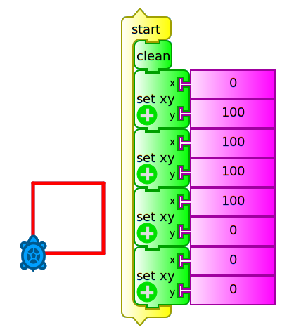

To run it, you must either press the icon  (run), or click in the topmost block `start` (which executes the main routine of the program). The block `clean` clears the canvas before starting any action.

If you want to know what action each block performs, the program can be executed by pressing the icon  (debug) which runs the program block by block, modifying the color of the block that is running at every moment; this mode allows understanding what it is doing and detecting possible programming errors.

**Case B:** An alternative is to have the turtle move forward and turn 90 degrees (an angle that we will call *external*, supplemental to internal) four times, as shown in the following example (`cuadrado adelante derecha.ta`):

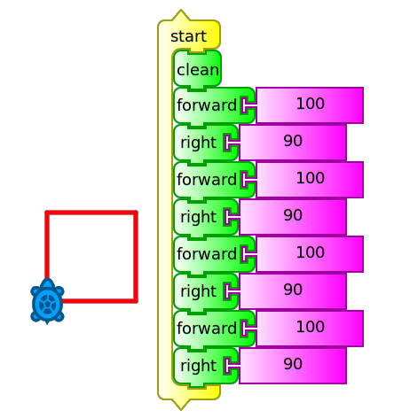

Here you can see that the forward and right blocks repeat themselves, so we could run the same action without retyping, adding a repeat block as shown in the following example (`cuadrado repetir 4.ta`): 

**Case C:**

In this case we have included the block `hide blocks` (in order not display them while the program is running), full screen (to show only the canvas and the turtle strokes while hiding toolbars and palettes) and `set color` / `random (0, 100)` (to randomly change the stroke color on each new side of the square). 

This example shows that it is possible to perform the same action in different ways, each of them written more concisely than its predecessor. The idea is not to repeat blocks, by including blocks such as repeat, while, forever, until, etc.

### Example 2 - to draw an equilateral triangle

We will trace this path (`triángulo repetir 3.ta`) recalling that internal angles thereof are 60°. But as our turtle makes use of external angles, we will use the corresponding 120°. We will proceed in a similar way to the programming of previous **case C**:

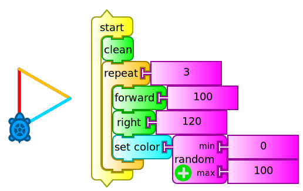

### Example 3 - to draw a regular polygon of N sides. Introduction to using variables ("box") in TB: 

Comparing the last two programs we see that the set of blocks within the repeat block runs a number of times that matches the "Number of sides" of the polygon to draw, and that the external angle that is written along the right block (responsible for spinning the turtle) corresponds to the value (360° / number of sides). This allows us to introduce the concept of **variable**, an amount that can be entered as a parameter and can then be displayed on screen, used for later calculations, etc.: 

In TB variables are stored in *"boxes"*: box 1, box 2, or in a box whose name we choose. 

In this case we create two boxes: 

1. "Number of sides" and 
2. "external angle". 

The value corresponding to the box "Number of sides" should be written in it before running the program, while the value of the box "external angle" is calculated from that.

The following program (`polígono cajas.ta`) draws a triangle, a square, a pentagon, etc. according to the value initially entered in the box "Number of sides" (values 3, 4, 5, etc.). Cases corresponding to the values 3 and 5 are shown which produce the figure of an equilateral triangle and a pentagon:

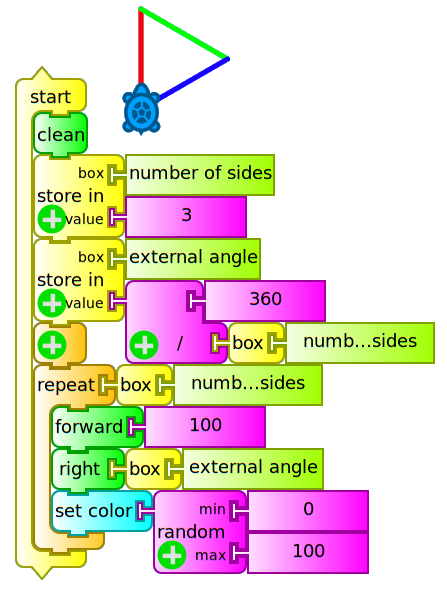

## Displaying text, numerical values and images on-screen. Introduction to data types, operators and control structures in TB

To do this simply use the block `show` connected to:

1. A `text` block (string of characters) you want to display
2. A `100` block [insert number block]  (real or integer numeric value) or
3. The contents of a variable "box". This block may be the result of reading a sensor connected to the external microphone input of the XO.

The `show` block may be used to display text and numeric values at the same time using the addition operator in order to clarify the interpretation of the displayed value. The following example (`mostrar volumen.ta`) displays the numeric value corresponding to the volume of sound captured by the microphone of the XO:

If we want to continually monitor the volume, we should write a program (`monitor de volumen.ta`) that permanently repeats the above action. For this we will use the block `forever`, but attached to the `print` block which will show it in a status bar that is displayed on the bottom of the screen. We will do this because `show` writes from the initial position of the turtle and, if we don't want to do it over what is already written, we must reposition before repeating the action (we will use it to generate tables of values further ahead). The following is the volume monitor:

To complete the presentation of data types in TB how to display them on screen, we'll add a logical condition: if the volume is greater than a certain value, the camera will take a photo and it will be shown on screen.  

For this we must use the `if-then` block (from the Flow operators palette) in addition to the `greater-than` operator: in this way, if the condition (logical or boolean data type that can only be either `true` or `false`) is met, the program (`si volumen 100 saca foto.ta`) runs the lines that follow the `then`:

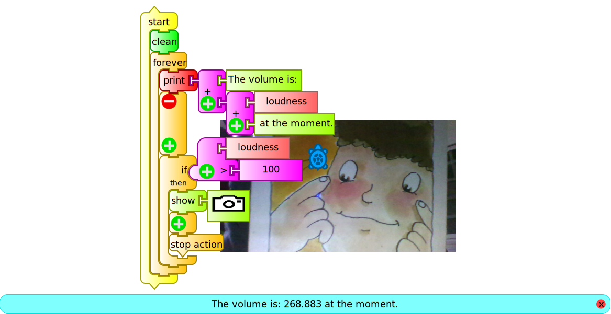

The `stop action` block connected at the lowest location in the set stops execution of the `forever` block once the condition is met and the picture is displayed. If you want to continue program execution indefinitely that block should be removed. This permanent execution without a stopping condition is called an infinite loop.
 
The following example (`storyboard 36.ta`) is a program that triggers the camera 36 times in succession, placing a photo next to each other forming a 6x6 matrix to cover the entire screen. This is an example that can be used as entertainment for younger children.

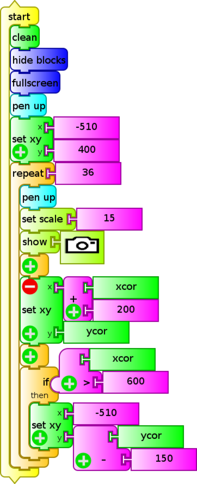

A slight modification (`storyboard.ta`) repeats the action indefinitely until the program execution is interrupted:

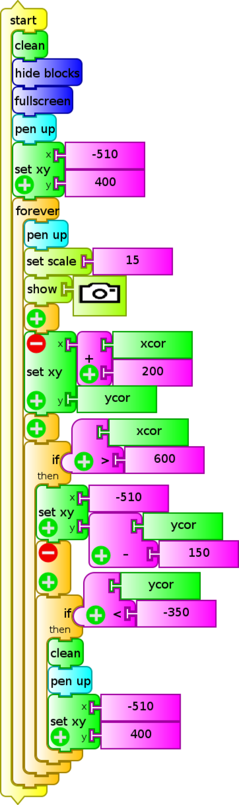

With the `show` block, any other type of media objects, in particular videos, can also be displayed on screen: these objects must be stored in the Journal of the XO.

## Emitting sounds and synthesizing speech. Introduction to the Python block.

TB's ability to make sounds of adjustable frequency was discussed in **Chapter 10 - Digital to analog conversion** (by loading the Python  programming sample `sinewave.py`).

Another interesting TB feature refers to the possibility of issuing a spoken message using the Python programming block `speak.py` included as a sample in the folder `pysamples`. This code can be included in our TB program by loading the Python block; this procedure is described in **Chapter 11 Turtle Blocks Activity (TB)**.

The following example (`si volumen 100 habla.ta`) is a modification of the previous `si volumen 100 saca foto.ta` which makes the XO "speak" when the volume recorded by the microphone exceeds the (arbitrary) value 100. In this case the message "the volume is very loud" will be heard:

Note: You must remember that every time this program is copied to another XO, the Python block is "empty", so the process "load" and save in the Journal should be repeated. From then it runs correctly each time it is invoked. A `comment` programming block has been added as a reminder of this fact is easily forgotten.

When working with TB version 130 or later, this problem of "emptying" does not exist because the `speak` block is used, as shown below (`si volumen 100 habla v130.ta`):

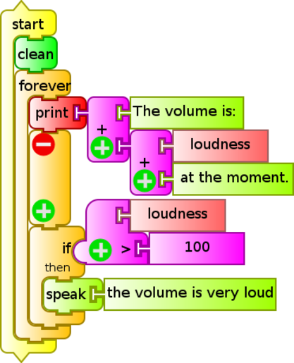

**Generalization**: as in the two examples above (speak.py and sinewave.py), within a TB program, one can enter a portion of code written in several lines of Python by introducing the `Python` block. This can facilitate common tasks that appear as samples in the pysamples folder and that can not be programmed using the available TB blocks. An absolutely original block may be written using (for example) Pippy Activity, saved it in the Journal with the name `myblock`, and then loaded it into our program.

## Access to time measurements and calculations of mathematical functions. Introduction to the Python function block.

A block having a great versatility when programming is the `Python function` block , unlike the `Python` block, it allows the execution of a command or single line of programming; for example, if one wants to make time measurements, we may use this block to invoke the Python `time ()` statement, and we will obtain the current time, measured with respect to an arbitrary origin (known as epoch). If we wanted to program a timer to the thousandth of a second, we could write the following program (`Cronómetro (ms).ta`):

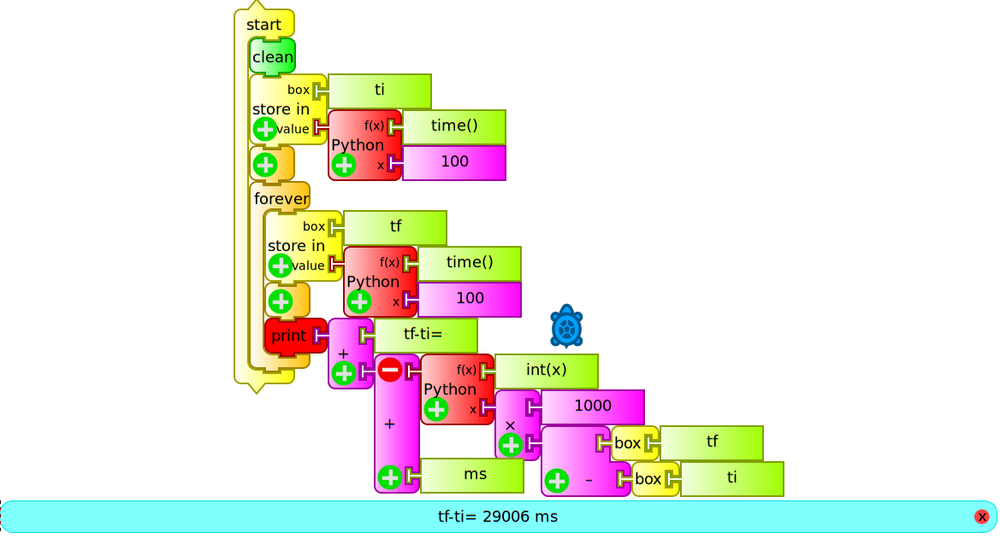

The program begins by saving the initial instant in a box we will call "ti" and then permanently prints on screen the result of subtracting to the current time (previously stored in the box "tf") the value of "ti". Since `time ()` is expressed in seconds, we multiply the result by 1000 so that the interval will appear in milliseconds on screen. Of the operation "1000x(tf-ti)" we take only the integer part, by running the Python function `int ()`.

We see another example of programming (`reloj.ta`) using the `localtime().tm_hour` and `localtime().tm_min` statements within `Python function` blocks in order to program the on-screen display of the current time:

In addition to the above, this block allows us to perform advanced mathematical calculations of one (x), two (x, y) or three (x, y, z) variables. To select the number of parameters or variables, you must press the "+" sign, located at the lower left corner of the block. By default the block's output is: f (x) = x with x = 100. To perform any other calculations, the function must be written within the block function "f(x)" with the proper syntax that can be consulted in PYTHON DOC MATH. The following example (`Báskara.ta`) is a program that obtains the roots of a quadratic equation after inputing the a, b and c coefficients (storing them in "boxes" of the same name):

In this case it is x² - x - 10 = 0, displaying on screen:

The previous program could be constructed by joining blocks of the numeric operators palette, but it would be longer and much less intuitive.

## Using actions and storing values in the stack: `empty stack`, `push` and `pop` blocks.

It may be noted that the example program immediately preceding (`Báskara.ta`) is written based on two columns of blocks: the main column is headed by `start` and a secondary column is headed by `action hat` `calculate`. When invoked with `action call` `calculate`, the latter is run from the main body of the program.  

This way of writing complex programs based on specific modules that perform simple tasks is recommended to gain simplicity, clarity and the ability to reuse actions that are repeated in various programs. In TB these subroutines or sub-programs are called actions and to work with them, the `action1`, `action2`, or `named action` blocks are used, the latter being very useful for making the drafting of the program more readable and intuitive.

After introducing the concept of variable in TB with the use of "boxes", we present an alternative that expands this type of storage possibilities: the stack. These consist of a series of memory addresses that can be loaded with values with the `push` block for subsequent use, in this case, by using the `pop` block. The values are stored as when filling a box with packages: the first to enter will be the last to leave (so called FILO - first in, last out).

It should be made clear that any program that makes use of a stack, should begin by erasing its contents with the `empty stack` block. If while testing a program one wishes to know the contents of a stack, the `show stack` block can be used.

We will show here an application program, which monitors the current time, and when it matches any of the values stored in the "stack" (through the action `load alarms`), it will emit a sound of 1000 Hz frequency.

For getting current time, the functions `localtime().tm_hour` (hour) and `localtime().tm_min` (minutes) are used. The action `load alarms` empties the stack and stores the time values for every alarm.  The action `setup` stores in the box `alarm` the time nearest to the current time. When both values match, a sound is emitted.

This example (`timbres solymar1.ta`) can be used for automatically ringing school bells for starting and ending classes at a school. The current time and the time for the next ring are displayed:

**NOTE:** The set of blocks within the action `load alarms` may be collapsed into a single block by clicking the "-" sign.

## Programming the display of tables of values onscreen

A very common application of any data acquisition software is the generation and on-screen display of a table of values. The following example displays a table of values showing in the left column the values of x and in the right column the result of the given function of $$x$$, in this example, the expression $$ f(x) = x^2 +5 $$.

To do this, we must use the block `show` repeatedly (iteration): for each iteration, the variable $$x$$ is incremented by one unit and the value of the chosen function $$f(x)$$ will be calculated.

Initially the screen is cleared, the turtle is located in the upper row, and a header is written (action `header`), and the turtle is positioned in the next row. Then, and repeatedly $$N$$ times, (the amount of values to show), the value of $$x$$ is written, moving on to the next column, the value of $$f(x)$$ is written, and then moving on to the next row to start again writing each pair of values (`tabla fx.ta`):

The following program (`tabla tiempo volumen.ta`) will show a table of values "time instant $$t$$" / "volume recorded by the microphone **volume**". In order to do this, it will calculate the time interval (in seconds) measured from the beginning of the program's execution in a similar way as the procedure outlined before in the `cronómetro (ms).ta` example:

## Construction of charts based in the x coordinate and based on time

The application that follows the construction and display of tables of values is the construction of charts. To begin, we shall graph a mathematical function of x as a function of the value of the **x** coordinate that is incremented in successive iterations. The direct way of obtaining a drawing of a chart of this kind is by means of the turtle positioning block `set xy`, that will locate it at the given (x, y) coordinates. By default, the turtle will draw a line between its origin and its destination, so if they are close, it will draw the curve that represents the function.

The function $$ f(x)=400e^{\frac{-x}{150}} sin(\frac{x}{10}) $$ for the interval $$[1, 559]$$.

The variable $$x$$ matches the $$x$$ coordinate of the turtle that will take the initial value 1 and increment an unit for each iteration. The block `Python function` will calculate the value that the function will take and is used to determine the $$y$$ coordinate of the turtle.

To achieve the iteration we must use one of:

1. the `repeat` block N times,
2. the `forever` block (plus a stop condition)
3. the `until` block (plus a condition), or
4. the `while` block (that will run as long as the condition is met)

In this case (`osc amort.ta`) we used the latter to draw a chart until the turtle's **x** coordinate reaches the value 560.

In a similar way as when displaying a table of values for x/f(x) or time/volume, drawing a chart where the **x** coordinate is proportional to time involves using the `Python function` block with `time()` initially stored as "ti" (initial instant) in order to be able to further on calculate the elapsed time from the beginning. Since the canvas **x** coordinate is between -450 and 450, it is likely that we'll have to multiply the time interval by a factor to allow optimally displaying the chart onscreen.

The example (`gráfica volumen= f(t) con ejes.ta`) shows a chart of the microphone's volume as a function of time:

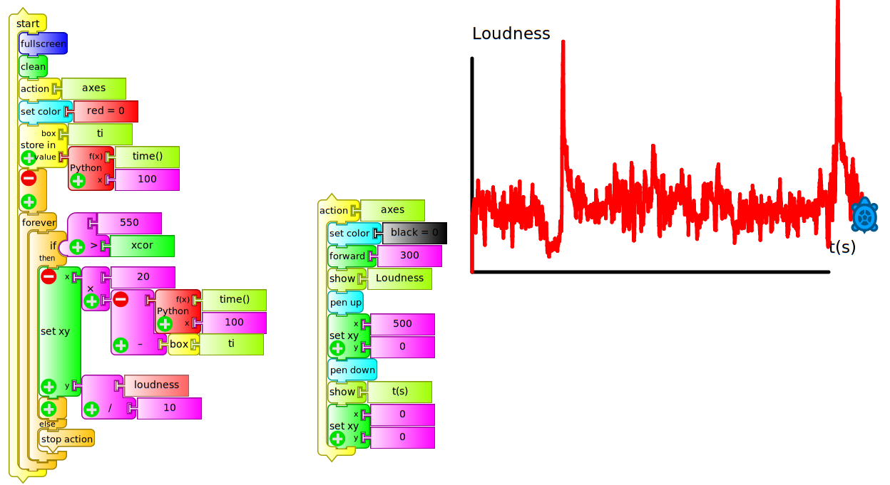

The action `ejes` is in charge of drawing a pair of black colored axes with origin at the center of the screen (0, 0) with headers "volume" and "t(s)". Then, a red color is chosen for drawing the curve and the initial time is pushed into the *`ti` box*. The program is structured based on a `forever` block that will draw the curve until the turtle reaches the coordinate **x=550** (visible right border of the screen). It shows that the drawing is not only based on placing the turtle at coordinates (X=time interval, y=volume) for the following reasons:

1. **x** coordinate: when using the time interval directly, the turtle takes 550 seconds to reach the visible border to the right of the screen (excessively slow speed), for this reason we use this value multiplied by **20** in order to achieve a faster screen sweep.

2. **y** coordinate: when using the value as returned by the `volume` block for the usual sound intensity in a room with several people talking, the turtle will move outside the screen (values of y>600), for this reason we used "volume/10" in order to obtain a drawing that will be visible in the entire screen.

Of course the values of coefficients mentioned above must be adjusted to the use that the program will have. The values obtained from the microphone by monitoring `loudness` (arbitrary units) must be used qualitatively and will only make sense relative to each other, since the sound subsystems of different XO models will produce very different values.

### Note on Recursiveness in TB

Some programming languages have a very particular ability called recursiveness. It consists of the possibility of an action to call itself, producing very potent programs that are able to perform complex actions in few lines of code. TB possesses this ability, as has been reported by FORSTER (blog of Tony Forster).

## 12.2 Recommendations when programming the reading of sensors in TB and Measure

Our experience in using different versions of Measure and TB indicates a series of recommendations to take into account:

1. Measure and TB are activities in constant development, so the calibration of measures obtained from Measure will need to be verified, as well running program in each new version of TB, to be sure that they are not affected by new improvements. This testing work is fundamental to avoid losing time later on. In this project we use versions of Measure 31 (XO1), 42 (XO1.5), TB v109 (XO1) and TB v130 (XO1.5) because they were tested to satisfaction. For XO1.75, TB v158 was used.

2. A common bug in TB consists of programs failing to run the first time they are executed, so testing should start from the second execution.

3. When working with TB and *sensor blocks* one must take into account that two sensor blocks cannot be used at the same time, or you will get an error. This also happens when one supposedly has erased a block by dragging it back to the palette, but in reality remaining behind it. There are exceptions: for example, `volume` and `frequency` might coexist. An example of this is included in the program `dibuja con tu voz.ta` that allows to draw the screen by placing the turtle in position (x,y), commanded by the values of (frequency, volume) of the captured voice.

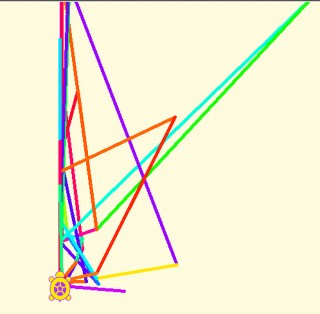
