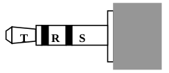
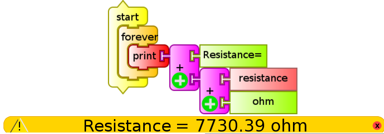
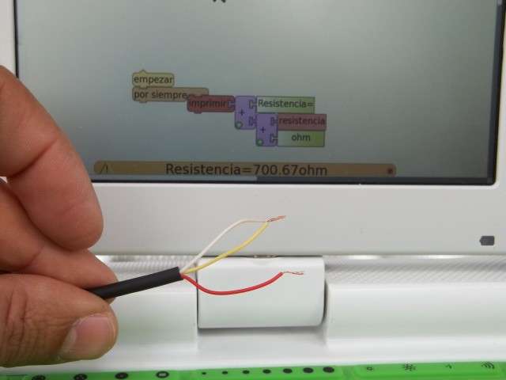

# 13 Measuring Voltage and Resistance: Range, sampling frequency. Physical magnitudes measurable with XO. Building a sensor box.

## Introduction

The XO netbooks (sub-laptops), like most netbooks, include a microphone for recording sounds. With proper software one can measure the volume and frequency (or frequencies) present in obtained sounds; Consequently, it is possible  to read (small) values of alternating voltage (AC) by using the external microphone input.

The built-in camera of the XO will allow us to make (besides photos and videos) qualitative measurements of lighting level as well as color (by their RGB components) of objects captured by it.

However in this work we will focus on a unique capability of the XO that consists in reading direct current (DC) voltages and ohmic resistance though the external microphone input.

# 13.1 Measuring Voltage and Resistance: Ranges, Sampling frequency

## Voltage mode

The XO's external microphone input admits reading external voltages only within a range specified by the manufacturer. Although it features safety electrical components, if voltages outside the specified range are connected, permanent damage may occur to the motherboard of the XO, making it unusable. For this reason all reading of voltages or usage of sensors that output voltage (which are generally powered by the 5V USB output) must be in charge of qualified adults and must ALWAYS be tested with a voltmeter connected to the male TRS plug.

A voltage within range but with inverted polarity can also cause irreversible damage to the motherboard. We suggest to have the utmost care and to take every precaution when working in voltage mode.

To emphasize this, the following should be noted:

SAFETY PRECAUTIONS

1. Never connect voltage from the wall outlet (120-220V AC) to the power input, to the external microphone audio connectors and headphones, or USB ports on the XO, as this will damage it beyond repair and they are very dangerous for you.

2. Do not connect voltages exceeding the ranges indicated, or having the reverse polarity to that indicated, to the external microphone input as this will damage the XO beyond repair.

3. USB ports can provide a maximum total current of 1 A. Do not perform connections that can establish currents exceeding this value as they could damage the XO beyond repair.

## Resistance mode:

If working in resistance mode, unlike the previous mode, there is no danger in the connections to be made. For the XO to be able to register readings, the choice of resistive components whose resistance values are within the measurement range, should be considered.

**DC voltage Input ranges and resistance in XO1, XO1.5 and XO1.75 (SKU206)**

According to data available on OLPC Measure, and Sugarlabs Sensors:

|                       | DC Voltage | Resistance |
|-----------------------|------------|------------|
| XO1 foreseen          |(0.40 to 1.85 V)^[¤] (14k Ohm impedance) |750 Ohm to 14 kOhm
| XO1 measured          |0.41 to 1.87 V                              |700.67 Ohm to 14079.07 Ohm
| (XO1.5)[^¤¤] foreseen |0.17 to 3 V (15 kOhm impedance)          |2 kOhm to open circuit
| (XO1.5)[^¤¤] measured |CHL: 0.17 to 3.22 V CHR:0.17 to 3.22 V|CHL: 26353.22 Ohm to 420 MOhm CHR: 2653.22 Ohm to 13 MOhm
| XO1.75 measured       |CHL: -0.3 to 3.03 V CHR: --        |CHL: 0 Ohm to 1x10^10 Ohm CHR: --

[^¤]: While the absolute maximum input range of the AD1888 is -0.5 V to 6.3 V - it is suggested to respect the ranges stated here.

[^¤¤]: CHL (acronym in English): refers to the "Left Channel" input (TS contacts in the male audio connector) and CHR: refers to the "Right Channel" input (RS contacts)

Note: When obtaining the measures we found curious that resistance ranges measured by the XO1.5 in each channel did not match. This should be reviewed along with the comparison of the calibration levels of both channels.

## Maximum sample frequency in Measure Activity and TB Activity

Any data acquisition system is limited by characteristics originating first in their hardware, and then in their software.

Oftentimes these limitations can be overcome by modifying one or the other, which implies knowledge and additional resources. The project presented here attempts to divulge the concepts of a *data acquisition system* by minimizing the number of components (hardware), prioritizing the use of resistive sensors(to reduce the possibility of damaging the XO by setup mistakes), and using Sugar Activities that have been programmed for this XO (Measure, TB, etc.). The ranges for measuring voltage and resistance are set by the hardware of each different XO model. The maximum sampling frequency (maximum amount of measurements that can be made per second), while determined by the characteristics of the sound card, will also be limited by the Activity we are using. The Measure Activity will allow us to measure a sampling frequency of 48kHz (48.000 samples per second). For those who need it, the XO1 audio subsystem (according to available technical information) has the ability to reach a maximum sample frequency of 96kHz. It would be necessary to study what modifications to the file `config.py` would be necessary to reach that maximum value.

Programs written in TB are interpreted at execution time (because Python is an interpreted programming language), yielding two effects:

1. they don't sample at a fixed frequency
2. the maximum sampling frequency must be practically determined for each written program

In our experience, TB programs on the XO1 allow reading voltages as a function of time with a frequency surrounding 20 Hz. Later models reach higher frequencies.

### Conclusion

The mentioned limitations (ranges, maximum sampling frequency), in addition to the characteristics of the transducers to be used, explain why in many of the following cases we will determine some physical magnitudes quantitatively, in cases only qualitatively.

## Physical magnitudes to measure with XO

Considering the previous section and the existence of adequate transducers, we will be able to record (among others) the following physical magnitudes:

### Reference

The **TM** column indicates whether the reading is direct (D) or indirect (I); 
the **SI** column provides the name of the built-in sensor used to make the reading; 
the **SV** column shows the name of the sensor used to measure through the output voltage;  
the **SR** column shows the name of the resistive sensor used to measure from variations in resistance;

*<u>Note</u>*: Measure and TB Activities give provide *volume* readings for sounds captured by the microphone - we'll use this data for qualitative applications related to the intensity of the sensed sound.

[[insert table here]]
[^¤]: Note: this case is an exception because it is a psycho-physical magnitude used in photometry.

Applications of any sensor can be classified in:

1. qualitative: Are the ones in which the information obtained by the sensor will be used to make determinations of **"yes/no"** or **"more/less"**: they require to detect only variations in measuring values and not values themselves

2. quantitative: In these applications it is desired to make measurement in the corresponding units, using the sensor+XO set as a measurement instrument. For this one must proceed to *calibrating* the sensor.

## 13.3 Mounting a sensor box

## Tha audio cable: Identifying terminals and conducers

For working in this project we must prepare an audio cable that will allow us to connect the signals we want to measure to the micorphone input of the XO. In order to do this, we'll use a mono or stereo audio cable (the latter are more frequent) which, respectively, include TR or TRS connectors of 3.5mm as seen in the picture:

In the case of a mono cable, the connector has two terminals (connected to the inside cables):

* the tip terminal T *(tip)* and
* the terminal at the base or sleeve S *(sleeve)*.

If it is a stereo cable, the connector will have three terminals:

* the tip terminal T *(tip)*,
* the middle ring terminal R *(ring)* and
* the terminal at the base or sleeve S *(sleeve)*.

The following series of steps will allow identifying which cables are connected to which audio connector terminal. In order to avoid damage to the XO when measuring DC voltages, the following set up must be respected:

|Terminal|Audio channel| Signal   |
|--------|-------------|----------|
| T      | CHL (left)  | V+ (CHL) |
| R      | CHR (right) | V- (CHR) |
| S      | Common terminal | V- (GND) |

When working with the XO1 measuring resistance or voltage, we will only use the T and S terminals, that correspond to the left audio channel (CHL).

The XO1.5, XO1.75 and later models support reading two signals at the same time, so we'll use the R terminal corresponding (along with S) to the right audio channel (CHR).

### Identifying the cables that correspond to the T and S terminals (CHL).

Cut the stereo cable in half and remove some 6cm of the external insulation. Within it you'll find three isolated conducers: two of them correspond to the CHL; in order to identify them, remove 5mm of insulation off the tip of each conducer and proceed as follows:

1. Connect the cable to the microphone input of the XO
   Write and run the following program in TB (`monitor de resistencia.ta`),

   

   If the cables don't touch each other, the status bar (at the bottom, in orange) will display the maximum resistance that your XO can measure (XO1: 14 000 Ohm, XO1.5 420 000 000 Ohm, XO1.75 999 999 999 Ohm).

2. Put two cables in contact trying every possible combination one by one: When the resistance displayed changes its value to the minimum (XO1: 700 Ohm, XO1.5: 2 600 Ohm, XO1.75: 0 Ohm) it will mean that you have found the cables corresponding to the T and S terminals (CHL). In the case of the example photo, it's the white and yellow cables.

3. With the help of the other end of the original cable, the T terminal (*tip*) can be determined by using a similar procedure. Once it is done, we recommend to weld the ends of each cable to an alligator clip of color corresponding to the polarity (T red, S black). These cables should be cut in different lengths to avoid them connecting to each other in an oversight (more on this later).

||||
|---|---|---|
||||
|       &nbsp;              ||        &nbsp;               |

### Identifying conducers

<strong><u>Extreme care:</u> irresponsible handling of the USB terminals (for example, a short-circuit between 5v and ground) may damange the XO permanently. Don't perform the following manipulations if you are not an experienced user.</strong>

In various of the described cases, we'll use voltage sensors (**SV**) that must be powered by the 5V that are provided by any USB port of the XO. This allows us to mount sensors without the need of an external power supply, which is an advantage in terms of costs and practicality.

To do this a USB cables is required, it is cut and the inner cables identified: the one that is colored red (+5V) and black (0V or ground). The rest of the cables are cut and isolated to avoid contact between them.

### Mounting the power strip to integrate the audio cable (signal) and the USB cable (power for voltage sensors). Sensing box:

For any later montage, it is convenient to design a model of *connection terminals* to simplify the sensor testing task; one possible choice is to use a connection strip to integrate the audio cable for connecting the signal coming from the sensors and the USB cable that provides power to the voltage sensors (SV) like the one shown in the following photo set:

|  |  | 
|---|---|
|  |  | 

A more definitive model will integrate terminals, a 200 mA fuse connected in series to the ground cable and a led indicator. A label to identify the terminals is useful to avoid mistakes in the moment of testing sensors. Such a *sensing box* is shown in the following photo series:

|  |  | 
|---|---|
|  |  | 
|  |  | 

The resistive sensors (**SR**) have two connectors and don't need power, they are connected between "OV" (black) and "signal" (white): the previous image on the left shows an LDR based light sensor as an example.

The voltage sensors (**SV**) have three terminals and need power, they are connected to the corresponding "OV" (black), "signal" (white) and "5 V" (red): the previous image on the right shows a temperature sensor based on the LM35 integrated circuit.

The label used above is presented in detail:

