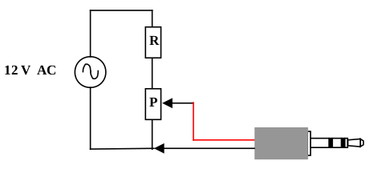
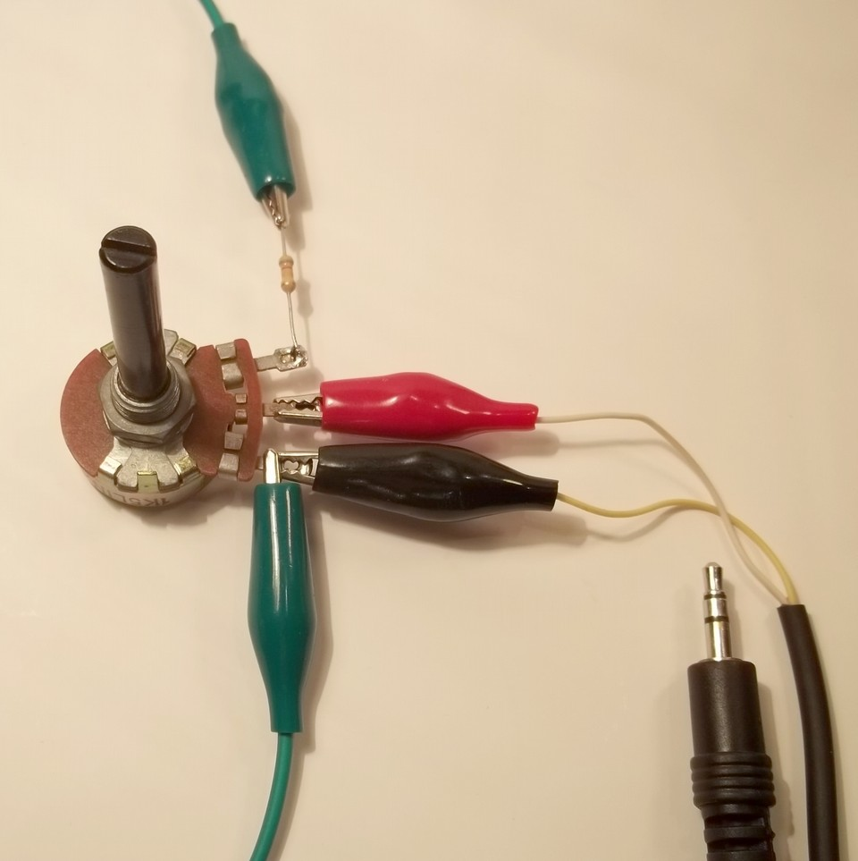
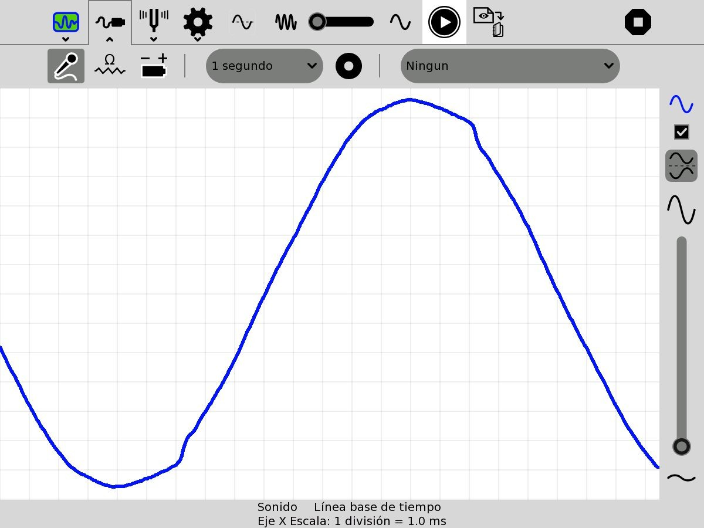
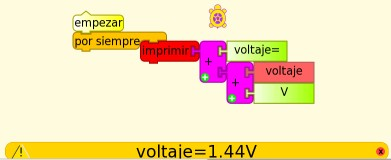
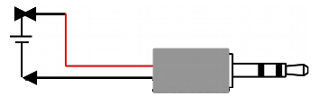
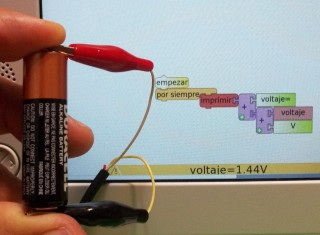

# 14. Experimental Activities

## Introduction

The hardware of the XO was designed with the possibility of connecting low cost and easy to build sensors to it, making it an ideal instrument for **introducing** our students into data acquisition, treatment and storage of measurements that arise from the interaction of between the XO and the physical world, allowing us to measure a great 
variety of physical magnitudes. We can process the information of the sensors with the "Measure" Activity or else writing programs with the "TurtleBlocks" Activity, which includes tools exclusively for processing sensor readings.

For this, elementary knowledge of programming, electronics and Physics are needed. To integrated and in order for every student make these activities for every student, we have settled on a set of basic criteria that must be met to include a given activity as part of the **"Physics with XO" project**:

1. The experimental activities must be able to be carried out with any XO model starting from XO1 (the most basic of them).

2. Planned measurements must be obtained by using the microphone sensors, the built-in camera, or else by mounting sensors. For this we'll use basic electronics, selecting components with two terminals to be connected or (as maximum) three terminals (power 5V DC USB + signal), that can be found locally on stock and which prices is below $U 200 (about 8€ or U$S 10).

3. Readings of these sensors should be done with Sugar Activities, or else Linux software included in the images (for example, Audacity).

4. Programming must be integrated with a perspective of an introduction to programing.

Because of this, the Project must be considered and introduction of physical measurements with a DA interface; under no circumstances is it meant to substitute equipment manufactured for that purpose.

## Experimental Activities

Following we include a series of ideas to develop Experimental Activities with XO: among them we may find the some using constructed sensors that must be programmed, measurements coming from the built-in sensors or those that make use of built-in elements of the XO such as the lid-close magnet or the charger; there are qualitative as well as quantitative ones; some integrate games (Primary school), elements for discovery of physical phenomena (Primary and basic Secondary) as well as experiments for the level of higher Secondary school. It is the author's intention to make a contribution for those that want to integrate Physics in their courses, Workshops, or to discover it by personal exploration, and so these ideas are presented with the understanding that what's most important is not what has been done but what readers will want to do based on it.

### <u>IMPORTANT NOTE:</u>

1. If you are interested in developing Experimental Activities that pose no risk to your XO (from wrong connections, etc.) you may look in this chapter for *Experimental Activity* sheets that are identified in the upper right cell of each table with the codes:

    1. SR (resistive sensor)
    2. SI (integrated sensor)
    3. X (no sensor) or
    4. Mic. Ext. (external microphone)

      For a higher level one may work (taking into precautions into account) with the ones identified with the codes:

    5. SV (voltage sensor)
    6. SR USB

2. All programs may be downloaded from:  [https://sites.google.com/site/solymar1fisica/programas-tb](https://sites.google.com/site/solymar1fisica/programas-tb).

## A) VOLTAGE  <u>AC Voltage</u>

### Introduction

The external microphone input of the XO allows the reading of very small AC values, in the order of **some millivolts**. In the case of periodic signals, these values may be captured with the Measure Activity; with it you will be able to:

1. Capture the waveform produced from reading a given signal working with *Time Base*. Identify (qualitatively) the type of signal by observing the waveform: sinusoidal signal, square, triangular, "beat" (sum of oscillations of similar frequencies), etc. Determine the period of the measured signal and calculate the frequency of it.

2. Measure the frequencies of the different components working with *Frequency Base*.

### Measuring range

**XO1:** According to measurements made, it's possible to measure sinusoidal signals of effective voltage of 4.0 mV, which corresponds with a maximum voltage of 5.6 mV and a $$V _ {\text{pp}}$$ ("peak to peak" voltage) in the order of **13 mV**. Accordingly, only very small signals will be measurable, or voltage dividers will be needed to measure higher voltage signals.

### Sampling frequency

According to its technical specifications, the sampling frequency of the XO for the Measure Activity is above 48 kHz, which would allow to determine (from Nyquist's sampling theorem) the signal frequency of components with maximum frequencies of about 20 kHz.

This type of signal an also be captured with TB programs and the `sound` sensor block. However, the reading frequency in this case won't reach more than some 20 Hz (XO1) which makes it impractical for this use.

| Experimental Activity 01 The XO as oscilloscope: waveform of a 50 Hz AC signal | **SV** |
| --- | --- |
| **Level:**  Higher Secondary School |
| **Goals:**  To measure the voltage of an alternating current (AC) 50 Hz.  Analysis in time.
| **Magnitude to be measured:**  Alternating current (AC)
| **Type of measurement:**  Direct
| **Sugar Activity:**  Measure version 42 (set to *Time Base*)
| **Model of XO used:**  XO1 (SKU5)
| **Sensors used:** (none) **Other materials:** Audio cable connected to the external microphone input of the XO.  220/12 V Transformer. 820 kΩ Resistor. 1.5 kΩ Potentiometer.
| **Precautions to consider:**  Extreme care: Voltage outside range can damage the XO permanently. Don't work measuring voltage on the XO if you are not an experienced user.

We will be measuring alternating current output voltage (secondary winding or just *secondary*) of a 220V/12V transformer connected to a domiciliary power network (220 V AC/50 Hz).

As the input range of XO for measuring AC voltages is in the order of millivolts, a voltage divider is built with a fixed resistor R (820 kΩ) and a potentiometer P (1.5 kΩ), as can be seen in the circuit schema:

Because we're dealing with alternating voltage, there is no need to consider polarity.

The circuit can be seen in the picture below; connectors joined to the green tweezers are connected to the *secondary* of the transformer (feed), while those connected to the red and black tweezers are from the audio cable connected to the XO:

The procedure consists of building the circuit, placing the potentiometer in such a way that voltage between the bottom and middle terminal is null and connecting the transformer to the power network. Before connecting the audio cable to the XO it, first the T and S terminals should be connected to an AC voltmeter and the potentiometer should be adjusted until voltage reaches 3.0 mV. Once this has been verified, connect the cable to the netbook and run the Measure Activity.

By default the Activity will start in *Time Base* mode. Adjust the "time by division" control until the waveform displays a full alternation; adjust the "gain" control and turn the potentiometer until obtaining an optimal on-screen display as shown in the picture below (negative colors of a screen capture of a measurement):

It can be seen (qualitatively) that the measured signal corresponds (with some alterations) to the sinusoidal function, which was expected.

Considering that a 1.0 ms division was selected, it can be verified that the period of the same corresponds to 20 divisions, that is $$ T = 20 \cdot 10^{-3} \text{s} $$. From there the frequency may be calculated as $$ f = 1/T = 50 \text{Hz} $$.

## <u>DC Voltage</u>

Measurement of DC voltages has been previously documented. Grasping it allows understanding of why *sensors* of other physical magnitudes can be built *based on voltage* which, by means of transducers, produce DC voltage as a function of the value of the physical magnitude that we wish to measure.

| Experimental Activity 02 Voltage Monitor| **SV** |
| --- | --- |
| **Level:**  Primary, Basic Secondary School |
| **Goals:**  Monitor of DC voltage. Measuring the voltage between terminals in a battery.
| **Magnitude to be measured:**  Alternating current (AC)
| **Type of measurement:**  Direct
| **Sugar Activity:**  TB v.109
| **Model of XO used:**  XO1 (SKU5)
| **Sensors used:** (none) **Other materials:** Audio cable connected to the external microphone input of the XO. AA Battery.
| **Precautions to consider:**  Extreme care: Voltage outside range or reverse polarity can damage the XO permanently. Don't work measuring voltage on the XO if you are not an experienced user.

You will only need the audio cable, an AA, AAA, C or D common battery (carbon-zinc) or alkaline. In all cases nominal voltage is 1.5 V. Measuring different battery sizes allows for the introduction of the concept of voltage joined by intensity of current and electric potency.

When batteries are new, voltage is slightly higher (above 1.6 V). With use, lower values are obtained. If rechargeable Ni-MH batteries are measured, the nominal voltage value is 1.2 V.

Below you will find the program used (`monitor de voltaje.ta`), the circuit schema and a picture:

|     | 
| --- | --- |

| Experimental Activity 03 The XO as oscilloscope: waveform of a rectified half wave 50 AC signal | **SV** |
| --- | --- |
| **Level:**  Higher Secondary School |
| **Goals:**  Measure voltage of a continuous pulsating (DC) signal resulting from rectifying half a wave of a 50 Hz AC signal.  Temporal analysis.
| **Magnitude to be measured:**  Direct current (DC)
| **Type of measurement:**  Direct
| **Sugar Activity:**  Measure version 42 (*Base Time* mode)
| **Model of XO used:**  XO1 (SKU5)
| **Sensors used:** (none) **Other materials:** Audio cable connected to the external microphone input of the XO. 220/12 V Transformer. 1N4007 Diode. 12 kΩ Resistor. 1.5 kΩ Potentiometer.
| **Precautions to consider:**  Extreme care: Voltage outside range or reverse polarity can damage the XO permanently. Don't work measuring voltage on the XO if you are not an experienced user.

| Experimental Activity 04 The XO as oscilloscope: waveform of a fully rectified 50 AC signal | **SV**|
| --- | --- |
| **Level:**  Higher Secondary School|
| **Goals:**  Measure voltage of a continuous pulsating (DC) signal resulting from the full rectification of a 50 Hz AC signal.|
| **Magnitude to be measured:**  Direct current (DC)
| **Type of measurement:**  Direct
| **Sugar Activity:**  Measure version 42 (*Base Time* mode)
| **Model of XO used:**  XO1 (SKU5)
| **Sensors used:** (none) **Other materials:** Audio cable connected to the external microphone input of the XO. 220/12 V Transformer. 4 x 1N4007 Diode. 12 kΩ Resistor. 1.5 kΩ Potentiometer.
| **Precautions to consider:**  Extreme care: Voltage outside range or reverse polarity can damage the XO permanently. Don't work measuring voltage on the XO if you are not an experienced user.

| Experimental Activity 05 Discharging a Capacitor thorough a Resistor: Voltage/time table.| **SV**|
| --- | --- |
| **Level:**  Higher Secondary School|
| **Goals:**  Tabulating of time/voltage for an RC discharge with trigger level
| **Magnitude to be measured:**  Direct current (DC)
| **Type of measurement:**  Direct
| **Sugar Activity:**  TB v.109
| **Model of XO used:**  XO1 (SKU5)
| **Sensors used:** (none) **Other materials:** Audio cable connected to the external microphone input of the XO. 1000 μF Electrolytic capacitor. 6800 Ω Resistor. AA Battery.
| **Precautions to consider:**  Extreme care: Voltage outside range or reverse polarity can damage the XO permanently. Don't work measuring voltage on the XO if you are not an experienced user.

| Experimental Activity 06 Discharging a Capacitor thorough a Resistor: Voltage/time chart.| **SV**|
| --- | --- |
| **Level:**  Higher Secondary School |
| **Goals:**  To graph  time/voltage for an RC discharge with trigger level
| **Magnitude to be measured:**  Direct current (DC)
| **Type of measurement:**  Direct
| **Sugar Activity:**  TB v.109
| **Model of XO used:**  XO1 (SKU5)
| **Sensors used:** (none) **Other materials:** Audio cable connected to the external microphone input of the XO. 1000 μF Electrolytic capacitor. 6800 Ω Resistor. AA Battery.
| **Precautions to consider:**  Extreme care: Voltage outside range or reverse polarity can damage the XO permanently. Don't work measuring voltage on the XO if you are not an experienced user.

| Experimental Activity 07 The XO as DC ampere-meter| **SV**|
| --- | --- |
| **Level:**  Higher Secondary School |
| **Goals:**  To use the XO as a DC current intensity monitor
| **Magnitude to be measured:**  Direct current (DC) intensity
| **Type of measurement:**  Indirect
| **Sugar Activity:**  TB v.109
| **Model of XO used:**  XO1 (SKU5)
| **Sensors used:** (none) **Other materials:** Audio cable connected to the external microphone input of the XO. 1Ω 5W Resistor. 12 V DC (max 2 A) power source. 12V (max 5 W) lamps (4x).
| **Precautions to consider:**  Extreme care: Voltage outside range or reverse polarity can damage the XO permanently. Don't work measuring voltage on the XO if you are not an experienced user.

# 14.1 Ohmic Resistance

How to measure ohmic resistance has been described previously. Understanding it allows to comprehend why *resistive sensors* can be built, based on how they modify their resistance value as a function of the value of the physical magnitude being measured.

This feature can be applied for using the XO as an ohmmeter and for producing games, entertainment pieces, alarms, etc. as we will show. They will be programmed to monitor variation of resistance between "yes/no" extremes, corresponding to "contact/no contact" between the audio cable terminals.

| Experimental Activity 08 Linking N resistors serially or in parallel. $$ R _ \text{eq} = f(N) $$ chart. Equivalent resistance.| **SR**|
| --- | --- |
| **Level:**  Primary / Basic Secondary School |
| **Goals:**  To monitor resistance. Graph of equivalent resistance $$ R _ \text{eq} $$ as a function of $$ N $$ resistors (of same value) linked in parallel or series.
| **Magnitude to be measured:**  Resistance
| **Type of measurement:**  Direct
| **Sugar Activity:**  TB v.109
| **Model of XO used:**  XO1 (SKU5)
| **Sensors used:** (none) **Other materials:** Audio cable connected to the external microphone input of the XO. 10 x 1 kΩ Resistor. 10 x 10 kΩ Resistor.
| **Precautions to consider:**  (none)

| Experimental Activity 09 Game of coincidences.| **SR**|
| --- | --- |
| **Level:**  Primary / Basic Secondary School |
| **Goals:**  To build and program with TB the game consisting of finding pairs of right/wrong answers.
| **Magnitude to be measured:**  Resistance
| **Type of measurement:**  Direct
| **Sugar Activity:**  TB v.109
| **Model of XO used:**  XO1 (SKU5)
| **Sensors used:** (none) **Other materials:** Audio cable connected to the external microphone input of the XO. Board with internally wired question/answer pairs.
| **Precautions to consider:**  (none)

| Experimental Activity 10 Electric fire alarm. (hidden cable)| **SR**|
| --- | --- |
| **Level:**  Primary / Basic Secondary School |
| **Goals:**  To build and program with TB an alarm that is triggered with an electric fire sensor
| **Magnitude to be measured:**  Resistance
| **Type of measurement:**  Direct
| **Sugar Activity:**  TB v.109
| **Model of XO used:**  XO1 (SKU5)
| **Sensors used:** Fire sensor **Other materials:** Audio cable connected to the external microphone input of the XO.
| **Precautions to consider:**  Battery and connector polarity must be observed when feeding the sensor.

| Experimental Activity 11 Hoop game (3 versions)| **SR**|
| --- | --- |
| **Level:**  Primary / Basic Secondary School |
| **Goals:**  To build and program with TB a game of manual skill
| **Magnitude to be measured:**  Resistance
| **Type of measurement:**  Direct
| **Sugar Activity:**  TB v.109
| **Model of XO used:**  XO1 (SKU5)
| **Sensors used:**  **Versions A and B:** Hoop and wire each connected to an audio cable terminal. **Version C:** Add 2 resistors and a NC switch.
| **Precautions to consider:** (none)

| Experimental Activity 12 Oscillating a physical pendulum: Chart of angle as a function of time (qualitative)| **SR**|
| --- | --- |
| **Level:**  Primary / Basic Secondary School |
| **Goals:**  To display the graph θ = f(t) corresponding to the angular position θ of an oscillating vertical stick as a function of time.
| **Magnitude to be measured:**  Angular position
| **Type of measurement:**  Indirect
| **Sugar Activity:**  TB v.109
| **Model of XO used:**  XO1 (SKU5)
| **Sensors used:**  Potentiometer of 10 kΩ or 50 kΩ (lineal). **Other materials:** Audio cable connected to the external microphone input of the XO.
| **Precautions to consider:** (none)

| Experimental Activity 13 The XO as oscilloscope: chart of a signal produced by a photovoltaic cell| **SV**|
| --- | --- |
| **Level:**  Primary / Basic Secondary School / Higher Secondary School |
| **Goals:**  To measure the voltage signal produced by a photovoltaic cell lit by different sources: incandescent bulb powered by DC and AC and fluorescent light powered by AC. Temporal analysis.
| **Magnitude to be measured:**  (Qualitative) amount of light proportional to continuous voltage (DC)
| **Type of measurement:**  Indirect
| **Sugar Activity:**  Measure v31 (set to *Base Time*)
| **Model of XO used:**  XO1 (SKU5)
| **Sensors used:**  Photovoltaic cell **Other materials:** Audio cable connected to the external microphone input of the XO. 12V DC power source. 12V & 10W incandescent lamp. 50 kΩ. Incandescent 220V & 75W lamp. Fluorescent tube 220V (*NT: or 110V*) AC.
| **Precautions to consider:**  Extreme care: Voltage outside range or reverse polarity can damage the XO permanently. Don't work measuring voltage on the XO if you are not an experienced user.

| Experimental Activity 14 "Welcome"| **SR**|
| --- | --- |
| **Level:**  Primary / Basic Secondary School / Higher Secondary School
| **Goals:**  To build and program a *hand sensor* that, when covered, will trigger the XO to emit a spoken message and take a picture.
| **Magnitude to be measured:**  (Qualitative) lightness measured by resistance of LDR.
| **Type of measurement:**  Indirect
| **Sugar Activity:**  TB v.109 (and v.130 and beyond)
| **Model of XO used:**  XO1 (SKU5)
| **Sensors used:**  LDR GL12537. **Other materials:** Audio cable connected to the external microphone input of the XO. Trigger switch NA or NO. Portable lamp or laser pointer.
| **Precautions to consider:** (none)

| Experimental Activity 15 LDR as light sensor. Loop chart of l=f (t)| **SR**|
| --- | --- |
| **Level:**  Primary / Basic Secondary School / Higher Secondary School
| **Goals:**  To build and program a *hand sensor* that, when covered, will trigger the XO to emit a spoken message and take a picture.
| **Magnitude to be measured:**  (Qualitative) lightness measured by resistance of LDR.
| **Type of measurement:**  Indirect
| **Sugar Activity:**  TB v.109 (and v.130 and beyond)
| **Model of XO used:**  XO1 (SKU5)
| **Sensors used:**  LDR GL12537. **Other materials:** Audio cable connected to the external microphone input of the XO. Trigger switch NA or NO. Portable lamp or laser pointer.
| **Precautions to consider:** (none)

| Experimental Activity 15 LDR as light sensor. Loop chart of l=f (t)| **SR**|
| --- | --- |
| **Level:**  Primary / Basic Secondary School / Higher Secondary School
| **Goals:**  To build and program an LDR as calibrated *lighting sensor*. The information is displayed on screenas a loop chart l=f(t).
| **Magnitude to be measured:**   Lighting
| **Type of measurement:**  Indirect
| **Sugar Activity:**  TB v.109
| **Model of XO used:**  XO1 (SKU5)
| **Sensors used:**  LDR GL12537. **Other materials:** Audio cable connected to the external microphone input of the XO. Trigger switch NA or NO. Portable lamp or laser pointer.
| **Precautions to consider:** (none)

