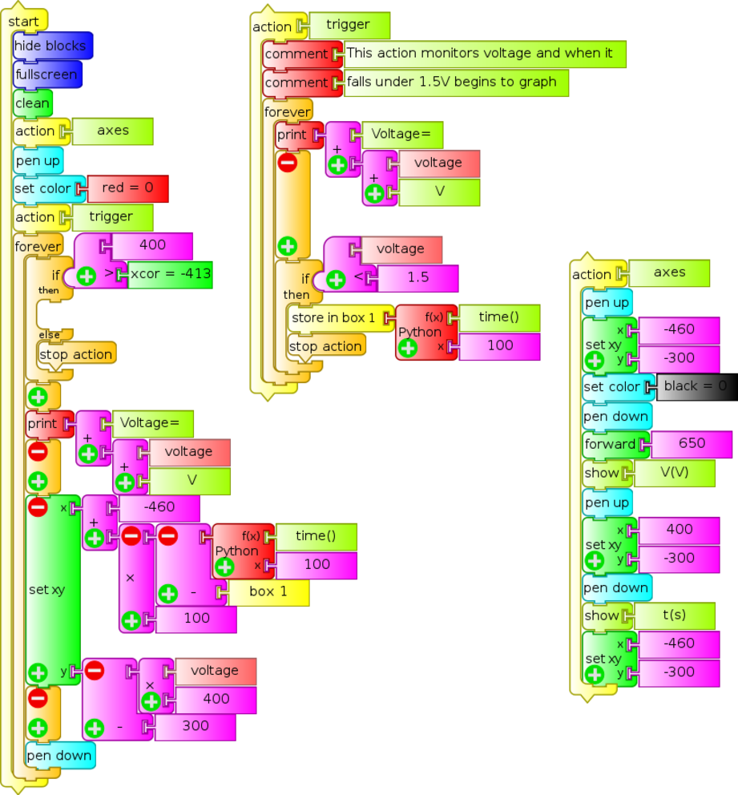
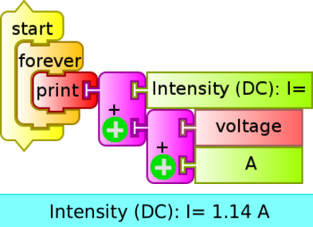
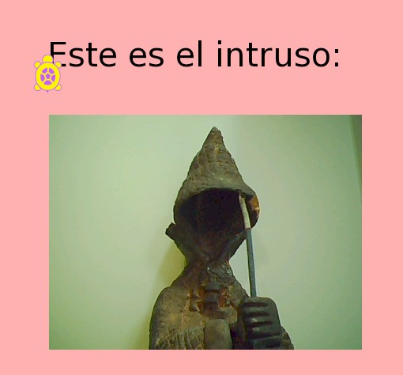
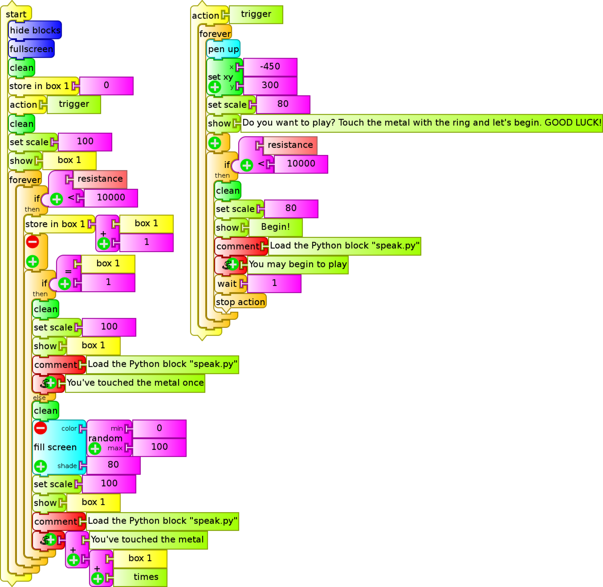
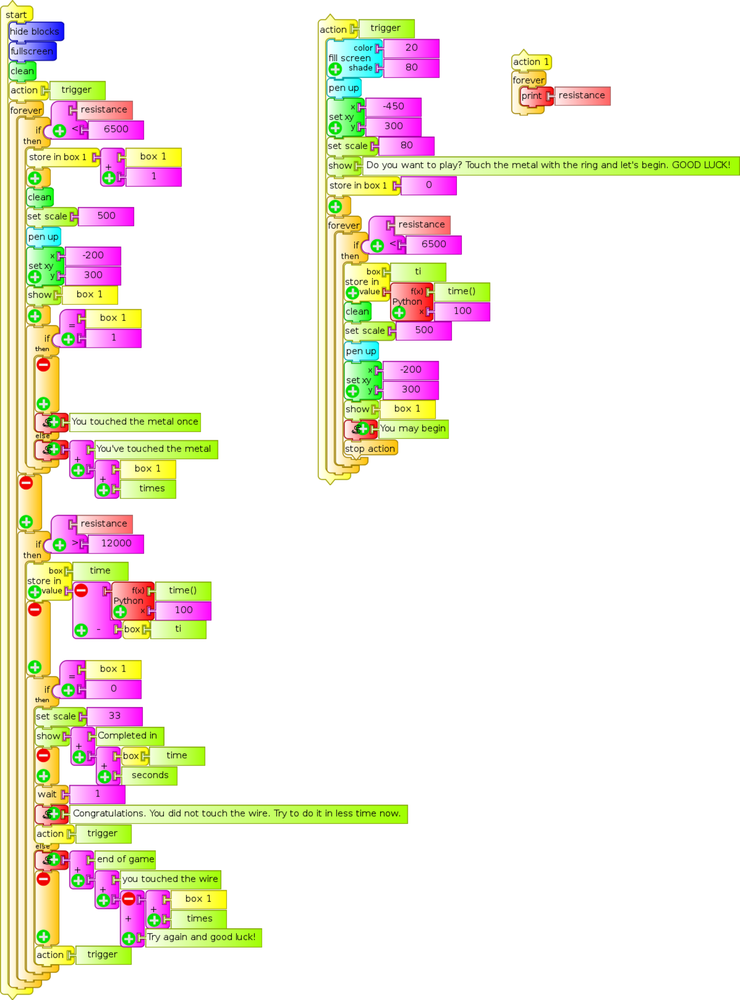
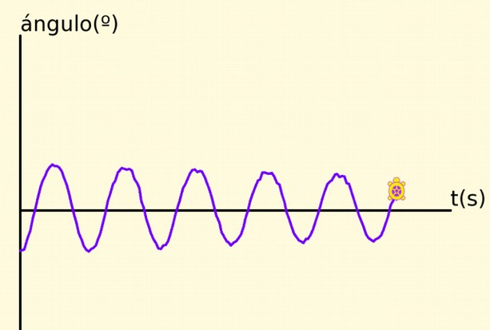
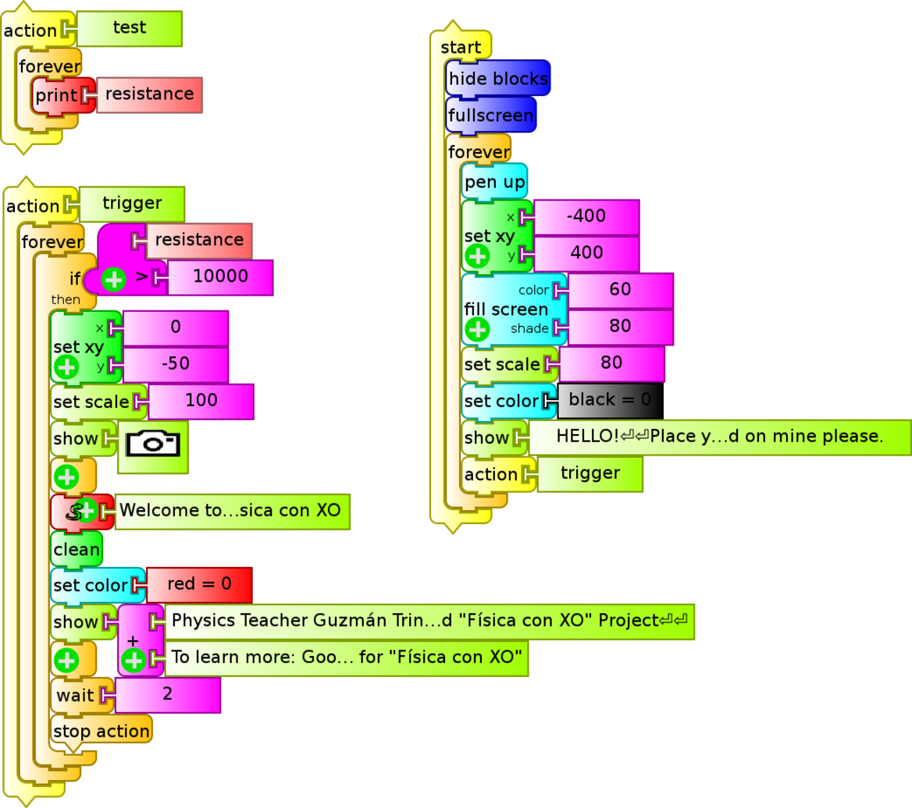
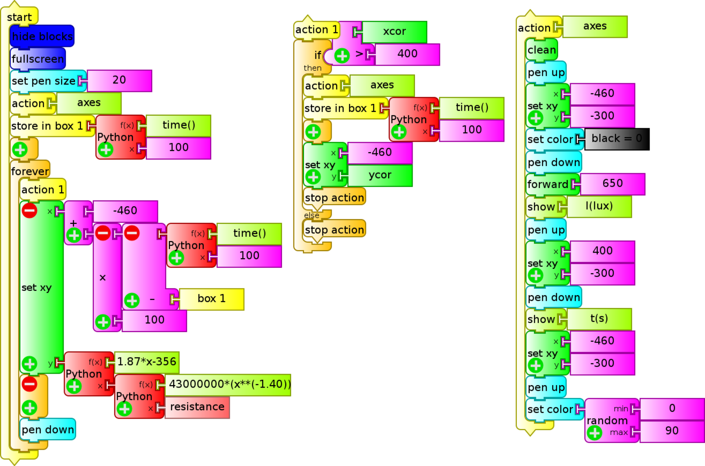
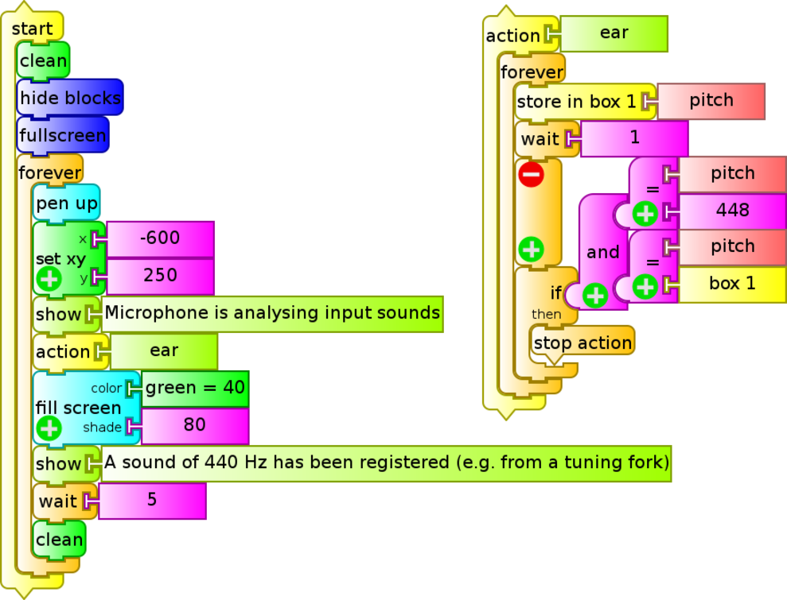

# 14. Experimental Activities

## Introduction

The hardware of the XO was designed with the possibility of connecting low cost and easy to build sensors to it, making it an ideal instrument for **introducing** our students into data acquisition, treatment and storage of measurements that arise from the interaction of between the XO and the physical world, allowing us to measure a great 
variety of physical magnitudes. We can process the information of the sensors with the "Measure" Activity or else writing programs with the "TurtleBlocks" Activity, which includes tools exclusively for processing sensor readings.

For this, elementary knowledge of programming, electronics and Physics are needed. To integrated and in order for every student make these activities for every student, we have settled on a set of basic criteria that must be met to include a given activity as part of the **"Physics with XO" project**:

1. The experimental activities must be able to be carried out with any XO model starting from XO1 (the most basic of them).

2. Planned measurements must be obtained by using the microphone sensors, the built-in camera, or else by mounting sensors. For this we'll use basic electronics, selecting components with two terminals to be connected or (as maximum) three terminals (power 5V DC USB + signal), that can be found locally on stock and which prices is below $U 200 (about 8€ or U$S 10).

3. Readings of these sensors should be done with Sugar Activities, or else Linux software included in the images (for example, Audacity).

4. Programming must be integrated with a perspective of an introduction to programing.

Because of this, the Project must be considered and introduction of physical measurements with a DA interface; under no circumstances is it meant to substitute equipment manufactured for that purpose.

## Experimental Activities

Following we include a series of ideas to develop Experimental Activities with XO: among them we may find the some using constructed sensors that must be programmed, measurements coming from the built-in sensors or those that make use of built-in elements of the XO such as the lid-close magnet or the charger; there are qualitative as well as quantitative ones; some integrate games (Primary school), elements for discovery of physical phenomena (Primary and basic Secondary) as well as experiments for the level of higher Secondary school. It is the author's intention to make a contribution for those that want to integrate Physics in their courses, Workshops, or to discover it by personal exploration, and so these ideas are presented with the understanding that what's most important is not what has been done but what readers will want to do based on it.

### <u>IMPORTANT NOTE:</u>

1. If you are interested in developing Experimental Activities that pose no risk to your XO (from wrong connections, etc.) you may look in this chapter for *Experimental Activity* sheets that are identified in the upper right cell of each table with the codes:

    1. SR (resistive sensor)
    2. SI (integrated sensor)
    3. X (no sensor) or
    4. Mic. Ext. (external microphone)

      For a higher level one may work (taking into precautions into account) with the ones identified with the codes:

    5. SV (voltage sensor)
    6. SR USB

2. All programs may be downloaded from:  [https://sites.google.com/site/solymar1fisica/programas-tb](https://sites.google.com/site/solymar1fisica/programas-tb).

## a) VOLTAGE  <u>AC Voltage</u>

### Introduction

The external microphone input of the XO allows the reading of very small AC values, in the order of **some millivolts**. In the case of periodic signals, these values may be captured with the Measure Activity; with it you will be able to:

1. Capture the waveform produced from reading a given signal working with *Time Base*. Identify (qualitatively) the type of signal by observing the waveform: sinusoidal signal, square, triangular, "beat" (sum of oscillations of similar frequencies), etc. Determine the period of the measured signal and calculate the frequency of it.

2. Measure the frequencies of the different components working with *Frequency Base*.

### Measuring range

**XO1:** According to measurements made, it's possible to measure sinusoidal signals of effective voltage of 4.0 mV, which corresponds with a maximum voltage of 5.6 mV and a $$ V _ {\text{pp}} $$ ("peak to peak" voltage) in the order of **13 mV**. Accordingly, only very small signals will be measurable, or voltage dividers will be needed to measure higher voltage signals.

### Sampling frequency

According to its technical specifications, the sampling frequency of the XO for the Measure Activity is above 48 kHz, which would allow to determine (from Nyquist's sampling theorem) the signal frequency of components with maximum frequencies of about 20 kHz.

This type of signal an also be captured with TB programs and the `sound` sensor block. However, the reading frequency in this case won't reach more than some 20 Hz (XO1) which makes it impractical for this use.

&nbsp;

| Experimental Activity 01 The XO as oscilloscope: waveform of a 50 Hz AC signal | **SV** |
| --- | --- |
| **Level:**  Higher Secondary School |
| **Goals:**  To measure the voltage of an alternating current (AC) 50 Hz.  Analysis in time.
| **Magnitude to be measured:**  Alternating current (AC)
| **Type of measurement:**  Direct
| **Sugar Activity:**  Measure version 42 (set to *Time Base*)
| **Model of XO used:**  XO1 (SKU5)
| **Sensors used:** (none) **Other materials:** Audio cable connected to the external microphone input of the XO.  220/12 V Transformer. 820 kΩ Resistor. 1.5 kΩ Potentiometer.
| **Precautions to consider:**  Extreme care: Voltage outside range can damage the XO permanently. Don't work measuring voltage on the XO if you are not an experienced user.

We will be measuring alternating current output voltage (secondary winding or just *secondary*) of a 220V/12V transformer connected to a domiciliary power network (220 V AC/50 Hz).

As the input range of XO for measuring AC voltages is in the order of millivolts, a voltage divider is built with a fixed resistor R (820 kΩ) and a potentiometer P (1.5 kΩ), as can be seen in the circuit schema:

Because we're dealing with alternating voltage, there is no need to consider polarity.

The circuit can be seen in the picture below; connectors joined to the green tweezers are connected to the *secondary* of the transformer (feed), while those connected to the red and black tweezers are from the audio cable connected to the XO:

The procedure consists of building the circuit, placing the potentiometer in such a way that voltage between the bottom and middle terminal is null and connecting the transformer to the power network. Before connecting the audio cable to the XO it, first the T and S terminals should be connected to an AC voltmeter and the potentiometer should be adjusted until voltage reaches 3.0 mV. Once this has been verified, connect the cable to the netbook and run the Measure Activity.

By default the Activity will start in *Time Base* mode. Adjust the "time by division" control until the waveform displays a full alternation; adjust the "gain" control and turn the potentiometer until obtaining an optimal on-screen display as shown in the picture below (negative colors of a screen capture of a measurement):

It can be seen (qualitatively) that the measured signal corresponds (with some alterations) to the sinusoidal function, which was expected.

Considering that a 1.0 ms division was selected, it can be verified that the period of the same corresponds to 20 divisions, that is $$ T = 20 \cdot 10^{-3} \text{s} $$. From there the frequency may be calculated as $$ f = 1/T = 50 \text{Hz} $$.

## <u>DC Voltage</u>

Measurement of DC voltages has been previously documented. Grasping it allows understanding of why *sensors* of other physical magnitudes can be built *based on voltage* which, by means of transducers, produce DC voltage as a function of the value of the physical magnitude that we wish to measure.

| Experimental Activity 02 Voltage Monitor| **SV** |
| --- | --- |
| **Level:**  Primary, Basic Secondary School |
| **Goals:**  Monitor of DC voltage. Measuring the voltage between terminals in a battery.
| **Magnitude to be measured:**  Alternating current (AC)
| **Type of measurement:**  Direct
| **Sugar Activity:**  TB v.109
| **Model of XO used:**  XO1 (SKU5)
| **Sensors used:** (none) **Other materials:** Audio cable connected to the external microphone input of the XO. AA Battery.
| **Precautions to consider:**  Extreme care: Voltage outside range or reverse polarity can damage the XO permanently. Don't work measuring voltage on the XO if you are not an experienced user.

You will only need the audio cable, an AA, AAA, C or D common battery (carbon-zinc) or alkaline. In all cases nominal voltage is 1.5 V. Measuring different battery sizes allows for the introduction of the concept of voltage joined by intensity of current and electric potency.

When batteries are new, voltage is slightly higher (above 1.6 V). With use, lower values are obtained. If rechargeable Ni-MH batteries are measured, the nominal voltage value is 1.2 V.

Below you will find the program used (`monitor de voltaje.ta`), the circuit schema and a picture:

|  | 
| --- | --- |
|  |

&nbsp;

| Experimental Activity 03 The XO as oscilloscope: waveform of a rectified half wave 50 AC signal | **SV** |
| --- | --- |
| **Level:**  Higher Secondary School |
| **Goals:**  Measure voltage of a continuous pulsating (DC) signal resulting from rectifying half a wave of a 50 Hz AC signal.  Temporal analysis.
| **Magnitude to be measured:**  Direct current (DC)
| **Type of measurement:**  Direct
| **Sugar Activity:**  Measure version 42 (*Base Time* mode)
| **Model of XO used:**  XO1 (SKU5)
| **Sensors used:** (none) **Other materials:** Audio cable connected to the external microphone input of the XO. 220/12 V Transformer. 1N4007 Diode. 12 kΩ Resistor. 1.5 kΩ Potentiometer.
| **Precautions to consider:**  Extreme care: Voltage outside range or reverse polarity can damage the XO permanently. Don't work measuring voltage on the XO if you are not an experienced user.

Build the circuit described in the diagram, connecting in series a 1N4007 diode D, a fixed resistor R (12 kΩ) and a potentiometer P (1.5 kΩ) to be powered by the secondary of a 220v/12v transformer as shown:

Polarity must be respected when connecting the audio cable to the potentiometer.

The circuit is shown in the image: the cables attached to the green clamps are connected to the secondary of the transformer (power), while the red and black clamps are connected to the audio cable that will be plugged into the XO:

With positive alternation (upper terminal +, bottom terminal -) the series circuit creates a clockwise current intensity, while with negative alternation (upper terminal -, lower terminal +) there is no current because of the diode D. For verification, run Measure Activity in voltage *sensor* mode, with base time, 1ms per division, to obtain the following waveform:

For optimal on screen display, start by setting the potentiometer P in such a way that its output is 0V and then turn it until obtaining the desired amplitude.

Observing the waveform it can be noticed that, practically speaking, there is tension at the potentiometer for 10 ms, then it is cancelled for the next 10 ms, and so on, demonstrating *half wave rectification* of the original signal with period T=20 ms. It is worth clarifying that the diode is not an ideal rectifier (which would have null resistance with direct connection and infinite resistance with inverse connection), resulting in a certain decrease in potential between extremes.

&nbsp;

| Experimental Activity 04 The XO as oscilloscope: waveform of a fully rectified 50 AC signal | **SV**|
| --- | --- |
| **Level:**  Higher Secondary School|
| **Goals:**  Measure voltage of a continuous pulsating (DC) signal resulting from the full rectification of a 50 Hz AC signal.|
| **Magnitude to be measured:**  Direct current (DC)
| **Type of measurement:**  Direct
| **Sugar Activity:**  Measure version 42 (*Base Time* mode)
| **Model of XO used:**  XO1 (SKU5)
| **Sensors used:** (none) **Other materials:** Audio cable connected to the external microphone input of the XO. 220/12 V Transformer. 4 x 1N4007 Diode. 12 kΩ Resistor. 1.5 kΩ Potentiometer.
| **Precautions to consider:**  Extreme care: Voltage outside range or reverse polarity can damage the XO permanently. Don't work measuring voltage on the XO if you are not an experienced user.

It's possible to obtain a direct continuous current from an alternating current in stages, where the main stage is known as *full-wave rectification*. For this, a circuit known as full-wave bridge, or Graetz bridge, needs to be constructed, using four diodes mounted as sides of a square; AC signal is connected in two opposite vertices, and the remaining will output a DC signal of variable voltage but single polarity (DC pulse). The setup can be seen in the circuit diagram, where the four 1N4007 diode bridge is connected to the secondary of a 220V/12V transformer ad the remaining vertices of the square are serially connected to a fixed resistor R (12 kΩ) and a potentiometer P (1.5 kΩ):

Polarity must be respected when connecting the audio cable to the potentiometer.

The functioning of the bridge formed by the D1, D2, D3 and D4 diodes may be analyzed as follows: 

* When a positive alternation occurs (upper terminal of source +, lower terminal of source -), the circuit establishes a clockwise current intensity *source (upper terminal)* - D2 - R - P - D3 - *source (lower terminal)*,
* while for a negative alternation (upper source terminal -, lower source terminal +), the circuit establishes a counter-clockwise current *source (lower terminal)* - D1 - R - P - D4 - *source (upper terminal)*.

In both alternations, the polarity of the upper end of the R / P series is positive and the lower end is negative, with current always circulating in one direction (downward in the drawing), constituting a DC signal.

The circuit is shown in the figure: the green clamps are connected to the transformer secondary (power), while the red and black clamps are to the audio that connects to the XO:

For verification, run Measure Activity in voltage *sensor* mode with base time / 1 ms per division and the following waveform is obtained:

### Rectification and RC filtering

A capacitor can be connected in parallel to the Resistor/Potentiometer series to obtain a waveform of a full-wave rectification bridge with filtering. By connecting capacitors of different capacitance, the influence of this component feature in resulting filtering level might be studied.

&nbsp;

| Experimental Activity 05 Discharging a Capacitor through a Resistor: Voltage/time table.| **SV**|
| --- | --- |
| **Level:**  Higher Secondary School|
| **Goals:**  Tabulating of time/voltage for an RC discharge with trigger level
| **Magnitude to be measured:**  Direct current (DC)
| **Type of measurement:**  Direct
| **Sugar Activity:**  TB v.109
| **Model of XO used:**  XO1 (SKU5)
| **Sensors used:** (none) **Other materials:** Audio cable connected to the external microphone input of the XO. 1000 μF Electrolytic capacitor. 6800 Ω Resistor. AA Battery.
| **Precautions to consider:**  Extreme care: Voltage outside range or reverse polarity can damage the XO permanently. Don't work measuring voltage on the XO if you are not an experienced user.

This application relates to a classic practical exercise in Physics Laboratory in which the discharge of an electrolytic capacitor through a resistor is studied. The circuit used is a 1000 μF Electrolytic capacitor which is mounted in parallel to a 6800 Ω resistor and the assembly is connected to an AA battery. The negative terminal is fixed and it must be possible to disconnect the positive: the circuit schematics use a Normal Open (NO) button switch to show this.

Below is a diagram and photo:

*(missing diagram)*

The TB program (`Tabla RC .ta`) continually monitors voltage and when the same takes values below 1.5 V (trigger threshold) it triggers the construction of the time/voltage table. This is programmed by means of the `trigger` `action`.

We have displayed 15 values:

Since the XO1 measures values between 0.40 and 1.9V, and the time constant of the selected pair is RC=6.8 s, it was decided to make measurements every 0.5 s (approximately), which is selected with the `wait` `0.5` block. For selecting a different sampling frequency this value must be modified.

An acquired table is shown as example:

It can be seen in the example that the acquisition is not produced at regular time intervals (it's not isochronous) because TB programs are "graphical masks" of interpreted Python statements. For advanced applications, a "Discharge RC Activity" might be created, as described in the 'Make Your Own Sugar Activities' manual.

It's worth clarifying that for calculating the capacitance of the Capacitor on a first (basic) level, the XO1 can be considered as an ideal voltmeter (of infinite internal resistance) and for deeper analysis consider the real (finite) value.

&nbsp;

| Experimental Activity 06 Discharging a Capacitor thorough a Resistor: Voltage/time chart.| **SV**|
| --- | --- |
| **Level:**  Higher Secondary School |
| **Goals:**  To graph time/voltage for an RC discharge with trigger level
| **Magnitude to be measured:**  Direct current (DC)
| **Type of measurement:**  Direct
| **Sugar Activity:**  TB v.109
| **Model of XO used:**  XO1 (SKU5)
| **Sensors used:** (none) **Other materials:** Audio cable connected to the external microphone input of the XO. 1000 μF Electrolytic capacitor. 6800 Ω Resistor. AA Battery.
| **Precautions to consider:**  Extreme care: Voltage outside range or reverse polarity can damage the XO permanently. Don't work measuring voltage on the XO if you are not an experienced user.

This TB program complements the previous activity "Discharging a capacitor through a resistor: Time/Voltage table". The same RC circuit is used.

The V=f(t) graph is constructed that corresponds to the RC discharge starting the instant voltage drops below 1.5 V (trigger threshold). The measured voltage is displayed at the bottom of the screen.

The scale of the y axis is chosen in such a way that values are charted between 1.5 V and 0.40 V.

### b) Intensity of DC electrical current

According to Ohm's law, to measure electrical current intensity **I** with XO a resistor of resistance **R** can be connected in series in the circuit and measuring the voltage **V** between its terminals, the sought value can be calculated with:

$$ I = V/R $$

The range of measurable intensities will be determined by the voltages range of the XO and the resistance of the chosen resistor.

#### For example:

    If using a 1.0 Ω resistor and working with a XO1 (range: 0.40 - 1.9 V) it will be possible to measure intensities in the range 0.40 A to 1.9 A. The maximal potency that the resistor will be able to dissipate must be taken into account by using: $$ P _ {\text{max}} = (V _ \text{max})^2/R $$, in this case the value is 3.6 W. Consequently a resistor of 1.0 Ω and 5 W or higher potency must be used. Since the intensity is calculated from voltage measurements, attention must be given to the following precaution:

Extreme care: Voltage outside range or reverse polarity can damage the XO permanently. Don't work measuring voltage on the XO if you are not an experienced user.

&nbsp;

| Experimental Activity 07 The XO as DC ampere-meter| **SV**|
| --- | --- |
| **Level:**  Higher Secondary School |
| **Goals:**  To use the XO as a DC current intensity monitor
| **Magnitude to be measured:**  Direct current (DC) intensity
| **Type of measurement:**  Indirect
| **Sugar Activity:**  TB v.109
| **Model of XO used:**  XO1 (SKU5)
| **Sensors used:** (none) **Other materials:** Audio cable connected to the external microphone input of the XO. 1Ω 5W Resistor. 12 V DC (max 2 A) power source. 12V (max 5 W) lamps (4x).
| **Precautions to consider:**  Extreme care: Voltage outside range or reverse polarity can damage the XO permanently. Don't work measuring voltage on the XO if you are not an experienced user.

In order to use the XO1 as amp-meter in the range 0.40 to 1.9 A we will use a 1Ω 5W resistor connected in series to the circuit and voltage will be measured between the endpoints; for this reason the intensity is numerically equal to the measured voltage.

In order to run our program (`Amperimetro DC.ta`) we will use a 12V & 2A (max) DC source for powering a set of four 12V lamps that will be set up in parallel; four(4) 12V & 5W (max) car light bulbs can be used. The resistor and the XO1 are connected in series to measure voltage between the endpoints (Mind polarity!) as shown:

    The photo shows the parallel setup of the 4 bulbs hanging from two wires by means of their terminals, attached to a voltage source (not shown); The circuit has a digital tester attached that has been added as amp-meter to verify accordance between measuring instruments.

&nbsp;

# 14.1 Ohmic Resistance

How to measure ohmic resistance has been described previously. Understanding it allows to comprehend why *resistive sensors* can be built, based on how they modify their resistance value as a function of the value of the physical magnitude being measured.

This feature can be applied for using the XO as an ohmmeter and for producing games, entertainment pieces, alarms, etc. as we will show. They will be programmed to monitor variation of resistance between "yes/no" extremes, corresponding to "contact/no contact" between the audio cable terminals.

| Experimental Activity 08 Linking N resistors serially or in parallel. $$ R _ \text{eq} = f(N) $$ chart. Equivalent resistance.| **SR**|
| --- | --- |
| **Level:**  Primary / Basic Secondary School |
| **Goals:**  To monitor resistance. Graph of equivalent resistance $$ R _ \text{eq} $$ as a function of $$ N $$ resistors (of same value) linked in parallel or series.
| **Magnitude to be measured:**  Resistance
| **Type of measurement:**  Direct
| **Sugar Activity:**  TB v.109
| **Model of XO used:**  XO1 (SKU5)
| **Sensors used:** (none) **Other materials:** Audio cable connected to the external microphone input of the XO. 10 x 1 kΩ Resistor. 10 x 10 kΩ Resistor.
| **Precautions to consider:**  (none)

This program (`asociacion de R.ta`) introduces the concept of equivalent resistance $$ R _ \text{eq} $$ of a setup where various resistors are connected in series or in parallel for the particular case where all have identical resistance value. The screen will display the amoutn N of associated resistors and the value of the equivalent resistance. The chart $$ R _ \text{eq} = f(N) $$ is displayed. The quantity N of repetitions (with a 5 seconds distance for manipulation) is fixed and so are the scales for both axes for optimal display of the graph.

The execution of the program for 10 resistors of 1 kΩ connected in series (lower left chart) and for 10 resistors of 10 kΩ connected in parallel (lower right chart). The values of the axes don't correspond to measurements. They are displayed by default when running the `Cartesian` block. The photos feature a series of 4 resistors and 2 in parallel.

||
|---|---
||

**Note:** Optimal programming of this activity would display the value of **R** resistance measured as a function of the quantity **N** entered with the keyboard (not deduced as a function of time as is done here). The exercise is left to the inventiveness of the reader.

&nbsp;

| Experimental Activity 09 Game of coincidences.| **SR**|
| --- | --- |
| **Level:**  Primary / Basic Secondary School |
| **Goals:**  To build and program with TB the game consisting of finding pairs of right/wrong answers.
| **Magnitude to be measured:**  Resistance
| **Type of measurement:**  Direct
| **Sugar Activity:**  TB v.109
| **Model of XO used:**  XO1 (SKU5)
| **Sensors used:** (none) **Other materials:** Audio cable connected to the external microphone input of the XO. Board with internally wired question/answer pairs.
| **Precautions to consider:**  (none)

This is a versions of the classic school game that consists in finding the match between a set of questions and answers, or, finding *name/image* pairs. The application is simple: it's a program that continually monitors the resistance between the audio cable terminals and emits some signal when the value falls below a certain predefined threshold; for the general case it is enough that the measured value exhibits a variation indicating that the sought match has been found.

A board with *conducting terminals* must be prepared, located nexto to each question and answer or each *image* and *name*; the matching *terminals* must be connected to each other by a soldered cable that is hidden in the back or inside the body of the board. As *terminals*, one can use screws, nails or pins. Care must be taken to remove any insulating material from them such as grease, dust or rust.

The TB program (`Cerebrin.ta`) displays the message: *"Do you want to play? You must connect the ends of the cable with the correct results. Good luck!"*.

Upon finding the first match, the screen background color changes, displaying the number "1" and uttering the sentence *"Very good: you found the first match"*. Subsequently, it will change the background color randomly, display the number of accumulated matches N and say *"Congratulations: N coincidences"*.

It is very important to clarify that the interest of the kids in the game grows with the challenge of designing the matching pairs and the attractiveness of the graphical presentation.

The setup could be modified to indicate when the wrong options was picked. This variant is left free for the reader's creativity if so inclined.

|||
|---|---

&nbsp;

| Experimental Activity 10 Pyroelectric alarm.| **SR**|
| --- | --- |
| **Level:**  Primary / Basic Secondary School |
| **Goals:**  To build and program with TB an alarm that is triggered with a pyroelectric sensor
| **Magnitude to be measured:**  Resistance
| **Type of measurement:**  Direct
| **Sugar Activity:**  TB v.109
| **Model of XO used:**  XO1 (SKU5)
| **Sensors used:** Fire sensor **Other materials:** Audio cable connected to the external microphone input of the XO.
| **Precautions to consider:**  Battery and connector polarity must be observed when feeding the sensor.

The TB program (`Alarma con foto JAM.ta`) consists of an alarm system that is activated when resistance between audio cable contacts takes values above a certain predetermined threshold. The system takes 5 seconds to activate, which is displayed on screen as a countdown simulating a real case. Following, resistance between audio cable terminals is continually monitored (in this case it's the minimum value (because they are in contact). When for some reason the contact is opened, the increase in measured resistance triggers the alarm: then a pictures is taken with the built in camera and a sound with frequency of 1000 Hz is emitted. After 5 seconds, the system is armed again.

The particularity of our setup is the mechanism by which the contact between terminals is opened. While flexible contacts might have been used (springs, strips, etc.) that remain in contact when the house door is closed (activated system) and are separated when it is opened, triggering the alarm, we have chosen to introduce a **pyroelectric sensor**: it consists of an electronic circuit based on a sensor that monitors the configuration of infrared radiation that bodies at human temperature (or higher) emit: when the same is altered (for example when the body in front of the sensor moves), the circuit is opened by disconnection of the pair of contacts that trigger the alarm. Although it's a complex circuit, it's functioning is simple: it requires a power source of 9 to 12 V DC (depending on the model), which we'll obtain by connecting a 9V battery to the corresponding terminals (Mind polarity when connecting!).

We can also feed it with the XO charger (as will be shown further ahead).

The audio cable terminals must be connected to the sensor's activation contacts, which are in Normal Closed (NC) position when it is not activated; some models also exist that offer Normal Open (NO). Below are the sensor with connections, the program and an example photo taken when the alarm has been activated.

&nbsp;

| Experimental Activity 11 Ring game (3 versions)| **SR**|
| --- | --- |
| **Level:**  Primary / Basic Secondary School |
| **Goals:**  To build and program with TB a game of manual skill
| **Magnitude to be measured:**  Resistance
| **Type of measurement:**  Direct
| **Sugar Activity:**  TB v.109
| **Model of XO used:**  XO1 (SKU5)
| **Sensors used:**  **Versions A and B:** Ring and wire each connected to an audio cable terminal. **Version C:** Add 2 resistors and a NC switch.
| **Precautions to consider:** (none)

It's about a version of a classic manual dexterity game: a metallic ring is placed around a wire and must be moved along it from one end to the other without touching it, or touching it as few times as possible.

Three levels of complexity are presented that have been created as the application was shown at different expositions and workshops: at each one the children demanded to different scores for players that touched the wired as many times but having taken different amounts of time for doing it, to distinguish users who touched the wire from those that didn't, etc. Following is a description of the variants:

#### Variant A:

This is the simplest program (`juego del aro (conteo).ta`): the sensor consists of a ring and a wire connected to the audio cable; the wire plastic insulation at the ends must be kept to avoid constant triggering. The program invites to begin the game by placing the metal parts in touch once, then it monitors resistance and each time there is contact a message is spoken and the screen will display how many times there has been contact. The background color varies randomly with each contact.

#### Variant B:

We use the same sensor but this program (`juego del aro (puntaje).ta`) will assign an initial score of 1000 which descends as a function of the time of contact between the metals:

#### Variant C:

In this variant the TB program (`juego del aro (puls).ta`) monitors the resistance of the microphone input. To begin playing, the ring must touch the wire once. From then on the program notifies and displays on screen each time it is touched again. When reaching the opposite end of the wire (end of game) the NC button trigger must be pressed: the program will then indicate how many times the player touched the metals and will restart for a new game. If there was no contact between metals, the total time taken is displayed and the player is encouraged to try again to succeed in less time.

If there has been contact the number of times is displayed. For mounting the sensor the following is required:

1. Conductive wire and ring (in this case we used copper, but it is advisable to use metals that don't rust when exposed to the environment).
2. Two 6800 ohm 1/8 W resistors
3. Normal Closed (NC) trigger switch. This button maintains contact between terminals while not triggered (as opposed to the usual ones). It can be substituted with a common switch.

Following is the circuit diagram:

||
|---|---

&nbsp;

# 14.2 Angular/Linear position

## I- Resistive Sensor (SR):

A resistor whose value of resistance can be adjusted between 0 and a maximum value with the linear or angular placement of a cursor is known as *potentiometer*. It's common to find them in audio equipment, radio receivers and old television sets as volume controls, tone, etc. Generally they are components with three terminals: the sides coincide with the base resistor, while the third, usually located in a position between the others is the contact determined by the adjusted resistance value. This value can be measured between either of the sides and the middle terminal.

Values therefore range between 0 and the maximum resistance nominal value. In the case of *linear potentiometers*, measured resistance between terminals varies proportionally with the location (linear or angular) that the cursor occupies. In this way, the component will allow reading positions by reading ohmic resistance. The calibration factor must be programmed that transforms the value of measured resistance in ohm to the linear position in centimeters or the angular position in degrees.

| Experimental Activity 12 Oscillating a physical pendulum: Chart of angle as a function of time (qualitative)| **SR**|
| --- | --- |
| **Level:**  Primary / Basic Secondary School |
| **Goals:**  To display the graph θ = f(t) corresponding to the angular position θ of an oscillating vertical stick as a function of time.
| **Magnitude to be measured:**  Angular position
| **Type of measurement:**  Indirect
| **Sugar Activity:**  TB v.109
| **Model of XO used:**  XO1 (SKU5)
| **Sensors used:**  Potentiometer of 10 kΩ or 50 kΩ (lineal). **Other materials:** Audio cable connected to the external microphone input of the XO.
| **Precautions to consider:** (none)

## II.- Voltage Sensor (SV)

# 14.3 Lighting level

## Photovoltaic cell

## II.- LDR (light dependent resistor)

&nbsp;

| Experimental Activity 13 The XO as oscilloscope: chart of a signal produced by a photovoltaic cell| **SV**|
| --- | --- |
| **Level:**  Primary / Basic Secondary School / Higher Secondary School |
| **Goals:**  To measure the voltage signal produced by a photovoltaic cell lit by different sources: incandescent bulb powered by DC and AC and fluorescent light powered by AC. Temporal analysis.
| **Magnitude to be measured:**  (Qualitative) amount of light proportional to continuous voltage (DC)
| **Type of measurement:**  Indirect
| **Sugar Activity:**  Measure v31 (set to *Base Time*)
| **Model of XO used:**  XO1 (SKU5)
| **Sensors used:**  Photovoltaic cell **Other materials:** Audio cable connected to the external microphone input of the XO. 12V DC power source. 12V & 10W incandescent lamp. 50 kΩ. Incandescent 220V & 75W lamp. Fluorescent tube 220V (*NT: or 110V*) AC.
| **Precautions to consider:**  Extreme care: Voltage outside range or reverse polarity can damage the XO permanently. Don't work measuring voltage on the XO if you are not an experienced user.

&nbsp;

| Experimental Activity 14 "Welcome"| **SR**|
| --- | --- |
| **Level:**  Primary / Basic Secondary School / Higher Secondary School
| **Goals:**  To build and program a *hand sensor* that, when covered, will trigger the XO to emit a spoken message and take a picture.
| **Magnitude to be measured:**  (Qualitative) lighting measured by resistance of LDR.
| **Type of measurement:**  Indirect
| **Sugar Activity:**  TB v.109 (and v.130 and beyond)
| **Model of XO used:**  XO1 (SKU5)
| **Sensors used:**  LDR GL12537. **Other materials:** Audio cable connected to the external microphone input of the XO. Trigger switch NA or NO. Portable lamp or laser pointer.
| **Precautions to consider:** (none)

&nbsp;

| Experimental Activity 15 LDR as light sensor. Chart loop of l=f (t)| **SR**|
| --- | --- |
| **Level:**  Primary / Basic Secondary School / Higher Secondary School
| **Goals:**  To build and program a *hand sensor* that, when covered, will trigger the XO to emit a spoken message and take a picture.
| **Magnitude to be measured:**  (Qualitative) lighting measured by resistance of LDR.
| **Type of measurement:**  Indirect
| **Sugar Activity:**  TB v.109 (and v.130 and beyond)
| **Model of XO used:**  XO1 (SKU5)
| **Sensors used:**  LDR GL12537. **Other materials:** Audio cable connected to the external microphone input of the XO. Trigger switch NA or NO. Portable lamp or laser pointer.
| **Precautions to consider:** (none)

&nbsp;

| Experimental Activity 16 XO as pulse monitor| **SR** **USB**|
| --- | --- |
| **Level:**  Primary / Basic Secondary School / Higher Secondary School
| **Goals:**  To build a *pulse sensor* and program a chart to monitor it on screen.
| **Magnitude to be measured:**  (Qualitative) lighting measured by resistance of LDR.
| **Type of measurement:**  Indirect
| **Sugar Activity:**  TB v.109
| **Model of XO used:**  XO1 (SKU5)
| **Sensors used:**  Pulse sensor (LDR, LED, resistor, support clamp, USB cable, audio cable)
| **Precautions to consider:**  The USB port is used for powering the LED light with 5V. Use extreme care when handling connections: A short circuit would damage the XO permanently.

&nbsp;

| Experimental Activity 17 LDR lighting monitor| **SR**|
| --- | --- |
| **Level:**  Basic Secondary School / Higher Secondary School
| **Goals:**  To program an LDR as a *light sensor* calibrated for studying the l=f(r) dependence (lighting as a function of distance) with respect to a small light source
| **Magnitude to be measured:**  Lighting
| **Type of measurement:**  Indirect
| **Sugar Activity:**  TB v.109
| **Model of XO used:**  XO1 (SKU5)
| **Sensors used:**  LDR GL12537 **Other materials:** Audio cable connected to the external microphone input of the XO. Lamp of 12V 18W powered by the XO power source. Measuring tape.
| **Precautions to consider:** (none)

# 14.4 Temperature

&nbsp;

| Experimental Activity 18 Time/temperature table (every 2 seconds)| **SV**|
| --- | --- |
| **Level:**  Primary / Basic Secondary School
| **Goals:**  To display on screen a table of values of time/temperature every 2 seconds (approx.)
| **Magnitude to be measured:**  Temperature
| **Type of measurement:**  Indirect
| **Sugar Activity:**  TB v.109
| **Model of XO used:**  XO1 (SKU5)
| **Sensors used:**  LM35 **Other materials:** Audio cable connected to the external microphone input of the XO. USB Cable.
| **Precautions to consider:**  Extreme care: Voltage outside range or reverse polarity can damage the XO permanently. Don't work measuring voltage on the XO if you are not an experienced user.

&nbsp;

| Experimental Activity 19 Thermometer and *thermo-phone*| **SV**|
| --- | --- |
| **Level:**  Primary / Basic Secondary School
| **Goals:**  To show the elemental thermometer application (displays temperature on screen) and *thermo-phone* ("speaks" the temperature)
| **Magnitude to be measured:**  Temperature
| **Type of measurement:**  Indirect
| **Sugar Activity:**  TB v.109
| **Model of XO used:**  XO1 (SKU5)
| **Sensors used:**  LM35 **Other materials:** Audio cable connected to the external microphone input of the XO. USB Cable.
| **Precautions to consider:**  Extreme care: Voltage outside range or reverse polarity can damage the XO permanently. Don't work measuring voltage on the XO if you are not an experienced user.

&nbsp;

| Experimental Activity 20 Chart loop for temperature/time and on screen display| **SR**|
| --- | --- |
| **Level:**  Primary / Basic Secondary School / Higher Secondary School
| **Goals:**  Thermometer application that additionally displays temperature chart as a function of time.
| **Magnitude to be measured:**  Temperature
| **Type of measurement:**  Indirect
| **Sugar Activity:**  TB v.109
| **Model of XO used:**  XO1 (SKU5)
| **Sensors used:**  NTC103 Termistor **Other materials:** Audio cable connected to the external microphone input of the XO.
| **Precautions to consider:** (none)

# 14.5 Magnetic Field

# 14.6 Force

# 14.7 Acceleration

&nbsp;

# 14.8 Frequency

| Experimental Activity 21 Monitor 440 Hz frequency| **SV**
| --- | --- |
| **Level:**  Primary / Basic Secondary School / Higher Secondary School
| **Goals:**  To detect sounds in the 440 Hz frequency with a minimum duration of 2 seconds
| **Magnitude to be measured:**  Frequency
| **Type of measurement:**  Direct
| **Sugar Activity:**  TB v.109
| **Model of XO used:**  XO1 (SKU5)
| **Sensors used:**  The built-in microphone
| **Precautions to consider:** (none)

&nbsp;

| Experimental Activity 22 Pure sounds: Waveform of the signal produced by a tuning fork. Calculating period and frequency.  Amplitude chart as a function of frequency A=f(f).| **SI**|
| --- | --- |
| **Level:**  Primary / Basic Secondary School / Higher Secondary School
| **Goals:**  Characterization of the sound emitted by a tuning fork based on time and frequency
| **Magnitude to be measured:**  Frequency
| **Type of measurement:**  Direct
| **Sugar Activity:**  Measure v.42
| **Model of XO used:**  XO1 (SKU5)
| **Sensors used:**  The built-in microphone
| **Precautions to consider:** (none)

&nbsp;

| Experimental Activity 23 Superposition of two sounds of similar frequencies: Beats Waveform: Calculating the period and frequency of the superposition. Charting amplitude as a function of frequency A=f(f).| **SI**|
| --- | --- |
| **Level:**  Primary / Basic Secondary School
| **Goals:**  Characterization of a sound to be studied based on time and frequency
| **Magnitude to be measured:**  Frequency
| **Type of measurement:**  Direct
| **Sugar Activity:**  Measure v.42
| **Model of XO used:**  XO1 (SKU5)
| **Sensors used:**  The built-in microphone
| **Precautions to consider:** (none)

&nbsp;

| Experimental Activity 24 Complex musical sounds: Waveform of the sound signal produced by tapping a guitar string at different points| **SI**|
| --- | --- |
| **Level:**  Primary / Basic Secondary School / Higher Secondary School
| **Goals:**  Characterizing the sound emitted by the strings of a guitar based on time and frequency. Influence of the location of the tapping as a factor defining the tone of the generated sound.
| **Magnitude to be measured:**  Frequency
| **Type of measurement:**  Direct
| **Sugar Activity:**  Measure v.42
| **Model of XO used:**  XO1 (SKU5)
| **Sensors used:**  The built-in microphone
| **Precautions to consider:** (none)

&nbsp;

| Experimental Activity 25 Complex musical sounds: Interaction between the strings of a guitar. Resonance. Chart of amplitude as a function of frequency A=f(f).| **SI**|
| --- | --- |
| **Level:**  Primary / Basic Secondary School / Higher Secondary School
| **Goals:**  Interaction between strings of a guitar in accordance to their harmonic components.
| **Magnitude to be measured:**  Frequency
| **Type of measurement:**  Direct
| **Sugar Activity:**  Measure v.42 / TB v.109
| **Model of XO used:**  XO1 (SKU5)
| **Sensors used:**  The built-in microphone
| **Precautions to consider:** (none)

&nbsp;

# 14.9 Other applications

| Experimental Activity 26 Normal oscillation of a metal plaque: Chladni figures| **X**|
| --- | --- |
| **Level:**  Higher Secondary School
| **Goals:**  A pure sound is synthesized which is amplified by using common amplified computer speakers to feed a woofer that excites normal oscillation of a metal plaque
| **Magnitude to be measured:**  Does not apply
| **Type of measurement:**  Doesn't apply
| **Sugar Activity:**  Pippy or TB in Sugar, or Audacity in GNOME
| **Model of XO used:**  XO1, XO1.5, XO1.75
| **Sensors used:** None
| **Precautions to consider:** (none)

&nbsp;

| Experimental Activity 27 Normal oscillation of a metal ring: Quantification of energy in a Hydrogen atom (Broglie Hypothesis).| **X**|
| --- | --- |
| **Level:**  Higher Secondary School
| **Goals:**  A pure sound is synthesized which is amplified by using common amplified computer speakers to feed a speaker that excites normal oscillation of a metallic ring. Introduction to Broglie's concept of associated waves.
| **Magnitude to be measured:**  Does not apply
| **Type of measurement:**  Doesn't apply
| **Sugar Activity:**  Pippy or TB in Sugar, or Audacity in GNOME
| **Model of XO used:**  XO1, XO1.5, XO1.75
| **Sensors used:** None
| **Precautions to consider:** (none)

&nbsp;

| Experimental Activity 28 XO Gramophone| **Ext. mic.**|
| --- | --- |
| **Level:**  Primary / Basic Secondary School
| **Goals:**  A pure sound is synthesized which is amplified by using common amplified computer speakers to feed a speaker that excites normal oscillation of a metallic ring. Introduction to Broglie's concept of associated waves.
| **Magnitude to be measured:**  Does not apply
| **Type of measurement:**  Doesn't apply
| **Sugar Activity:**  Pippy or TB in Sugar, or Audacity in GNOME
| **Model of XO used:**  XO1, XO1.5, XO1.75
| **Sensors used:** None
| **Precautions to consider:** (none)

&nbsp;

| Experimental Activity 29 XO charger as (fixed and adjustable) power source: Setting up (identical) lamps in series and parallel| **X**|
| --- | --- |
| **Level:**  Primary / Basic Secondary School
| **Goals:**  To set up the charger as a volt source for experiments with direct current. Elemental design of a volt regulator circuit with LM317
| **Magnitude to be measured:**  Does not apply
| **Type of measurement:**  Doesn't apply
| **Sugar Activity:**  Doesn't apply
| **Model of XO used:**  Charger of XO1, XO1.5, XO1.75
| **Sensors used:** None
| **Precautions to consider:**  Take the usual precautions of working with direct current (DC): You must observe polarity and avoid short-circuits.

&nbsp;

| Experimental Activity 30 XO's magnetic spectrum. Setting up an electric motor using the XO's closure magnet| **X**|
| --- | --- |
| **Level:**  Primary / Basic Secondary School
| **Goals:**  Mapping of the magnetic field of the XO to discover the existence of built-in magnets in some XO components. Setting up a DC motor based on the closure magnet.
| **Magnitude to be measured:**  Does not apply
| **Type of measurement:**  Doesn't apply
| **Sugar Activity:**  Doesn't apply
| **Model of XO used:**  XO1, XO1.5, XO1.75
| **Sensors used:** None
| **Precautions to consider:**  Special care must be taken when working with iron filings to cover the XO completely with a translucent bag and avoid getting them into the laptop and damaging it permanently.

