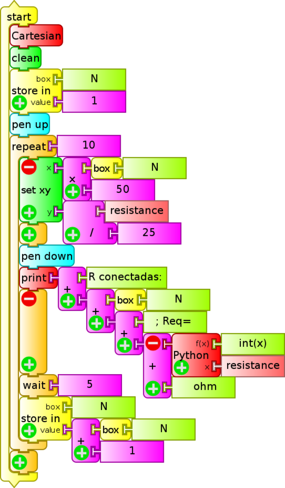
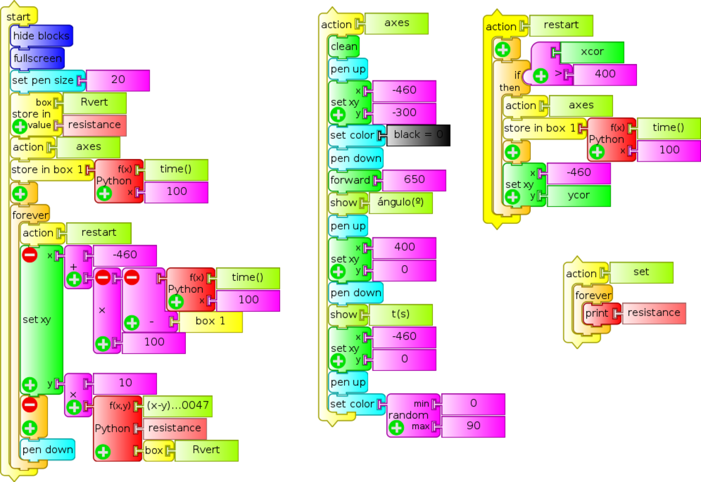
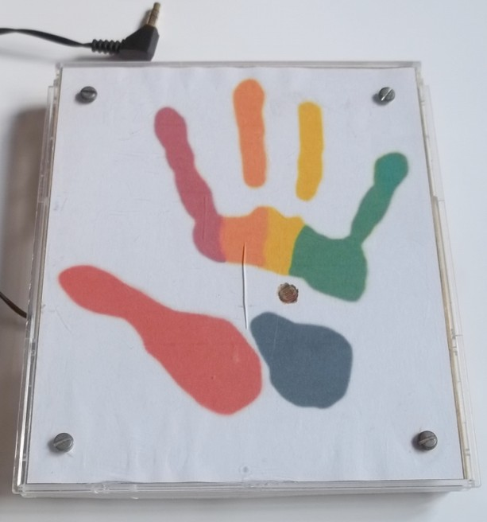
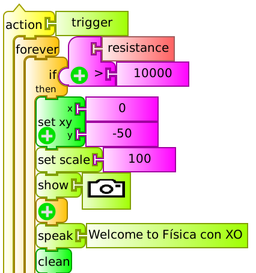
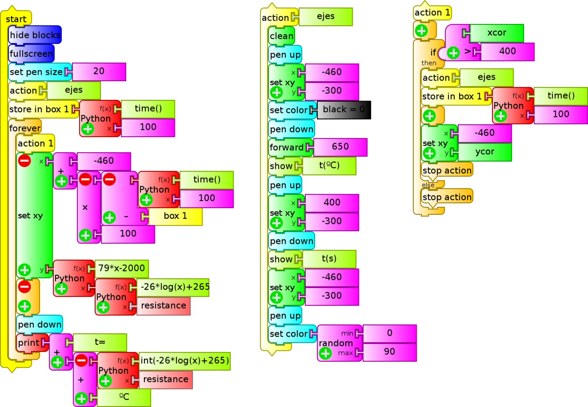
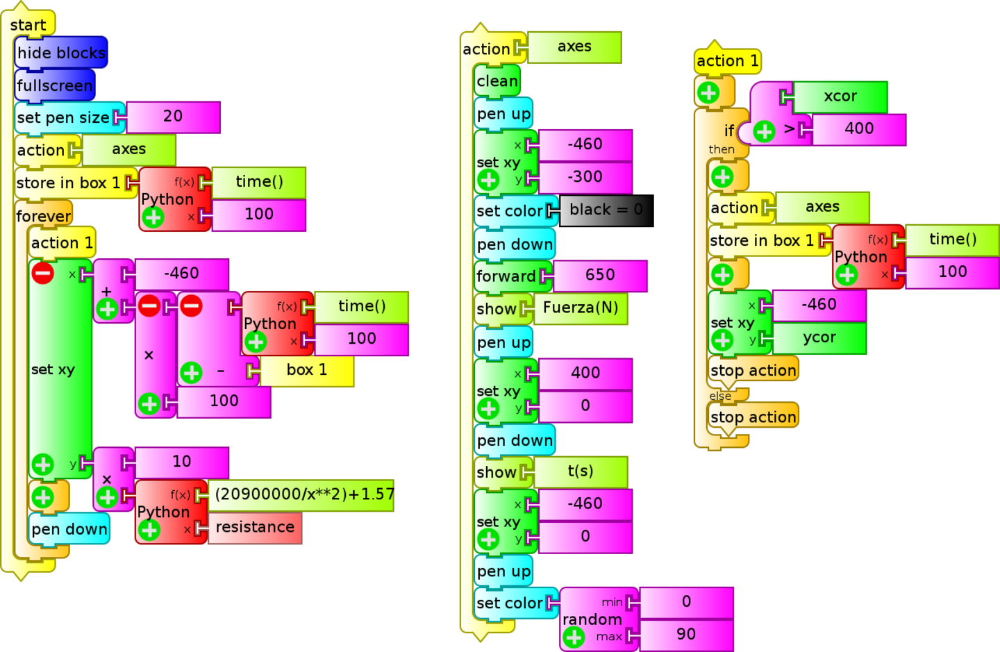
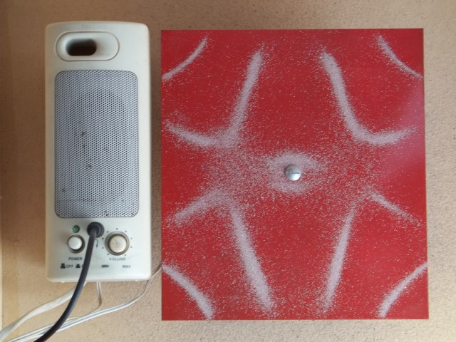

# 14. Experimental Activities

## Introduction

The hardware of the XO was designed with the possibility of connecting low cost and easy to build sensors to it, making it an ideal instrument for **introducing** our students into data acquisition, treatment and storage of measurements that arise from the interaction of between the XO and the physical world, allowing us to measure a great 
variety of physical magnitudes. We can process the information of the sensors with the "Measure" Activity or else writing programs with the "TurtleBlocks" Activity, which includes tools exclusively for processing sensor readings.

For this, elementary knowledge of programming, electronics and Physics are needed. To integrated and in order for every student make these activities for every student, we have settled on a set of basic criteria that must be met to include a given activity as part of the **"Physics with XO" project**:

1. The experimental activities must be able to be carried out with any XO model starting from XO1 (the most basic of them).

2. Planned measurements must be obtained by using the microphone sensors, the built-in camera, or else by mounting sensors. For this we'll use basic electronics, selecting components with two terminals to be connected or (as maximum) three terminals (power 5V DC USB + signal), that can be found locally on stock and which prices is below $U 200 (about 8€ or U$S 10).

3. Readings of these sensors should be done with Sugar Activities, or else Linux software included in the images (for example, Audacity).

4. Programming must be integrated with a perspective of an introduction to programing.

Because of this, the Project must be considered and introduction of physical measurements with a DA interface; under no circumstances is it meant to substitute equipment manufactured for that purpose.

## Experimental Activities

Following we include a series of ideas to develop Experimental Activities with XO: among them we may find the some using constructed sensors that must be programmed, measurements coming from the built-in sensors or those that make use of built-in elements of the XO such as the lid-close magnet or the charger; there are qualitative as well as quantitative ones; some integrate games (Primary school), elements for discovery of physical phenomena (Primary and basic Secondary) as well as experiments for the level of higher Secondary school. It is the author's intention to make a contribution for those that want to integrate Physics in their courses, Workshops, or to discover it by personal exploration, and so these ideas are presented with the understanding that what's most important is not what has been done but what readers will want to do based on it.

### <u>IMPORTANT NOTE:</u>

1. If you are interested in developing Experimental Activities that pose no risk to your XO (from wrong connections, etc.) you may look in this chapter for *Experimental Activity* sheets that are identified in the upper right cell of each table with the codes:

    1. SR (resistive sensor)
    2. SI (integrated sensor)
    3. X (no sensor) or
    4. Mic. Ext. (external microphone)

      For a higher level one may work (taking into precautions into account) with the ones identified with the codes:

    5. SV (voltage sensor)
    6. SR USB

2. All programs may be downloaded from:  [https://sites.google.com/site/solymar1fisica/programas-tb](https://sites.google.com/site/solymar1fisica/programas-tb).

## a) VOLTAGE  <u>AC Voltage</u>

### Introduction

The external microphone input of the XO allows the reading of very small AC values, in the order of **some millivolts**. In the case of periodic signals, these values may be captured with the Measure Activity; with it you will be able to:

1. Capture the waveform produced from reading a given signal working with *Time Base*. Identify (qualitatively) the type of signal by observing the waveform: sinewave signal, square, triangular, "beat" (sum of oscillations of similar frequencies), etc. Determine the period of the measured signal and calculate the frequency of it.

2. Measure the frequencies of the different components working with *Frequency Base*.

### Measuring range

**XO1:** According to measurements made, it's possible to measure sinewave signals of effective voltage of 4.0 mV, which corresponds with a maximum voltage of 5.6 mV and a $$ V _ {\text{pp}} $$ ("peak to peak" voltage) in the order of **13 mV**. Accordingly, only very small signals will be measurable, or voltage dividers will be needed to measure higher voltage signals.

### Sampling frequency

According to its technical specifications, the sampling frequency of the XO for the Measure Activity is above 48 kHz, which would allow to determine (from Nyquist's sampling theorem) the signal frequency of components with maximum frequencies of about 20 kHz.

This type of signal an also be captured with TB programs and the `sound` sensor block. However, the reading frequency in this case won't reach more than some 20 Hz (XO1) which makes it impractical for this use.

&nbsp;

| Experimental Activity 01 The XO as oscilloscope: waveform of a 50 Hz AC signal | **SV** |
| --- | --- |
| **Level:**  Higher Secondary School |
| **Goals:**  To measure the voltage of an alternating current (AC) 50 Hz.  Analysis in time.
| **Magnitude to be measured:**  Alternating current (AC)
| **Type of measurement:**  Direct
| **Sugar Activity:**  Measure version 42 (set to *Time Base*)
| **Model of XO used:**  XO1 (SKU5)
| **Sensors used:** (none) **Other materials:** Audio cable connected to the external microphone input of the XO.  220/12 V Transformer. 820 kΩ Resistor. 1.5 kΩ Potentiometer.
| **Precautions to consider:**  Extreme care: Voltage outside range can damage the XO permanently. Don't work measuring voltage on the XO if you are not an experienced user.

We will be measuring alternating current output voltage (secondary winding or just *secondary*) of a 220V/12V transformer connected to a domiciliary power network (220 V AC/50 Hz).

As the input range of XO for measuring AC voltages is in the order of millivolts, a voltage divider is built with a fixed resistor R (820 kΩ) and a potentiometer P (1.5 kΩ), as can be seen in the circuit schema:

Because we're dealing with alternating voltage, there is no need to consider polarity.

The circuit can be seen in the picture below; connectors joined to the green tweezers are connected to the *secondary* of the transformer (feed), while those connected to the red and black tweezers are from the audio cable connected to the XO:

The procedure consists of building the circuit, placing the potentiometer in such a way that voltage between the bottom and middle terminal is null and connecting the transformer to the power network. Before connecting the audio cable to the XO it, first the T and S terminals should be connected to an AC voltmeter and the potentiometer should be adjusted until voltage reaches 3.0 mV. Once this has been verified, connect the cable to the netbook and run the Measure Activity.

By default the Activity will start in *Time Base* mode. Adjust the "time by division" control until the waveform displays a full alternation; adjust the "gain" control and turn the potentiometer until obtaining an optimal on-screen display as shown in the picture below (negative colors of a screen capture of a measurement):

It can be seen (qualitatively) that the measured signal corresponds (with some alterations) to the sinewave function, which was expected.

Considering that a 1.0 ms division was selected, it can be verified that the period of the same corresponds to 20 divisions, that is $$ T = 20 \cdot 10^{-3} \text{s} $$. From there the frequency may be calculated as $$ f = 1/T = 50 \text{Hz} $$.

## <u>DC Voltage</u>

Measurement of DC voltages has been previously documented. Grasping it allows understanding of why *sensors* of other physical magnitudes can be built *based on voltage* which, by means of transducers, produce DC voltage as a function of the value of the physical magnitude that we wish to measure.

| Experimental Activity 02 Voltage Monitor| **SV** |
| --- | --- |
| **Level:**  Primary, Basic Secondary School |
| **Goals:**  Monitor of DC voltage. Measuring the voltage between terminals in a battery.
| **Magnitude to be measured:**  Alternating current (AC)
| **Type of measurement:**  Direct
| **Sugar Activity:**  TB v.109
| **Model of XO used:**  XO1 (SKU5)
| **Sensors used:** (none) **Other materials:** Audio cable connected to the external microphone input of the XO. AA Battery.
| **Precautions to consider:**  Extreme care: Voltage outside range or reverse polarity can damage the XO permanently. Don't work measuring voltage on the XO if you are not an experienced user.

You will only need the audio cable, an AA, AAA, C or D common battery (carbon-zinc) or alkaline. In all cases nominal voltage is 1.5 V. Measuring different battery sizes allows for the introduction of the concept of voltage joined by intensity of current and electric potency.

When batteries are new, voltage is slightly higher (above 1.6 V). With use, lower values are obtained. If rechargeable Ni-MH batteries are measured, the nominal voltage value is 1.2 V.

Below you will find the program used (`monitor de voltaje.ta`), the circuit schema and a picture:

|  | 
| --- | --- |
|  |

&nbsp;

| Experimental Activity 03 The XO as oscilloscope: waveform of a rectified half wave 50 AC signal | **SV** |
| --- | --- |
| **Level:**  Higher Secondary School |
| **Goals:**  Measure voltage of a continuous pulsating (DC) signal resulting from rectifying half a wave of a 50 Hz AC signal.  Temporal analysis.
| **Magnitude to be measured:**  Direct current (DC)
| **Type of measurement:**  Direct
| **Sugar Activity:**  Measure version 42 (*Base Time* mode)
| **Model of XO used:**  XO1 (SKU5)
| **Sensors used:** (none) **Other materials:** Audio cable connected to the external microphone input of the XO. 220/12 V Transformer. 1N4007 Diode. 12 kΩ Resistor. 1.5 kΩ Potentiometer.
| **Precautions to consider:**  Extreme care: Voltage outside range or reverse polarity can damage the XO permanently. Don't work measuring voltage on the XO if you are not an experienced user.

Build the circuit described in the diagram, connecting in series a 1N4007 diode D, a fixed resistor R (12 kΩ) and a potentiometer P (1.5 kΩ) to be powered by the secondary of a 220v/12v transformer as shown:

Polarity must be respected when connecting the audio cable to the potentiometer.

The circuit is shown in the image: the cables attached to the green clamps are connected to the secondary of the transformer (power), while the red and black clamps are connected to the audio cable that will be plugged into the XO:

With positive alternation (upper terminal +, bottom terminal -) the series circuit creates a clockwise current intensity, while with negative alternation (upper terminal -, lower terminal +) there is no current because of the diode D. For verification, run Measure Activity in voltage *sensor* mode, with base time, 1ms per division, to obtain the following waveform:

For optimal on screen display, start by setting the potentiometer P in such a way that its output is 0V and then turn it until obtaining the desired amplitude.

Observing the waveform it can be noticed that, practically speaking, there is tension at the potentiometer for 10 ms, then it is cancelled for the next 10 ms, and so on, demonstrating *half wave rectification* of the original signal with period T=20 ms. It is worth clarifying that the diode is not an ideal rectifier (which would have null resistance with direct connection and infinite resistance with inverse connection), resulting in a certain decrease in potential between extremes.

&nbsp;

| Experimental Activity 04 The XO as oscilloscope: waveform of a fully rectified 50 AC signal | **SV**|
| --- | --- |
| **Level:**  Higher Secondary School|
| **Goals:**  Measure voltage of a continuous pulsating (DC) signal resulting from the full rectification of a 50 Hz AC signal.|
| **Magnitude to be measured:**  Direct current (DC)
| **Type of measurement:**  Direct
| **Sugar Activity:**  Measure version 42 (*Base Time* mode)
| **Model of XO used:**  XO1 (SKU5)
| **Sensors used:** (none) **Other materials:** Audio cable connected to the external microphone input of the XO. 220/12 V Transformer. 4 x 1N4007 Diode. 12 kΩ Resistor. 1.5 kΩ Potentiometer.
| **Precautions to consider:**  Extreme care: Voltage outside range or reverse polarity can damage the XO permanently. Don't work measuring voltage on the XO if you are not an experienced user.

It's possible to obtain a direct continuous current from an alternating current in stages, where the main stage is known as *full-wave rectification*. For this, a circuit known as full-wave bridge, or Graetz bridge, needs to be constructed, using four diodes mounted as sides of a square; AC signal is connected in two opposite vertices, and the remaining will output a DC signal of variable voltage but single polarity (DC pulse). The setup can be seen in the circuit diagram, where the four 1N4007 diode bridge is connected to the secondary of a 220V/12V transformer ad the remaining vertices of the square are serially connected to a fixed resistor R (12 kΩ) and a potentiometer P (1.5 kΩ):

Polarity must be respected when connecting the audio cable to the potentiometer.

The functioning of the bridge formed by the D1, D2, D3 and D4 diodes may be analyzed as follows: 

* When a positive alternation occurs (upper terminal of source +, lower terminal of source -), the circuit establishes a clockwise current intensity *source (upper terminal)* - D2 - R - P - D3 - *source (lower terminal)*,
* while for a negative alternation (upper source terminal -, lower source terminal +), the circuit establishes a counter-clockwise current *source (lower terminal)* - D1 - R - P - D4 - *source (upper terminal)*.

In both alternations, the polarity of the upper end of the R / P series is positive and the lower end is negative, with current always circulating in one direction (downward in the drawing), constituting a DC signal.

The circuit is shown in the figure: the green clamps are connected to the transformer secondary (power), while the red and black clamps are to the audio that connects to the XO:

For verification, run Measure Activity in voltage *sensor* mode with base time / 1 ms per division and the following waveform is obtained:

### Rectification and RC filtering

A capacitor can be connected in parallel to the Resistor/Potentiometer series to obtain a waveform of a full-wave rectification bridge with filtering. By connecting capacitors of different capacitance, the influence of this component feature in resulting filtering level might be studied.

&nbsp;

| Experimental Activity 05 Discharging a Capacitor through a Resistor: Voltage/time table.| **SV**|
| --- | --- |
| **Level:**  Higher Secondary School|
| **Goals:**  Tabulating of time/voltage for an RC discharge with trigger level
| **Magnitude to be measured:**  Direct current (DC)
| **Type of measurement:**  Direct
| **Sugar Activity:**  TB v.109
| **Model of XO used:**  XO1 (SKU5)
| **Sensors used:** (none) **Other materials:** Audio cable connected to the external microphone input of the XO. 1000 μF Electrolytic capacitor. 6800 Ω Resistor. AA Battery.
| **Precautions to consider:**  Extreme care: Voltage outside range or reverse polarity can damage the XO permanently. Don't work measuring voltage on the XO if you are not an experienced user.

This application relates to a classic practical exercise in Physics Laboratory in which the discharge of an electrolytic capacitor through a resistor is studied. The circuit used is a 1000 μF Electrolytic capacitor which is mounted in parallel to a 6800 Ω resistor and the assembly is connected to an AA battery. The negative terminal is fixed and it must be possible to disconnect the positive: the circuit schematics use a Normal Open (NO) button switch to show this.

Below is a diagram and photo:

The TB program (`Tabla RC .ta`) continually monitors voltage and when the same takes values below 1.5 V (trigger threshold) it triggers the construction of the time/voltage table. This is programmed by means of the `trigger` `action`.

We have displayed 15 values:

Since the XO1 measures values between 0.40 and 1.9V, and the time constant of the selected pair is RC=6.8 s, it was decided to make measurements every 0.5 s (approximately), which is selected with the `wait` `0.5` block. For selecting a different sampling frequency this value must be modified.

An acquired table is shown as example:

It can be seen in the example that the acquisition is not produced at regular time intervals (it's not isochronous) because TB programs are "graphical masks" of interpreted Python statements. For advanced applications, a "Discharge RC Activity" might be created, as described in the 'Make Your Own Sugar Activities' manual.

It's worth clarifying that for calculating the capacitance of the Capacitor on a first (basic) level, the XO1 can be considered as an ideal voltmeter (of infinite internal resistance) and for deeper analysis consider the real (finite) value.

&nbsp;

| Experimental Activity 06 Discharging a Capacitor thorough a Resistor: Voltage/time chart.| **SV**|
| --- | --- |
| **Level:**  Higher Secondary School |
| **Goals:**  To graph time/voltage for an RC discharge with trigger level
| **Magnitude to be measured:**  Direct current (DC)
| **Type of measurement:**  Direct
| **Sugar Activity:**  TB v.109
| **Model of XO used:**  XO1 (SKU5)
| **Sensors used:** (none) **Other materials:** Audio cable connected to the external microphone input of the XO. 1000 μF Electrolytic capacitor. 6800 Ω Resistor. AA Battery.
| **Precautions to consider:**  Extreme care: Voltage outside range or reverse polarity can damage the XO permanently. Don't work measuring voltage on the XO if you are not an experienced user.

This TB program complements the previous activity "Discharging a capacitor through a resistor: Time/Voltage table". The same RC circuit is used.

The V=f(t) graph is constructed that corresponds to the RC discharge starting the instant voltage drops below 1.5 V (trigger threshold). The measured voltage is displayed at the bottom of the screen.

The scale of the y axis is chosen in such a way that values are charted between 1.5 V and 0.40 V.

### b) Intensity of DC electrical current

According to Ohm's law, to measure electrical current intensity **I** with XO a resistor of resistance **R** can be connected in series in the circuit and measuring the voltage **V** between its terminals, the sought value can be calculated with:

$$ I = V/R $$

The range of measurable intensities will be determined by the voltages range of the XO and the resistance of the chosen resistor.

#### For example:

If using a 1.0 Ω resistor and working with a XO1 (range: 0.40 - 1.9 V) it will be possible to measure intensities in the range 0.40 A to 1.9 A. The maximal potency that the resistor will be able to dissipate must be taken into account by using: $$ P _ {\text{max}} = (V _ \text{max})^2/R $$, in this case the value is 3.6 W. Consequently a resistor of 1.0 Ω and 5 W or higher potency must be used. Since the intensity is calculated from voltage measurements, attention must be given to the following precaution:

Extreme care: Voltage outside range or reverse polarity can damage the XO permanently. Don't work measuring voltage on the XO if you are not an experienced user.

&nbsp;

| Experimental Activity 07 The XO as DC ampere-meter| **SV**|
| --- | --- |
| **Level:**  Higher Secondary School |
| **Goals:**  To use the XO as a DC current intensity monitor
| **Magnitude to be measured:**  Direct current (DC) intensity
| **Type of measurement:**  Indirect
| **Sugar Activity:**  TB v.109
| **Model of XO used:**  XO1 (SKU5)
| **Sensors used:** (none) **Other materials:** Audio cable connected to the external microphone input of the XO. 1Ω 5W Resistor. 12 V DC (max 2 A) power source. 12V (max 5 W) lamps (4x).
| **Precautions to consider:**  Extreme care: Voltage outside range or reverse polarity can damage the XO permanently. Don't work measuring voltage on the XO if you are not an experienced user.

In order to use the XO1 as amp-meter in the range 0.40 to 1.9 A we will use a 1Ω 5W resistor connected in series to the circuit and voltage will be measured between the endpoints; for this reason the intensity is numerically equal to the measured voltage.

In order to run our program (`Amperimetro DC.ta`) we will use a 12V & 2A (max) DC source for powering a set of four 12V lamps that will be set up in parallel; four(4) 12V & 5W (max) car light bulbs can be used. The resistor and the XO1 are connected in series to measure voltage between the endpoints (Mind polarity!) as shown:

The photo shows the parallel setup of the 4 bulbs hanging from two wires by means of their terminals, attached to a voltage source (not shown); The circuit has a digital tester attached that has been added as amp-meter to verify accordance between measuring instruments.

&nbsp;

# 14.1 Ohmic Resistance

How to measure ohmic resistance has been described previously. Understanding it allows to comprehend why *resistive sensors* can be built, based on how they modify their resistance value as a function of the value of the physical magnitude being measured.

This feature can be applied for using the XO as an ohmmeter and for producing games, entertainment pieces, alarms, etc. as we will show. They will be programmed to monitor variation of resistance between "yes/no" extremes, corresponding to "contact/no contact" between the audio cable terminals.

| Experimental Activity 08 Linking N resistors serially or in parallel. $$ R _ \text{eq} = f(N) $$ chart. Equivalent resistance.| **SR**|
| --- | --- |
| **Level:**  Primary / Basic Secondary School |
| **Goals:**  To monitor resistance. Graph of equivalent resistance $$ R _ \text{eq} $$ as a function of $$ N $$ resistors (of same value) linked in parallel or series.
| **Magnitude to be measured:**  Resistance
| **Type of measurement:**  Direct
| **Sugar Activity:**  TB v.109
| **Model of XO used:**  XO1 (SKU5)
| **Sensors used:** (none) **Other materials:** Audio cable connected to the external microphone input of the XO. 10 x 1 kΩ Resistor. 10 x 10 kΩ Resistor.
| **Precautions to consider:**  (none)

This program (`asociacion de R.ta`) introduces the concept of equivalent resistance $$ R _ \text{eq} $$ of a setup where various resistors are connected in series or in parallel for the particular case where all have identical resistance value. The screen will display the amoutn N of associated resistors and the value of the equivalent resistance. The chart $$ R _ \text{eq} = f(N) $$ is displayed. The quantity N of repetitions (with a 5 seconds distance for manipulation) is fixed and so are the scales for both axes for optimal display of the graph.

The execution of the program for 10 resistors of 1 kΩ connected in series (lower left chart) and for 10 resistors of 10 kΩ connected in parallel (lower right chart). The values of the axes don't correspond to measurements. They are displayed by default when running the `Cartesian` block. The photos feature a series of 4 resistors and 2 in parallel.

||
|---|---
||

**Note:** Optimal programming of this activity would display the value of **R** resistance measured as a function of the quantity **N** entered with the keyboard (not deduced as a function of time as is done here). The exercise is left to the inventiveness of the reader.

&nbsp;

| Experimental Activity 09 Game of coincidences.| **SR**|
| --- | --- |
| **Level:**  Primary / Basic Secondary School |
| **Goals:**  To build and program with TB the game consisting of finding pairs of right/wrong answers.
| **Magnitude to be measured:**  Resistance
| **Type of measurement:**  Direct
| **Sugar Activity:**  TB v.109
| **Model of XO used:**  XO1 (SKU5)
| **Sensors used:** (none) **Other materials:** Audio cable connected to the external microphone input of the XO. Board with internally wired question/answer pairs.
| **Precautions to consider:**  (none)

This is a versions of the classic school game that consists in finding the match between a set of questions and answers, or, finding *name/image* pairs. The application is simple: it's a program that continually monitors the resistance between the audio cable terminals and emits some signal when the value falls below a certain predefined threshold; for the general case it is enough that the measured value exhibits a variation indicating that the sought match has been found.

A board with *conducting terminals* must be prepared, located nexto to each question and answer or each *image* and *name*; the matching *terminals* must be connected to each other by a soldered cable that is hidden in the back or inside the body of the board. As *terminals*, one can use screws, nails or pins. Care must be taken to remove any insulating material from them such as grease, dust or rust.

The TB program (`Cerebrin.ta`) displays the message: *"Do you want to play? You must connect the ends of the cable with the correct results. Good luck!"*.

Upon finding the first match, the screen background color changes, displaying the number "1" and uttering the sentence *"Very good: you found the first match"*. Subsequently, it will change the background color randomly, display the number of accumulated matches N and say *"Congratulations: N coincidences"*.

It is very important to clarify that the interest of the kids in the game grows with the challenge of designing the matching pairs and the attractiveness of the graphical presentation.

The setup could be modified to indicate when the wrong options was picked. This variant is left free for the reader's creativity if so inclined.

|||
|---|---

&nbsp;

| Experimental Activity 10 Pyroelectric alarm.| **SR**|
| --- | --- |
| **Level:**  Primary / Basic Secondary School |
| **Goals:**  To build and program with TB an alarm that is triggered with a pyroelectric sensor
| **Magnitude to be measured:**  Resistance
| **Type of measurement:**  Direct
| **Sugar Activity:**  TB v.109
| **Model of XO used:**  XO1 (SKU5)
| **Sensors used:** Fire sensor **Other materials:** Audio cable connected to the external microphone input of the XO.
| **Precautions to consider:**  Battery and connector polarity must be observed when feeding the sensor.

The TB program (`Alarma con foto JAM.ta`) consists of an alarm system that is activated when resistance between audio cable contacts takes values above a certain predetermined threshold. The system takes 5 seconds to activate, which is displayed on screen as a countdown simulating a real case. Following, resistance between audio cable terminals is continually monitored (in this case it's the minimum value (because they are in contact). When for some reason the contact is opened, the increase in measured resistance triggers the alarm: then a pictures is taken with the built in camera and a sound with frequency of 1000 Hz is emitted. After 5 seconds, the system is armed again.

The particularity of our setup is the mechanism by which the contact between terminals is opened. While flexible contacts might have been used (springs, strips, etc.) that remain in contact when the house door is closed (activated system) and are separated when it is opened, triggering the alarm, we have chosen to introduce a **pyroelectric sensor**: it consists of an electronic circuit based on a sensor that monitors the configuration of infrared radiation that bodies at human temperature (or higher) emit: when the same is altered (for example when the body in front of the sensor moves), the circuit is opened by disconnection of the pair of contacts that trigger the alarm. Although it's a complex circuit, it's functioning is simple: it requires a power source of 9 to 12 V DC (depending on the model), which we'll obtain by connecting a 9V battery to the corresponding terminals (Mind polarity when connecting!).

We can also feed it with the XO charger (as will be shown further ahead).

The audio cable terminals must be connected to the sensor's activation contacts, which are in Normal Closed (NC) position when it is not activated; some models also exist that offer Normal Open (NO). Below are the sensor with connections, the program and an example photo taken when the alarm has been activated.

&nbsp;

| Experimental Activity 11 Ring game (3 versions)| **SR**|
| --- | --- |
| **Level:**  Primary / Basic Secondary School |
| **Goals:**  To build and program with TB a game of manual skill
| **Magnitude to be measured:**  Resistance
| **Type of measurement:**  Direct
| **Sugar Activity:**  TB v.109
| **Model of XO used:**  XO1 (SKU5)
| **Sensors used:**  **Versions A and B:** Ring and wire each connected to an audio cable terminal. **Version C:** Add 2 resistors and a NC switch.
| **Precautions to consider:** (none)

It's about a version of a classic manual dexterity game: a metallic ring is placed around a wire and must be moved along it from one end to the other without touching it, or touching it as few times as possible.

Three levels of complexity are presented that have been created as the application was shown at different expositions and workshops: at each one the children demanded to different scores for players that touched the wired as many times but having taken different amounts of time for doing it, to distinguish users who touched the wire from those that didn't, etc. Following is a description of the variants:

#### Variant A:

This is the simplest program (`juego del aro (conteo).ta`): the sensor consists of a ring and a wire connected to the audio cable; the wire plastic insulation at the ends must be kept to avoid constant triggering. The program invites to begin the game by placing the metal parts in touch once, then it monitors resistance and each time there is contact a message is spoken and the screen will display how many times there has been contact. The background color varies randomly with each contact.

#### Variant B:

We use the same sensor but this program (`juego del aro (puntaje).ta`) will assign an initial score of 1000 which descends as a function of the time of contact between the metals:

#### Variant C:

In this variant the TB program (`juego del aro (puls).ta`) monitors the resistance of the microphone input. To begin playing, the ring must touch the wire once. From then on the program notifies and displays on screen each time it is touched again. When reaching the opposite end of the wire (end of game) the NC button trigger must be pressed: the program will then indicate how many times the player touched the metals and will restart for a new game. If there was no contact between metals, the total time taken is displayed and the player is encouraged to try again to succeed in less time.

If there has been contact the number of times is displayed. For mounting the sensor the following is required:

1. Conductive wire and ring (in this case we used copper, but it is advisable to use metals that don't rust when exposed to the environment).
2. Two 6800 ohm 1/8 W resistors
3. Normal Closed (NC) trigger switch. This button maintains contact between terminals while not triggered (as opposed to the usual ones). It can be substituted with a common switch.

Following is the circuit diagram:

||
|---|---

&nbsp;

# 14.2 Angular/Linear position

## I- Resistive Sensor (SR):

A resistor whose value of resistance can be adjusted between 0 and a maximum value with the linear or angular placement of a cursor is known as *potentiometer*. It's common to find them in audio equipment, radio receivers and old television sets as volume controls, tone, etc. Generally they are components with three terminals: the sides coincide with the base resistor, while the third, usually located in a position between the others is the contact determined by the adjusted resistance value. This value can be measured between either of the sides and the middle terminal.

Values therefore range between 0 and the maximum resistance nominal value. In the case of *linear potentiometers*, measured resistance between terminals varies proportionally with the location (linear or angular) that the cursor occupies. In this way, the component will allow reading positions by reading ohmic resistance. The calibration factor must be programmed that transforms the value of measured resistance in ohm to the linear position in centimeters or the angular position in degrees.

| Experimental Activity 12 Oscillating a physical pendulum: Chart of angle as a function of time (qualitative)| **SR**|
| --- | --- |
| **Level:**  Primary / Basic Secondary School |
| **Goals:**  To display the graph θ = f(t) corresponding to the angular position θ of an oscillating vertical stick as a function of time.
| **Magnitude to be measured:**  Angular position
| **Type of measurement:**  Indirect
| **Sugar Activity:**  TB v.109
| **Model of XO used:**  XO1 (SKU5)
| **Sensors used:**  Potentiometer of 10 kΩ or 50 kΩ (lineal). **Other materials:** Audio cable connected to the external microphone input of the XO.
| **Precautions to consider:** (none)

Mount a linear 50 kΩ potentiometer in a vertical acrylic board. Drill an aluminium rod at one end with a diameter coincident with the axis of the potentiometer so that its oscillation will cause it to rotate. The center terminal
and one of the edges are connected to the audio cable and so the device is ready for recording the rod's oscillations by measuring the potentiometer's variation in resistance caused by the variations in the angular position of its axis. Place two screws on both sides of the upper part of the rod so as to limit its angular displacement and protect the potentiometer against mechanical damage.

Before measuring, the calibration factor to convert resistance to angular position (degrees) must be determined: in order to do so, measure the potentiometer's resistance with its axis turned near one edge, turn it a known number of degrees, then measure the final resistance and obtain the conversion factor from the quotient "sweep angle/variation of resistance": in our case it's 0.0047 °/Ω. As we will be measuring angular positions with respect to a certain vertical position, we shall read this initial value (we'll call it $$ R _ \text{vertical} $$) in order to be able to calculate the angular position $$ \theta $$ with the expression:

$$
\theta = 0.0047 \cdot (R - R _ \text{vertical})
$$

We have included the `action` "`set`" to be able to verify that the rod's oscillation limits correspond to resistances within the XO's measuring range (otherwise plateaus are obtained on the chart).

Here we have shared an image of the pendulum, the obtained chart (with some noise because the potentiometer had been heavily used) and the program (`grafica loop pendulo.ta`):

## II.- Voltage Sensor (SV)

It's possible to measure distances by using an infrared distance sensor such as the SHARP 2YOA21: with it distances can be measured in the range of 10 to 80 cm.

The sensor must be powered by DC voltage between 4.5 and 5.5 V and it produces an output voltage which is inversely proportional to the measured distance. The sensor's measuring range is going to be limited by the XO's input voltage range.

The sensor has three terminals corresponding to: signal (white cable), power negative (0 V black) and power positive $$ V _ + $$ (5V DC red cable).

Also, this is an integrated sensor that must be powered, for example, by the 5V USB output, remembering to be cautious:

Extreme care: Voltage outside range or reverse polarity can damage the XO permanently. Don't work measuring voltage on the XO if you are not an experienced user.

The relation between the sensor's output voltage and the inverse of the distance fits acceptably with a linear function.

As the sensor is not easily found in the market and its price if above US $10 (maximum established for this project), we present its general functioning but have not designed applications for it because it is outside the project's criteria.

# 14.3 Lighting level

There are several ways to detect or measure lighting levels with XO.

1. (camera **SI**) The first and simplest consists in using the built in camera as a *brightness sensor* (not referring to the photometric concept of **brightness**) by programming in TB using the `brightness` *sensor block*.

   While technical information mentions the possibility to disable automatic control of the camera for using it as a *photometer*, in practice (at the moment of writing) it has not been possible, so it will only be good for qualitative readings of lighting. When programming in TB we'll be able to access measuring lighting once per second (TB v.130 on XO1), 4 or 5 per seconds (XO1.5) or more (XO1.75). TB version 109 on XO1 does not function properly for sensing brightness.

2. (**SV**) Another way to measure lightness is by using the photovoltaic cell (like those used by "solar" calculators), and measuring its voltage output. If voltage exceeds the XO's range, a tension divider can be set up with a potentiometer, or by attaching a couple of resistors as appropriate.

3. (**SV**) Photo-diodes or photo-transistors can be used for these measurements, but for using them as light sensors, we'd need to build auxiliary circuits that, while being simple, fall outside the goals of this project.

4. (**SR**) A resistive sensor can be used, such as an LDR (light dependent resistor) that varies its resistance in response to lighting. We'll use this one frequently. For its use, consider limiting characteristics (relatively high response time, sensitivity curves as function of wavelength, etc.)

## I.- Photovoltaic cell

A photovoltaic cell is a device that produces continuous voltage in proportion with lighting. It's common to find them in "solar" calculators (they are actually solar and battery powered), toys, or as for charging led lamps (such as we will use in the following applications).

Because of this, before using them, we must identify the electric polarity of the terminals. To this goal, we may follow one of the following procedures:

1. A cell must be lit from a light source of constant illuminance such as the sun or an incandescent lamp powered by DC. In this case we've used a 12V, 10W lamp powered by the XO1 charger (12V and $$ P _ \text{max} $$ = 17W):

  

  Connect the cell terminals to a tester set to measure DC voltage: if the reading shows a positive value, then the terminals match the polarity of the tester (red +, black -, if connected to "V" and "COM") and vice-versa. The picture shows the first case: the green cable is negative and the yellow positive.

  

2. The cell must be lit from a light source with constant intensity such as the sun or an incandescent lamp powered by DC. In both cases the cell should not be lit directly but using an indirect diffuse reflection. Cover the cell with an opaque, dark cloth; connect the terminals of the same to the audio cable, and connect it to the external microphone input of the XO while running the Measure Activity, set to *voltage sensor* mode. Adjust the gain control slider (that appears at the right hand side of the screen) until the horizontal line (which indicates the measured DC voltage value) is visible and located at the center of the screen. Uncover the cell by slowly removing the cloth that covers it and observing the position of the trace on screen: if it starts to rise, the polarity of the terminals matches that of the audio cable's alligator clamps; if it descends, it's the opposite. The pictures show the cell with dimmed light and then with more light, and the trace rising (voltage increasing): this indicates that the yellow cable is positive and the green negative.

||
|---|---

## II.- LDR (light dependent resistor)

An LDR is a component whose resistance depends on illuminance. Its sensitivity depends on the wavelength of the incoming wave, and its *response time* is low, in the order of a tenth of a second; for this reason we'll apply it only for slow changes in illuminance. It could be used for applications such as "photo gate" (for determining mean velocity in kinematics) only in cases where time intervals are measured in the order of seconds.

The functional relationship between lighting **I** and resistance **R** is *inverse*, indicating that a greater illuminance will result in lower resistance, and vice-versa: a typical well-lit LDR has low resistances in the order of hundreds of ohm, and when dark, the resistance value is elevated to the order of a million ohm (MΩ).

The setup of components is direct, joining the terminals to the audio cable: clamps may be used, a connection block, or (preferably) they may be soldered to each other, with caution to avoid heating the component because it may be damaged with excess temperature. As with any resistive sensor, there is no need to observe polarity. Below is a photo and a diagram of the setup: 

For *qualitative* applications of the LDR as a sensor of lighting levels we can simply measure its resistance **R**.

For *quantitative* applications we'll follow the following procedure:

### Calibrating an LDR as for sensing illuminance 

If it is desired to measure illuminance **I** in the corresponding units (lux) for applications as a *luminosity sensor*, we must proceed to *calibrating* the component": the procedure consists in obtaining the function that translates resistance **R** to illuminance **I**; for it we must place the LDR next to a calibrated light sensor and light both in such a way that it's possible to vary the luminosity on both of them, and building a graph of illuminance as a function of resistance: I=f(R).

In this case we used a *light sensor* connected to a *LabQuest Mini (Vernier)*. The control and analysis software was *LoggerPro* running on Ubuntu Linux, on a Magallanes MG2 laptop.

The LDR used is model GL12537 chosen because its resistance varied within the XO1's measuring range for normal illumination levels: solar and classroom.

The light source used was a 12V / 18W bulb (such as cars or motorcycles use), powered by an XO1.5 charger (12V and $$ i _ \text{max} = $$ 2.1 A). It's necessary to clarify that luminosity was variable by changing the voltage of its power source or distancing it from the sensors: we chose the latter because the first changed the color composition of the filament's emitted light.

The procedure was performed in a dark room, where the only light source was the lamp. The location of the sensors was such that they received only light from the bulb, avoiding reflected light.

The adjustment curve is the function $$ I = a \cdot R^b $$ that appears in the legend of the graph:

The values taken by the parameters **a** and **b** of the adjustment function identify the used LDR.

**Note:** If it is desired to measure illuminance, the sensor used must present a response curve that matches or is close to the *brightness sensation* function, in relation to different *wavelengths* for the human eye; this function presents a *bell* shape known by the name *lighting performance*, *luminosity function* or *standard observer luminosity efficiency curve* that peaks at λ= 555 nm. Until determining the spectrum response of the sensor used, we will not be able to define its precision as an *illuminance sensor*.

&nbsp;

| Experimental Activity 13 The XO as oscilloscope: chart of a signal produced by a photovoltaic cell| **SV**|
| --- | --- |
| **Level:**  Primary / Basic Secondary School / Higher Secondary School |
| **Goals:**  To measure the voltage signal produced by a photovoltaic cell lit by different sources: incandescent bulb powered by DC and AC and fluorescent light powered by AC. Temporal analysis.
| **Magnitude to be measured:**  (Qualitative) amount of light proportional to continuous voltage (DC)
| **Type of measurement:**  Indirect
| **Sugar Activity:**  Measure v31 (set to *Base Time*)
| **Model of XO used:**  XO1 (SKU5)
| **Sensors used:**  Photovoltaic cell **Other materials:** Audio cable connected to the external microphone input of the XO. 12V DC power source. 12V & 10W incandescent lamp. 50 kΩ. Incandescent 220V & 75W lamp. Fluorescent tube 220V (*NT: or 110V*) AC.
| **Precautions to consider:**  Extreme care: Voltage outside range or reverse polarity can damage the XO permanently. Don't work measuring voltage on the XO if you are not an experienced user.

## i. Waveform of a signal produced by a cell when lit with an incandescent bulb powered by continuous voltage (DC)

We'll use an incandescent lamp of 12V and 10W powered by an XO1 charger (12V DC and $$ P _ \text{max} $$ = 17W located at some 20 cm of the cell directly connected to the external microphone input of the XO1:

It can be seen that this light source produces a constant lighting level which can be verified by the obtained waveform (straight line parallel to the temporal axis).

## ii. Waveform of a signal produced by a cell lit by an incandescent bulb powered by alternating voltage (50 HZ):

An incandescent bulb of 220V and 75W was located to the right of the XO1 as shown in the photo:

In this case the lighting causes the cell to produce a higher voltage than what the XO1 admits, so a tension divider must be added by means of a potentiometer; in the example we used one of 50kΩ, connecting the cell terminals to the ends of the same (green and yellow clamps) and the audio cable between one of the ends (black clamp next to the green one, cell negative) and the middle terminal of the potentiometer (red clamp).

The electrical schematic is shown here:

Polarity must be respected when connecting the audio cable to the potentiometer.

Before connecting the audio cable to the XO1, the potentiometer's knob needs to be set so that the middle terminal is in contact with the lower terminal (in the figure). This produces an output of 0V; then the cable is connected and the knob begins to be turned until variations in the signal can be observed on screen.

In this case we conclude that there is a variable illuminance whose period of 10ms is justified because the filament reaches maximum temperature at each alternation. The luminosity variation is slight because of the thermal inertia of the filament's material.

### iii. Waveform of a signal produced by the cell lit with a fluorescent tube powered by alternating voltage (50HZ):

The signal that is obtained at the cell in this case is what it produces when lit by a light coming from a fluorescent tube ("lux tube") powered by the domestic network 220V 50Hz. This light source is found above the XO1 as the photo shows:

||
|---|---

Just like in the previous case, a potentiometer must be used as a tension divider to protect the XO1 input from extreme voltages and for scaling the signal on screen. The waveform that is obtained allows affirming that we are dealing with a variable illumination level with the same period as the previous example but with brusque variations coinciding with the light production means based on an electrical discharge in the low pressure gas contained in the tube.

&nbsp;

| Experimental Activity 14 "Welcome"| **SR**|
| --- | --- |
| **Level:**  Primary / Basic Secondary School / Higher Secondary School
| **Goals:**  To build and program a *hand sensor* that, when covered, will trigger the XO to emit a spoken message and take a picture.
| **Magnitude to be measured:**  (Qualitative) lighting measured by resistance of LDR.
| **Type of measurement:**  Indirect
| **Sugar Activity:**  TB v.109 (and v.130 and beyond)
| **Model of XO used:**  XO1 (SKU5)
| **Sensors used:**  LDR GL12537. **Other materials:** Audio cable connected to the external microphone input of the XO. Trigger switch NA or NO. Portable lamp or laser pointer.
| **Precautions to consider:** (none)

### Option A: A hand sensor

#### Description

The *hand sensor* consists in a wooden block to which the drawing of a hand has been attached. An LDR is located at the center of the image and the set is covered with a (transparent) standard CD box for protecting the LDR and to avoid getting the paper dirty with use.

#### Functioning

Place the sensor in a location lit by the sun or another light source (portable lamp, etc.). When the user faces the XO, the program invites him with a message on the screen to cover the *hand sensor* .

Upon varying the incoming light, the program triggers taking a picture and a welcome message.

The TB program (`bienvenida (sensor mano).ta`) is shown below:

#### Set up

Start by connecting the *hand sensor* to the XO, lighting the LDR, and running the `action` `test` by clicking its heading. This `action` shows the resistance of the lit LDR, that must be under 14000 ohm (maximum range of the XO1).

If it shows that value, the amount of light must be increased; if even so there is no change, then this is a symptom of a broken wire or damaged LDR.

The value of measured resistance when lit must be below the value that appears in the `if then` condition within the `action` `trigger` (in our example it is 10000 ohm).

**Remember:** You must 'load' the *speak.py* example, otherwise the spoken message won't be emitted. This must be done each time you copy the program to another XO.

When working with TB v130 and later, the program can be modified (`bienvenida (sensor mano) v130.ta)`), simplifying the task by using the `speak` block as done in the portion of the program in the picture:

### Option B: A laser light barrier switch

A variant that students find fun is lighting the LDR with a laser pointer in such a way that the "welcome" program is triggered when the beam is interrupted. The pointer and the sensor can be separated by a great distance and can be interrupted when a person passes between them.

In the picture the setup is inside of a cardboard box that has been covered with plastic film, filled with smoke (using an incense stick that is not shown), showing the beam of a green laser pointer that lights the LDR (below); even under such conditions, the sensor's resistance is low, some 2600 ohm. 

### Option C: A Normal Open button (NO)

One possible simplification of the device consists in substituting the LDR with a Normal Open (NO) switch such as a doorbell switch or placing the audio cables so that when pressed, the come into contact.

The setup is direct as shown by the diagram and picture:

The only modification to the program (`bienvenida (pulsador NO).ta`) consists in substituting the condition `resistance > 10000` with `resistance < 10000` (because when cables come into contact, resistance diminishes, as opposite as to what happens when darkening the LDR).

#### Setup:

Start by connecting the XO1 audio cable and running the `action` `test` clicking its heading. This displays a resistance of 14000 and when the cables are in contact it will display 700.

&nbsp;

| Experimental Activity 15 LDR as light sensor. Chart loop of l=f (t)| **SR**|
| --- | --- |
| **Level:**  Primary / Basic Secondary School / Higher Secondary School
| **Goals:**  To build and program a *hand sensor* that, when covered, will trigger the XO to emit a spoken message and take a picture.
| **Magnitude to be measured:**  (Qualitative) lighting measured by resistance of LDR.
| **Type of measurement:**  Indirect
| **Sugar Activity:**  TB v.109 (and v.130 and beyond)
| **Model of XO used:**  XO1 (SKU5)
| **Sensors used:**  LDR GL12537. **Other materials:** Audio cable connected to the external microphone input of the XO. Trigger switch NA or NO. Portable lamp or laser pointer.
| **Precautions to consider:** (none)

This application includes the calibration function I=f(R) for our particular LDR and builds a chart on screen of illuminance as a function of time. When the trace reaches the right border it erases and restarts from the left changing the color randomly. The program `GL12537 grafica loop I (lux) t (s).ta` is as follows:

The python function blocks that can be seen at the bottom of the main stack relate to the calibration function (x=resistance) and to the function that scales the illuminance range to the length of the chosen vertical axis (to optimize the on screen display).

### Application: Polarimetry

&nbsp;

Working in collaboration with chemistry teacher Isabel Suárez (Liceo El Pinar N°1), the colleague suggested the idea of using this sensor and program to determine the angle of rotation in a plane of polarized light that propagates across an optically active substance in a device known as *polarimeter*.

This application would allow to determine an offset angle with greater precision than that obtained by the more traditional method.

| Experimental Activity 16 XO as pulse monitor| **SR** **USB**|
| --- | --- |
| **Level:**  Primary / Basic Secondary School / Higher Secondary School
| **Goals:**  To build a *pulse sensor* and program a chart to monitor it on screen.
| **Magnitude to be measured:**  (Qualitative) lighting measured by resistance of LDR.
| **Type of measurement:**  Indirect
| **Sugar Activity:**  TB v.109
| **Model of XO used:**  XO1 (SKU5)
| **Sensors used:**  Pulse sensor (LDR, LED, resistor, support clamp, USB cable, audio cable)
| **Precautions to consider:**  The USB port is used for powering the LED light with 5V. Use extreme care when handling connections: A short circuit would damage the XO permanently.

### Summary:

Here we present the setup of a *pulse monitor* that, when placed on a person, allows monitoring of their pulse on the XO screen, showing a chart where each peak corresponds with a heartbeat.

The sensor is connected to the XO1 thru the **mic** input and **USB** and the program (`monitor de pulso.ta`) is done in "TurtleBlocks" v.109:

This program can be modified for calculating the heartbeat rate and displaying it on screen.

### Introduction:

**Pulse oximetry** (Wikipedia pulse oximetry) is a non invasive method that allows to determine the oxygen saturation level of the hemoglobin in a patient.

For performing this technique, a sensor is placed in a thin body part, allowing us to determine the absorbance caused only by pulsation of arterial blood.

**Note: the application shown here is based on pulse oximetry but is not an example of this method.**

### Implementation:

A white, bright LED connected serially to an appropriate resistor, is lit powered by the 5V DC coming from the USB port. This LED lights an LDR (in this case the GL12537) connected to the external microphone input of an XO1. By placing both components at either end of a laundry clothing clip, and placing between them an area such as earlobes or the skin between the thumb and the index finger, each blood pulsation will produce a change in the light that reaches the LDR, and the corresponding resistance variation. The TurtleBlocks v109 program shows the resistance of the LDR on screen as a function of time, monitoring the "patient's" pulse.

With the voltage values $$ V _ \text{led} $$ and $$ I _ \text{led} $$ the value of resistance R can be calculated and the potency of the resistor, like:

$$
R = \frac{5V - V _ \text{led}}{i _ \text{led}} ; P = R \times i _ \text{led}^2
$$

When connecting the LED one must respect its polarity, otherwise it won't light up.

**WARNING**: Be very careful NOT to connect the red (+) and black (-) cables of the USB directly with each other, because the XO1 may be damaged permanently.

If avoiding this risk is desired, power the series Resistor-LED with 3 AA or AAA batteries. In that case use 4.5V instead of 5V in calculations.

The indicated LDR may be used or any whose resistance when lit falls between 700 and 14000 ohm (XO1 measuring range).

&nbsp;

| Experimental Activity 17 LDR lighting monitor| **SR**|
| --- | --- |
| **Level:**  Basic Secondary School / Higher Secondary School
| **Goals:**  To program an LDR as a *light sensor* calibrated for studying the l=f(r) dependence (lighting as a function of distance) with respect to a small light source
| **Magnitude to be measured:**  Lighting
| **Type of measurement:**  Indirect
| **Sugar Activity:**  TB v.109
| **Model of XO used:**  XO1 (SKU5)
| **Sensors used:**  LDR GL12537 **Other materials:** Audio cable connected to the external microphone input of the XO. Lamp of 12V 18W powered by the XO power source. Measuring tape.
| **Precautions to consider:** (none)

Here we replicate a classic experiment in optics where a light sensor is distanced from a small bulb to study the dependence of illuminance **I** with distance **r**. For the conditions we worked with, it can be stated that the variables maintain an inverse relation of the kind:

$$
I \propto \frac{1}{r^2}
$$

known as *inverse square law*.

The conditions were the same as for the calibration process of the LDR (previously described).

For measurements of illuminance, a monitor was programmed with said magnitude in TB (`GL12537 monitor de I (lux).ta`):

This sensor measures in the range of 60 to 600 lux. The obtained chart is shown next to the inverse square adjustment:

# 14.4 Temperature

Temperatures may be recorded by using one of the following sensors:

## I.- (SV) Temperature sensor:

This is one of the sensors that produce output voltage that depends on temperature to which they are exposed. They need DC voltage, so setting them up requires attention to the following warning:

Extreme care: Voltage outside range or reverse polarity can damage the XO permanently. Don't work measuring voltage on the XO if you are not an experienced user.

We use the integrated sensor LM35.

### Voltage sensor (SV) LM35:

### Description

This is an integrated sensor of three terminals that functions powered by 5V DC which we can obtain from the USB port. It produces an output voltage which is lineal to the temperature (Celsius) to which it is exposed. The sensor terminals, seen from the front, and ordered from left to right relate to:

- Feed voltage (positive or V+)
- Output voltage ($$V _ \text{out} $$) and
- Feed ground (negative or GND)

According to the technical specifications, the integrated sensor produces 0.010 V per °C of temperature and it is able to work between **-55** and **155 °C**. According to the DC voltage range of the XO1, we can work with this sensor between **40** and **155 °C**.

Ambient temperature can be measured to ¼ of °C and, for the whole temperature range, measurements within ¾ of a °C.

## II- (SR) Thermistor

This is a component whose resistance depends 
on the temperature it is exposed to. If it is connected to the microphone input the measured resistance value can be easily converted to a value of temperature by obtaining the calibration function. Choose the technical characteristics of the component so that the resistance range that the XO measures matches the range of temperatures that need to be measured.

There exist those in which the resistance varies inversely with temperature, known as NTC (Negative Temperature Coefficient).

### The resistive sensor (SR) Thermistor NTC103:

### Description

In this case, as with other resistive sensors, the setup is elementary and direct between the thermistor (a component with two terminals) and the audio cable: clamps may be used, a connection block, or (preferably) they may be soldered to the cable, with caution so as to not submit the component to excess heat because it may become damaged. As with any resistive sensor, there is no need to observe polarity.

In this case, since the sensor will measure temperatures of liquids, and its terminals should not get wet, it is recommended to protect them with either a heat-shrinkable plastic covering or within a thin metal sheath. The schematics of the circuit setup are as follows: 

### Calibration of the NTC103 termistor

For calibrating the thermistor it needs to be mounted next to the bulb of a lab thermometer (for example), and both submerged in water at different temperatures to register the values of both magnitudes and constructing the corresponding **t=f(R)** chart. The obtained curve is adjusted with a function like:

$$
t = a \cdot L(R) + b
$$

The **a** and **b** parameters identify the NTC thermistor used. Here is the chart obtained in our case:

### Modifying the measuring range with NTC103 and XO1

According to the previous section, using the NTC103 thermistor on the XO1, we'll get a thermometer that is able to measure in the rango of 16 to 93 °C (+/- 2°C). While it is wide, it doesn't include either water's fusion point or boiling point, one of the most accessible substances for any elementary experiment. However a small modification to the sensor will allow us to solve the problem.

The following is based on a group elaboration performed with teachers V. Almeida, I. Suárez, E. Stawsky and E. Santos, while researching the subject.

Analysing the calibration chart of the NTC103, we can see that at 110°C its resistance is around 370 ohm, below the minimum measurable by the XO1; but if we add a 330 ohm resistor in series, the XO1 will measure the total value of 700 ohm. In this fashion, we have *displaced* the range to include one of water's points. A slight modification is needed for the Python block to calculate the temperature from the thermistor resistance value; for it we must substitute:

"**x=resistance**" for

"**x=(resistance-330)**" as can be seen in the figure:

If it is desired to *displace* the series range again so that it will include water's fusion point, we must conect to the "330 ohm/NTC103" series a resistor in parallel such that equivalent resistance is 14000 ohm when temperature finds itself below 0°C. In this case, the program must be modified substituting:

"**x=(resistance-330)**" for

"**x=(27000 + resistance)/(27000 - resistance) - 330**"

Below you'll find the modified Python block as well as the schematics for a circuit that, with a switch, selects between *high* range (open switch) **17 to 110 °C** and *low* range (closed switch) **-2.4 to 95 °C**:

&nbsp;

| Experimental Activity 18 Time/temperature table (every 2 seconds)| **SV**|
| --- | --- |
| **Level:**  Primary / Basic Secondary School
| **Goals:**  To display on screen a table of values of time/temperature every 2 seconds (approx.)
| **Magnitude to be measured:**  Temperature
| **Type of measurement:**  Indirect
| **Sugar Activity:**  TB v.109
| **Model of XO used:**  XO1 (SKU5)
| **Sensors used:**  LM35 **Other materials:** Audio cable connected to the external microphone input of the XO. USB Cable.
| **Precautions to consider:**  Extreme care: Voltage outside range or reverse polarity can damage the XO permanently. Don't work measuring voltage on the XO if you are not an experienced user.

The TB program (`Tabla LM35.ta`) monitors the temperature of an LM35 sensor and when it goes above 41°C (minimum range for XO1), starts to display *time/temperature* values on screen. It reads every 2 seconds (approximately) and displays 18 pairs of values:

||
|---|---

&nbsp;

| Experimental Activity 19 Thermometer and *thermo-phone*| **SV**|
| --- | --- |
| **Level:**  Primary / Basic Secondary School
| **Goals:**  To show the elemental thermometer application (displays temperature on screen) and *thermo-phone* ("speaks" the temperature)
| **Magnitude to be measured:**  Temperature
| **Type of measurement:**  Indirect
| **Sugar Activity:**  TB v.109
| **Model of XO used:**  XO1 (SKU5)
| **Sensors used:**  LM35 **Other materials:** Audio cable connected to the external microphone input of the XO. USB Cable.
| **Precautions to consider:**  Extreme care: Voltage outside range or reverse polarity can damage the XO permanently. Don't work measuring voltage on the XO if you are not an experienced user.

Here we show the TB program that monitors temperature (`termometro LM35.ta`), the sensor with its terminals which are connected to the *sensor box*; a minimal variant in the program (`termofono LM35.ta`) turns it into a **thermophone** a thermometer that "says" the sensor temperature:

&nbsp;

| Experimental Activity 20 Chart loop for temperature/time and on screen display| **SR**|
| --- | --- |
| **Level:**  Primary / Basic Secondary School / Higher Secondary School
| **Goals:**  Thermometer application that additionally displays temperature chart as a function of time.
| **Magnitude to be measured:**  Temperature
| **Type of measurement:**  Indirect
| **Sugar Activity:**  TB v.109
| **Model of XO used:**  XO1 (SKU5)
| **Sensors used:**  NTC103 Thermistor **Other materials:** Audio cable connected to the external microphone input of the XO.
| **Precautions to consider:** (none)

Here we show the TB program that monitors temperature with the NTC103 thermistor (approximate range: 16 to 94°C) and continually renders a chart of measurements as a function of time. The program is designed for charting *temperature=f(time)* of the hand of a person touching the sensor. The trace changes color and restart from t=0 s upon reaching the right hand side of the screen. Vertical scale is dimensioned for optimal display of the skin temperature on a warm day (21 to 31°C).

We show the program (grafica NTC103 loop t(C) t(s).ta) and a photo of the screen rendering.

# 14.5 Magnetic Field

The Hall effect can be introduced using the following situation: consider a rectangular conducting flat sheet transporting an electric current of constant value across its long side. If it is put in a magnetic field $$ B $$ perpendicular to the plane that holds it (edge case), a $$ V _ \text{Hall} $$ voltage is produced between two points of the wider sides of the sheet, which is proportional to it. This allows the construction of magnetic field sensors. Again we are dealing with integrated sensors which produce a voltage linearly linked to the value of the magnetic field to be measured.

In the market it is possible to acquire the *Allegro 1302*, a sensor that produces 1.3 mV/G, which (in combination with the voltage measuring range of the XO) makes it suitable for measuring only very intense magnetic fields. For this reason we won't use it quantitatively.

The sensor has three terminals corresponding to feed V+ (5V red cable to the left of the photo), negative (0V black cable in the middle), and signal (white cable to the right). For feeding it with DC voltage we use the XO's USB port. For setting it up and testing it, the following warning must be considered:

Extreme care: Voltage outside range or reverse polarity can damage the XO permanently. Don't work measuring voltage on the XO if you are not an experienced user.

To test the functioning of the sensor we place it facing the north pole of a pair of neodymium magnets and locate both components at the opening of a digital caliper (which we have previously reset when closed) as shown in the photo.

We chart the output voltage as a function of the distance **r** next to and adjustment that shows that we can use the sensor (with XO1) for distances between 3 and 10mm only:

For calibrating the sensor we had only a commercial sensor that could not measure such intense fields. Also we found that we needed to correct the distance because the measuring chip is located some 10mm from the edge of the sensor body, as the photo shows. We have included the chart of the magnet field as a function of distance of the commercial sensor:

# 14.6 Force

Recently there have appeared resistive force sensors, known as FSR (Force-Sensing Resistor). They are components whose resistance depends on pressure applied to them. They are of robust construction but also of very low precision so we will use them only qualitatively.

We are using the model FSR402.

Here is a chart (for calibration) F=f(R) of a body's weight placed on top of the sensor as a function of the average resistance value (since great variability was observed in these values):

||
|---|---

A TB program (`grafica loop F(N)_t(s).ta`) renders the Force as a function of time chart for a mass-spring system oscillating vertically. The FSR sensor is placed between the upper end of the spring and the support base of the system for sensing applied force:

# 14.7 Acceleration

The XO netbook integrates an accelerometer sensor within its hardware starting with model XO1.75. The measured data can be accessed via the `accelerometer` sensor block which is included in TB. When invoking it, the values $$ a _ x, a _ y, \text{and} _ z $$ of measured components are stored in memory in a `stack`; to access them one must use the block `pop` three times. As with any routine that uses the `stack`, it must first first clear it with the `empty stack` block.

Here we show a TB program (`acelerometro.ta`) that prints the cited components at the bottom of the screen:

In the XO1.75 available to us at the moment of testing the program (SKU199), the acceleration was obtained in arbitrary units where gravitational acceleration took values around 60 ua. Spatial directions seemed to respect the following directions (with respect to the XO screen located in a vertical plane):

1. semiaxis x+: from left to right of the screen
2. semiaxis y+: from the upper border to the lower border of the screen
3. semiaxis z+: from the back to the front of the screen

&nbsp;

# 14.8 Frequency

## I- Measuring frequency with Turtle Blocks Activity:

The TB Activity allows determining the frequency of a given sound by using the `frequency` sensor block. However these measurements have a resolution of +/- 8 Hz, which is rather low precision.

| Experimental Activity 21 Monitor 440 Hz frequency| **SV**
| --- | --- |
| **Level:**  Primary / Basic Secondary School / Higher Secondary School
| **Goals:**  To detect sounds in the 440 Hz frequency with a minimum duration of 2 seconds
| **Magnitude to be measured:**  Frequency
| **Type of measurement:**  Direct
| **Sugar Activity:**  TB v.109
| **Model of XO used:**  XO1 (SKU5)
| **Sensors used:**  The built-in microphone
| **Precautions to consider:** (none)

A tuning fork is a metallic fork (which may be attached to a resonance box as in the picture) that is used as a reference for tuning musical instruments; to make it sound it must be hit with a rubber head hammer or some other soft material. The picture shows an sample with an adjustment knob: a metallic piece that is placed in one or both branches (in this case the left) and is used for altering (lowering) the natural oscillation frequency.

We show as an example a TB program (`Oreja 440.ta`) that detects the presence of a sound of frequency 440 Hz and reports it on screen if it lasts for at least 2 seconds; to trigger it hit the tuning fork corresponding to the musical note *A* 440 Hz. Of course it is also activated when somebody emits the corresponding note singing it.

**Note:** Within the `action` `ear` it is permanently monitored if the frequency of the strongest component detected holds for two seconds at 448 Hz, triggering the message "...a frequency of...". This value should be 440 Hz, but the value was adjusted because it's what the XO returned when measuring the sound coming from the tuning fork, fitting TB's bad performance when measuring frequencies (as was indicated previously).

&nbsp;

## II- Measuring frequency with Measure Activity

The **Measure Activity** allows analysis of sound features detected by the build-in microphone (or any external microphone connected to the XO). With this Activity a **time analysis** can be performed with the **waveform**: a chart of the **signal registered by the microphone as a function of time**, as well as a **frequency analysis** with the chart of **Amplitude as a function of frequencies** present; the former can be used to extract (qualitative) information about the type of signal recorded from the waveform (sinusoidal, square, etc.) and calculate the T period of the same. The second type of chart allows us to analyze the spectrum of frequencies present in a given sound performing the *harmonic analysis* (also known as *Fourier analysis*) of the signal.

### Summary

We may classify any mechanical or electrical oscillation by its period **T** (and with it the sounds they make) into simple and compound harmonics; the first may be described by a sine function y=f(t) of unique frequency (example: the sound produced by a tuning fork hit gently with a rubber hammer) while the second type can be analysed as the sum of a series of harmonic oscillations of fundamental frequency (corresponding to perido **T**), plus other frequencies which are a multiples of it, that we call harmonic components. The relative values that the amplitudes of each of the harmonic components take (among other factors) define what is known as the **timbre** of a sound, a feature which allows distinguishing between two instruments playing the same note in the same octave (same fundamental frequency), such as a piano and a guitar playing the A4 note (the middle piano key, 440 Hz).

Harmonic analysis allows us to obtain said components. This was possible (under certain conditions) by using the Discreet Fourier Transform, using a calculation algorithm known as Fast Fourier Transform (FFT); it's about analysing a sound (or oscillation) in order to obtain fundamental physical information from it.

**Source:** García (1991)

## Precision in the calculation of frequencies:

In the lowest range of the **Sound mode / Frequency Base** (up to 220 Hz), linking the waveform to the grid that divides the screen, frequencies can be determined with a resolution of +/- 1 Hz and even +/- 0.5 Hz depending on the observer. At the maximum range (up to 20000 Hz) frequencies can be determined with a resolution of +/- 50 Hz. This allows using the XO as a musical instrument tuner, knowing the reference frequencies that it must emit. Because of the above, we'll be using Measure for measuring frequencies on XO.

| Experimental Activity 22 Pure sounds: Waveform of the signal produced by a tuning fork. Calculating period and frequency.  Amplitude chart as a function of frequency A=f(f).| **SI**|
| --- | --- |
| **Level:**  Primary / Basic Secondary School / Higher Secondary School
| **Goals:**  Characterization of the sound emitted by a tuning fork based on time and frequency
| **Magnitude to be measured:**  Frequency
| **Type of measurement:**  Direct
| **Sugar Activity:**  Measure v.42
| **Model of XO used:**  XO1 (SKU5)
| **Sensors used:**  The built-in microphone
| **Precautions to consider:** (none)

Run the Measure Activity in **Sound Mode / Time base**, pick sensitivity in accordance to ambient sound and set "X Axis Scale:" to "1 division = 0.5 ms". Hit a 440 Hz tuning fork near the microphone of the XO1 and the following waveform is displayed:

It may be observed that it seems to adjust acceptably to a sine function. From the measurements on screen and the scaling information the period can be calculated as well as the frequency, obtaining the value 444 Hz.

To learn if it is indeed a **pure sound** produced by a single frequency we may select the **Sound Mode / Frequency base**; to analyze the frequency composition of the sound we have chosen in "X Axis Scale: 1 division = 100.0 Hz", the note A4 (440 Hz) and checked the option *"show harmonics"*, producing the following graph:

Observe that the recorded sound can be defined as **pure** with a frequency in the order of 442 Hz.

If it is desired to define the frequency with higher precision, a different scale should be picked for the X axis: in this case it wasn't done in order to underline the absence of frequencies higher than the main one.

It may also be demonstrated that hitting the tuning fork with a rigid hammer or with greater intensity, causes the sound to differ.

&nbsp;

| Experimental Activity 23 Superposition of two sounds of similar frequencies: Beats Waveform: Calculating the period and frequency of the superposition. Charting amplitude as a function of frequency A=f(f).| **SI**|
| --- | --- |
| **Level:**  Primary / Basic Secondary School
| **Goals:**  Characterization of a sound to be studied based on time and frequency
| **Magnitude to be measured:**  Frequency
| **Type of measurement:**  Direct
| **Sugar Activity:**  Measure v.42
| **Model of XO used:**  XO1 (SKU5)
| **Sensors used:**  The built-in microphone
| **Precautions to consider:** (none)

We will analyze the superposition of two pure sounds of frequencies near to each other. In these cases, the resulting sound is known as *beat* or *pulse* because it has the particularity of being modulated in amplitude. For producing it we will use an XO1.5 choosing the 7800 Hz frequency in TB. As we mentioned earlier, the synthesized sound is the sum of 7800 Hz and 8200 Hz. It may be verified that the sound has a frequency which is the average of both and its amplitude is modulated by a frequency that is the difference between them.

||

&nbsp;

| Experimental Activity 24 Complex musical sounds: Waveform of the sound signal produced by tapping a guitar string at different points| **SI**|
| --- | --- |
| **Level:**  Primary / Basic Secondary School / Higher Secondary School
| **Goals:**  Characterizing the sound emitted by the strings of a guitar based on time and frequency. Influence of the location of the tapping as a factor defining the tone of the generated sound.
| **Magnitude to be measured:**  Frequency
| **Type of measurement:**  Direct
| **Sugar Activity:**  Measure v.42
| **Model of XO used:**  XO1 (SKU5)
| **Sensors used:**  The built-in microphone
| **Precautions to consider:** (none)

Most sounds are not pure, rather they can be analyzed as the superimposition of pure sounds of different frequencies, and are called **complex sounds**; among them there exist a particular class whose components are multiples of a frequency we call fundamental: this particular class of sounds are called **musical sounds**. They are, among others, the sounds produced by musical instruments.

We will analyze the sound produced by tapping the *third* string (they are numbered from the bottom) of a spanish guitar at half its length (L/2). The sound emitted by said string corresponds to the note *Sol* (G3, 196 Hz).

To obtain the waveform we run the Measure Activity in **Sound Mode / Time Base**, select the sensitivity according to the level of ambient sound, and "X Axis Scale:" to "1 division = 0.83 ms" to get:

Clearly the function is periodic (with frequency in the expected order) and it doesn't adjust to the sine function.

To perform a frequency analysis we choose **Sound Mode / Frequency base**, producing the following graph:

When selecting *Guitar, G3 note* and *"show harmonics"*, it is evident that the sound is complex, compounded by frequencies which are multiples of the one that gives name to the note, that is, 196 Hz; This is characterized as a *musical sound*, and the pure sounds that compound it are called harmonic components. It can be seen that when tapping the string at the middle (L/2), the maximum amplitude component corresponds to the fundamental frequency 196 Hz (and the static oscillation mode that we call *first harmonic* n=1).

### Why does the string sound differently if we tap it in another location?

When tapping the string at a different point there is no doubt that the same note is produced, but the feature of the sound we call **timbre** is modified. Let's see what that modification is about:

We tap the same (*third*) string at one quarter of its length (L/4) measured from the bridge (where strings are attached to the resonance box):

||
|---|---

From the waveform we can confirm that it is a complex sound with different characteristics to the previous one, but with same period; The information provided by the frequency analysis clearly shows that we are dealing with the same series of frequencies but with a different harmonic composition: in this case the maximum amplitude corresponds to the stationary oscillation mode that we call *second harmonic* n=2 whose frequency is $$ 2 \times 196 Hz = 392 Hz $$.

&nbsp;

| Experimental Activity 25 Complex musical sounds: Interaction between the strings of a guitar. Resonance. Chart of amplitude as a function of frequency A=f(f).| **SI**|
| --- | --- |
| **Level:**  Primary / Basic Secondary School / Higher Secondary School
| **Goals:**  Interaction between strings of a guitar in accordance to their harmonic components.
| **Magnitude to be measured:**  Frequency
| **Type of measurement:**  Direct
| **Sugar Activity:**  Measure v.42 / TB v.109
| **Model of XO used:**  XO1 (SKU5)
| **Sensors used:**  The built-in microphone
| **Precautions to consider:** (none)

All six strings of a guitar constitute a complex physical system that interacts with itself, with the rest of the instruments components, with the air mass within it and outside it, etc.; This intimate relationship of components determines the acoustics of the instrument, a subtle art that is mastered by the *Luthiers* that construct them and the musicians that play them. In particular let's consider the interaction between the normal modes of oscillation of each string with the others.

To begin let's analyze the information summarized in the following table:

|String N°|Note|f 1 (Hz)|f 2 (Hz)|f 3 (Hz)|f 4 (Hz)
|---------|----|--------|--------|--------|---
|6        |E2  |082.4   |164.8   |247.2   |329.6
|5        |A2  |110.0   |220.0   |330.0   |440.0
|4        |D3  |146.8   |293.6   |440.4   |587.2
|3        |G3  |196.0   |392.0   |588.0   |784.0
|2        |B3  |246.9   |493.8   |740.7   |987.6
|1        |E4  |329.6   |659.2   |988.8   |1318.4

In it we have included the frequencies corresponding to the first four harmonics of each string: when a string is tapped the first harmonics are emitted simultaneously, with amplitudes depending on the point where it was tapped (as previously seen) and the quality of the instrument available. The more affordable ones are poor in quantity of harmonics (only the n=1 mode is excited or only the first two modes n=1 and n=2) in addition to damping very quickly.

When we have a certain harmonic richness the following may be verified: when the excited harmonics frequency of a tapped string matches one of the frequencies that another string may produce, it starts to vibrate; this physical phenomenon where one oscillator excites another because of accordance between their frequencies is known as **resonance**.

This is also noticeable when frequencies have very close values. For example, the table shows with same color the coincidences and closeness of frequencies of the six strings produce when freely tapping them (vibrating at their full length):

1. it is observed (in green color) that the frequencies of the 4th harmonic of the 6th string (329.6 Hz) and that of the 1st harmonic of the 1st string match, and that this value is very close to the 3th harmonic of the 5th string:

2. it is observed (in yellow color) that the frequencies of the 3th harmonic of the 6th string (247.2 Hz) and that of the 1st harmonic of the 2nd string are very close;

3. also it is observed (in cyan) that the frequencies of the 4th harmonic of the 5th string (440 Hz) and the 3th harmonic of the 4th string are very close.

**The preceding predicts that when tapping *freely* either the 6th, 5th, 2nd or 1st string, the rest in the set will excite and that this happens also between the 5th and 4th string.**

To demonstrate that when tapping one string another is excited, first the instrument must be carefully tuned, and then one of the following procedures may be followed:

a. tap the exciter string and observe in plain view how the string to be excited starts to vibrate noticeably; if this does not happen:

b. cut a small, light piece of paper, fold it and place it in the middle point of the string to be excited, tap the exciter string and the paper begins to vibrate making the string movements observable; in case of not obtaining results with this method:

c. tap the exciter string and immediately place your fingers on it and the rest of the strings ("shutting them down" to stop them from oscillating) except the one that needs to be excited: listen to the sound emitted by the excited string, evidencing oscillations that may not be seen but rather heard.

Coincidences and proximities between the values of the previously cited frequencies may be evidenced with the *Measure Activity / Sound / Frequency base* choosing for *"X Axis Scale" "1 division = 20 Hz"*, from available instruments pick *Guitar*, for notes pick *all notes* and enabling the option *"show harmonics"*, as in the figure:

&nbsp;

# 14.9 Other applications

| Experimental Activity 26 Normal oscillation of a metal plaque: Chladni figures| **X**|
| --- | --- |
| **Level:**  Higher Secondary School
| **Goals:**  A pure sound is synthesized which is amplified by using common amplified computer speakers to feed a woofer that excites normal oscillation of a metal plaque
| **Magnitude to be measured:**  Does not apply
| **Type of measurement:**  Doesn't apply
| **Sugar Activity:**  Pippy or TB in Sugar, or Audacity in GNOME
| **Model of XO used:**  XO1, XO1.5, XO1.75
| **Sensors used:** None
| **Precautions to consider:** (none)

"E. F. Chladni (1756-1827) created a method for making visible the vibrations of a metallic plaque attached at one spot or held at three or more spots. Thin sand sprinkled on the plaque will come to rest across nodal lines where there is no movement. The plaque may be excited by tapping it with a violin of holding a small piece of dry ice against the plaque." French (1974).

We will take a metallic plaque joined at its center to the movable cone of a low frequency speaker (woofer) of 5" diameter and 8Ω. The same is connected to the earphone output of a pair of amplified computer speakers (in this case the amplifier circuit is based on the CD2025 integrated chip). These speakers will amplify the pure sounds produced by the XO. To synthesize the desired frequencies we can use any of the methods described in chapter "10 Digital to analog conversion".

Initially the woofer cone is attached to a separator in such a way that the plaque (that will be attached later to it) will oscillate without touching the speaker edge (in our case we used a plastic valve from a kitchen drain pipe). This piece must be located in such a way that it is centered on the cone and so that the metal plaque can oscillate vertically.

Thin, dry sand is sprinkled (for better results it should be previously sifted) and then begin to synthesize increasing frequencies with the XO: when reaching one of the normal modes of oscillation the plaque will vibrate violently in certain zones separated by zones of no vibration (nodal zones) where sand is accumulated.

The following photos show our results for the first three most outstanding modes, corresponding to frequencies 109, 136, 315 and 433 Hz; the last photo shows the speaker used for amplifying the sound that excites the woofer (hidden under the plaque):

||
|---|---
||

&nbsp;

| Experimental Activity 27 Normal oscillation of a metal ring: Quantification of energy in a Hydrogen atom (Broglie Hypothesis).| **X**|
| --- | --- |
| **Level:**  Higher Secondary School
| **Goals:**  A pure sound is synthesized which is amplified by using common amplified computer speakers to feed a speaker that excites normal oscillation of a metallic ring. Introduction to Broglie's concept of associated waves.
| **Magnitude to be measured:**  Does not apply
| **Type of measurement:**  Doesn't apply
| **Sugar Activity:**  Pippy or TB in Sugar, or Audacity in GNOME
| **Model of XO used:**  XO1, XO1.5, XO1.75
| **Sensors used:** None
| **Precautions to consider:** (none)

The study of the quantization of the energy in the Hydrogen atom can be introduced by an elementary observation: if a metallic ring is excited (in our case we used a portion of the string of an old discarded alarm clock), at a spot near the attachment point, it will be observable that certain frequencies will excite stationary oscillation states such that the perimeter is equal to a whole number of wavelengths.

> *"Our first step consist of examining the movement of the electron ... in the electric field of a nucleus containing Z elemental charges. We refer to this kind of system as a Hydrogen-like atom. From the point of view of Newtonian mechanics, this kind of atom looks similar to the Earth-Moon system... this is as far as Newtonian mechanics will take us. None of these expressions "* - (Note: it relates to the equations that allow calculating  the total energy of an electron in a Hydrogen atom) - *"suggest that the total energy has any restriction in magnitude and, therefore, they can not explain the discreet lines of the Hydrogen spectrum... We have seen.. that the wave nature of the particles manifests by itself as long as all distances that appear in the experiment are small in comparison to the de Broglie wavelength. In our case we can expect that Newtonian mechanics will be adequate while the circumference of orbit, $$ 2 \pi r >> \lambda $$, the de Broglie wavelength... For the wave diagram to form a stationary wave in this circular channel, its circumference must be a whole number of the wavelength:*

$$
\frac{2\pir}{\lambda}=n
$$

> *Where **n** is a large number. If **n** can only take whole numbers, then **E''** (refers to the total energy of the electron) "must be discreet too..."*
> - PSSC (1970).

To do this we will proceed to synthesize pure sounds with the XO, amplifying them by means of common amplified computer speakers, and feeding a speaker that is attached to the ring with some kind of flexible glue. We sweep increasing frequencies until observing a stationary mode of oscillation. At the point of attachment the ring won't be able to oscillate, thus imposing a node at that point (spot of null oscillation). At the first stationary oscillation mode (**n=1**), the perimeter coincides with **λ**, producing a second node at the opposite diameter position. When the frequency increases the mode (**n=2**) will be reached, where the perimeter will have **2 λ**: this mode exhibits 4 nodes and 4 anti-nodes (areas with maximum amplitude located between nodes) as shown in the photo:

&nbsp;

| Experimental Activity 28 XO Gramophone| **Ext. mic.**|
| --- | --- |
| **Level:**  Primary / Basic Secondary School
| **Goals:**  A pure sound is synthesized which is amplified by using common amplified computer speakers to feed a speaker that excites normal oscillation of a metallic ring. Introduction to Broglie's concept of associated waves.
| **Magnitude to be measured:**  Does not apply
| **Type of measurement:**  Doesn't apply
| **Sugar Activity:**  Pippy or TB in Sugar, or Audacity in GNOME
| **Model of XO used:**  XO1, XO1.5, XO1.75
| **Sensors used:** None
| **Precautions to consider:** (none)

We may obtain the audio recorded in a shellac disc (or vinyl, but the procedure will likely damage the disk) by mounting the following device:

1. Gramophone record (shellac or vinyl, although the latter may be damaged)
2. Player tray
3. Sewing needle (as spike that contacts the groove)
4. Stethoscope (medical device for listening to heartbeats, etc.)
5. External microphone of small diameter
6. Rubber tube to conect the microphone to the stethoscope
7. XO

The sewing needle is attached to the stethoscope's diaphragm (located at its bell) in such a way that the needle's vibration (produced by the sounds recorded in the groove) are transfered to it.

The output tube from the stethoscope's bell is connected to rubber tube that has the microphone attached at the other end; it is then connected to the external microphone input of the XO.

Start the player tray with the needle resting on the groove. In order to amplify the sounds captured by the microphone and listen to it through the XO speakers (or earphones connected to it), open the Terminal Activity and run the command **arecord|aplay**.

If it is desired to listen at higher volume, a pair of amplified speakers can be connected to the XO's earphone socket.

&nbsp;

| Experimental Activity 29 XO charger as (fixed and adjustable) power source: Setting up (identical) lamps in series and parallel| **X**|
| --- | --- |
| **Level:**  Primary / Basic Secondary School
| **Goals:**  To set up the charger as a volt source for experiments with direct current. Elemental design of a volt regulator circuit with LM317
| **Magnitude to be measured:**  Does not apply
| **Type of measurement:**  Doesn't apply
| **Sugar Activity:**  Doesn't apply
| **Model of XO used:**  Charger of XO1, XO1.5, XO1.75
| **Sensors used:** None
| **Precautions to consider:**  Take the usual precautions of working with direct current (DC): You must observe polarity and avoid short-circuits.

Every XO has a charger which can be used as DC voltage source for performing experiments with electrical current circuits.

Chargers are integrated tension sources that provide voltages and intensities depending on the XO model for which they are designed:

**XO1:

Voltage DC 12V 
Nominal intensity $$I _ {nom}$$ = 1.42 A 
Nominal potency 17 W

XO1.5 and XO1.75:

Voltage DC 12V 
Nominal intensity $$I _ {nom}$$ = 2 A 
Nominal potency 24 W**

In order to describe them the following V=f(i) charts were obtained, which are known as characteristic curves for these voltage sources (left: XO1 charger, right: XO1.5 and XO1.75):

||
|---|---

According to available information and tests performed, these chargers have the ability to withstand short-circuits, but for their care we will consider them as sources capable of delivering 12V DC at a maximum intensity equal to nominal.

One necessary piece for the setup is the board connector for the charger: it is a *coaxial power connector* with external diameter of 6mm and internal pin diameter of 1.65mm, which is not easy to find in the market. The photo shows the connection performed to feed three 12 V & 3 W high luminosity LEDs, that we used for lighting the *hand sensor* of the "Welcome" experimental activity:

In order to protect the chargers in a straightforward way, with low cost components, a 12 V and 15 W (for XO1) lamp is attached in series to the charger output (or 12V and 21W for XO1.75): these are easy to find in the market because they are common in cars and motorcycles.

The output cables are terminated with a pair of alligator clamps of colors that identify polarity. Cut the wires at different lengths to avoid contact between them.

||
|---|---

As an introductory experiment to circuits, identical lamps can be connected serially or in parallel. We'll use a low cost 12V & 3W model. The pictures show possible setups:

||
|---|---

It is often useful to have an adjustable tension power source for which this absolutely elemental circuit can serve as a first approach; it is based on the integrated LM317T circuit (approximate price U$ 2) mounted on top of a heat sink and attached to a R=240Ω resistor and a P=5kΩ potentiometer. The input voltage is provided by the XO charger (in this case without overcharge protection lamp):

||
|---|---

The LM317 terminals are:

- Positive feed voltage **V in** (3)
- Positive output voltage **V out** (2) and
- Adjustment **Adj** (1).

The output voltage can be adjusted to the following ranges: 

- **1.25V to 9V (maximum intensity 1.42A) for the XO1 charger, or
- 1.25V to 8.5V (maximum intensity 2A) for the XO1.5 and XO1.75 charger.**

&nbsp;

| Experimental Activity 30 XO's magnetic spectrum. Setting up an electric motor using the XO's closure magnet| **X**|
| --- | --- |
| **Level:**  Primary / Basic Secondary School
| **Goals:**  Mapping of the magnetic field of the XO to discover the existence of built-in magnets in some XO components. Setting up a DC motor based on the closure magnet.
| **Magnitude to be measured:**  Does not apply
| **Type of measurement:**  Doesn't apply
| **Sugar Activity:**  Doesn't apply
| **Model of XO used:**  XO1, XO1.5, XO1.75
| **Sensors used:** None
| **Precautions to consider:**  Special care must be taken when working with iron filings to cover the XO completely with a translucent bag and avoid getting them into the laptop and damaging it permanently.

### Mapping of magnetic field:

This practical method allows us to explore a flat region to observe the existence of a magnetic field of a certain intensity, such as those created by magnets or currents of important intensities. We do this by dropping iron filings on tracing paper placed on above the area to be explored (it is recommended to cover the entire XO in a translucent plastic bag to avoid damage), at the same time we tap the surface repeatedly to facilitate the distribution of filings. In this case we did it on an XO1:

> *To the left, screen front: speaker magnets are detected; to the right, screen back: the same.*

||
|---|---
||

> *To the left, keyboard from above: The potent closure magnet of XO is detected; To the right, from below: the same.*

We will construct a continuous current motor based on this potent magnet, a winded wire, two holders that will support the winding and a AA battery for powering it.

### Construction of an electric motor:

We propose to construct a continuous current motor of widespread design but constructed based on our XO. To do this we must get a piece of (varnished) wire for winding motors of some 0.80 mm in diameter, that may be obtained from a damaged motor: the wire is coiled 4 to 6 times to the body of a cylindrical pen or pencil (diameter within 8mm).

The coiling, that we'll call *rotor* must be finished with two pieces of wire that will stick out in opposite directions; one of them will have the isolation varnish completely removed and the other one only to the lower half, placing the windings vertically looked from the side as shown:

Then input contacts are constructed and the *rotor* holder: to this end take two pieces of wire, remove isolation from them and wind them on a cylinder of slightly higher diameter than the wire; plug the *rotor* terminals inside the wound ends with plastic pieces placed as mechanical separators to avoid the motor from becoming stuck (red isolators in the photo).

Attach the *rotor* holders to a piece of wood and place it in front of the closure magnet of the XO as the photo shows: when connecting an AA battery for feeding the engine and giving it a small impulse, it begins to rotate.
